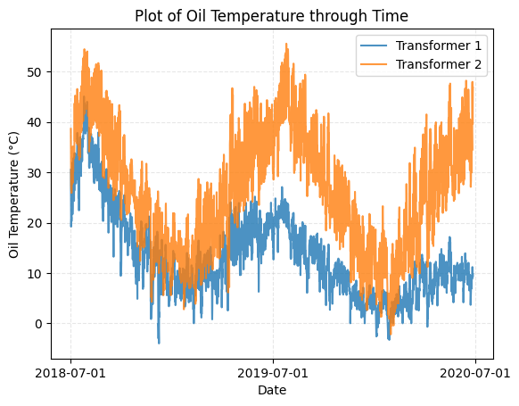
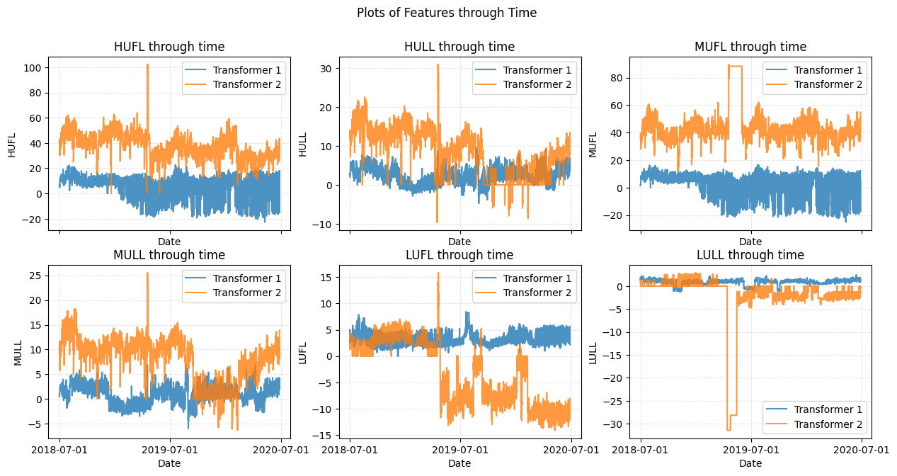
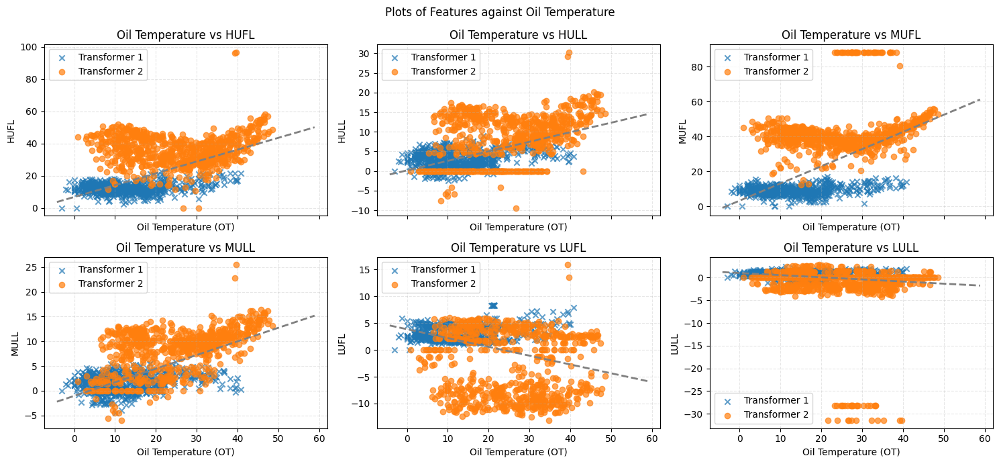
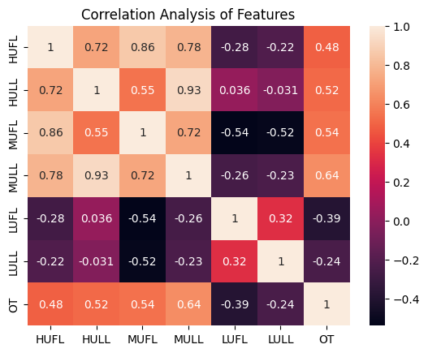

# Preface
This Repo contains both our research and code, our final report can be found in Evaluation Report.pdf, below represents the contents of Model Code.ipynb converted into a read me. 

# Chapter 1: Research of Related Works

## Introduction

Transformers are extremely important to our electrical systems due to their ability to control and distribute power. Hence, it is paramount that we can accurately assess its current and future condition, allowing us to diagnose potential problems in transformers before they occur. Since oil temperature is a good proxy for transformer conditions, we want to use machine learning models to forecast future oil temperatures, giving us a good gaugue for the condition of the transformer.

## Related Works
In a paper by Huang Xuemin, Zhuang Xiaoliang, Tian Fangyuan, Niu Zheng, Chen Yujie, Zhou Qian, and Chao, Yuan (2025), they found that using a hybrid time series forecasting model combining ARIMA, LSTM, and XGBoost was able to outperform traditional machine learning models, as ARIMA was able to capture linear trending data, while LSTM and XGBoost were able to capture non-linear parts of the data. However, we are unable to use Autoregression Models like Arima because we cannot use past oil temperatures to predict for future oil temperature. Additionally, the model was only trained to predict for the next time point, while we need to create models that predict for more time points in the future. Hence, instead of implementing a similar hybrid model, we want to explore XGBoost and LSTM models by themselves as the success of the hybrid proves some efficacy at capturing the trends of the data, while also allowing us to see if the different prediction lengths might affect their performance. Furthermore, the model including ARIMA to capture linear patterns also shows that there might be value in considering linear regression which can also capture these linear relationships.


In a paper by Bai et al. (2018), they outlines the efficacy of time series models, LSTM, XGBoost ,ARIMA against Temporal Convolution Networks (TCN) across a range of sequence modelling tasks such as synthetic stress tests, language modelling and phonic music, tests generally created to benchmark TCN models showing that TCN models consistently outperform canonical recurrent architectures like LSTM and GRU across a variety of sequence modelling tasks. Hence our final model is a TCN model

## Addressing Limitations

One limitation mentioned by the papers is the computational intensity of these models in tuning and training. We will address this by using bayesian optimisation instead of just a grid search where appropriate for tuning, and we will limit the complexity of the models.

Another limitation or concern mentioned is the risk of overfitting. To combat this, we will add early stopping to our deep learning models, limit batch size and learning rate, and add dropout to our layers.

##Sources
Bai, Shaojie; Kolter, J. Zico; and Koltun, Vladlen. 2018. An empirical evaluation of generic convolutional and recurrent networks for sequence modeling. arXiv preprint arXiv:1803.01271. (Related Work)

Huang, X.; Zhuang, X.; Tian, F.; Niu, Z.; Chen, Y.; Zhou, Q.; and Chao, Y. (2025). A Hybrid ARIMA-LSTM-XGBoost Model with Linear Regression Stacking for Transformer Oil Temperature Prediction. Energies 18(6), 1432. doi.org/10.3390/en18061432. (Related Work)

Toner, W., Darlow, L. 2024. An Analysis of Linear Time Series Forecasting Models. arXiv:2403.14587. doi.org/10.48550/arxiv.2403.14587.


# Chapter 2: Data Exploration, Feature Extraction and Visualization

## Importing Necessary Packages


```python
import matplotlib.pyplot as plt
import seaborn as sns
import pandas as pd
import numpy as np
import joblib
import math
from datetime import datetime

from sklearn.linear_model import LinearRegression
from sklearn.model_selection import KFold
from sklearn.model_selection import RandomizedSearchCV
from sklearn.metrics import mean_squared_error
from xgboost import XGBRegressor

import tensorflow as tf
from tensorflow.keras.models import Sequential
from tensorflow.keras.layers import *
from tensorflow.keras.callbacks import ModelCheckpoint
from tensorflow.keras.losses import MeanSquaredError
from tensorflow.keras.metrics import RootMeanSquaredError
from tensorflow.keras.optimizers import Adam
tf.random.set_seed(42)

import tensorflow as tf
import keras_tuner as kt
import math
from tcn import TCN
from tensorflow.keras.callbacks import EarlyStopping
from tensorflow.keras.callbacks import ReduceLROnPlateau
from tensorflow.keras.models import load_model
```

## Reading In Dataset

We first import the 2 transformer datasets and merge them into a single dataframe


```python
filepath = '../Model_and_Dataset/'
table1 = pd.read_csv(filepath + 'trans_1.csv')
#Create indicator column for transformer 1
table1['transformer'] = 1
table2 = pd.read_csv(filepath + 'trans_2.csv')
#Create indicator columns for transformer 2
table2['transformer'] = 2
data = pd.concat((table1,table2)).reset_index(drop=True)
data.head(10)
```


  <div id="df-30a6bf17-c8d2-43dd-b0dd-4ffebe102ccf" class="colab-df-container">
    <div>
<style scoped>
    .dataframe tbody tr th:only-of-type {
        vertical-align: middle;
    }

    .dataframe tbody tr th {
        vertical-align: top;
    }

    .dataframe thead th {
        text-align: right;
    }
</style>
<table border="1" class="dataframe">
  <thead>
    <tr style="text-align: right;">
      <th></th>
      <th>date</th>
      <th>HUFL</th>
      <th>HULL</th>
      <th>MUFL</th>
      <th>MULL</th>
      <th>LUFL</th>
      <th>LULL</th>
      <th>OT</th>
      <th>transformer</th>
    </tr>
  </thead>
  <tbody>
    <tr>
      <th>0</th>
      <td>2018-07-01 00:00:00</td>
      <td>5.827</td>
      <td>2.009</td>
      <td>1.599</td>
      <td>0.462</td>
      <td>4.203</td>
      <td>1.340</td>
      <td>30.531000</td>
      <td>1</td>
    </tr>
    <tr>
      <th>1</th>
      <td>2018-07-01 00:15:00</td>
      <td>5.760</td>
      <td>2.076</td>
      <td>1.492</td>
      <td>0.426</td>
      <td>4.264</td>
      <td>1.401</td>
      <td>30.459999</td>
      <td>1</td>
    </tr>
    <tr>
      <th>2</th>
      <td>2018-07-01 00:30:00</td>
      <td>5.760</td>
      <td>1.942</td>
      <td>1.492</td>
      <td>0.391</td>
      <td>4.234</td>
      <td>1.310</td>
      <td>30.038000</td>
      <td>1</td>
    </tr>
    <tr>
      <th>3</th>
      <td>2018-07-01 00:45:00</td>
      <td>5.760</td>
      <td>1.942</td>
      <td>1.492</td>
      <td>0.426</td>
      <td>4.234</td>
      <td>1.310</td>
      <td>27.013000</td>
      <td>1</td>
    </tr>
    <tr>
      <th>4</th>
      <td>2018-07-01 01:00:00</td>
      <td>5.693</td>
      <td>2.076</td>
      <td>1.492</td>
      <td>0.426</td>
      <td>4.142</td>
      <td>1.371</td>
      <td>27.787001</td>
      <td>1</td>
    </tr>
    <tr>
      <th>5</th>
      <td>2018-07-01 01:15:00</td>
      <td>5.492</td>
      <td>1.942</td>
      <td>1.457</td>
      <td>0.391</td>
      <td>4.112</td>
      <td>1.279</td>
      <td>27.716999</td>
      <td>1</td>
    </tr>
    <tr>
      <th>6</th>
      <td>2018-07-01 01:30:00</td>
      <td>5.358</td>
      <td>1.875</td>
      <td>1.350</td>
      <td>0.355</td>
      <td>3.929</td>
      <td>1.340</td>
      <td>27.646000</td>
      <td>1</td>
    </tr>
    <tr>
      <th>7</th>
      <td>2018-07-01 01:45:00</td>
      <td>5.157</td>
      <td>1.808</td>
      <td>1.350</td>
      <td>0.320</td>
      <td>3.807</td>
      <td>1.279</td>
      <td>27.084000</td>
      <td>1</td>
    </tr>
    <tr>
      <th>8</th>
      <td>2018-07-01 02:00:00</td>
      <td>5.157</td>
      <td>1.741</td>
      <td>1.279</td>
      <td>0.355</td>
      <td>3.777</td>
      <td>1.218</td>
      <td>27.787001</td>
      <td>1</td>
    </tr>
    <tr>
      <th>9</th>
      <td>2018-07-01 02:15:00</td>
      <td>5.157</td>
      <td>1.808</td>
      <td>1.350</td>
      <td>0.426</td>
      <td>3.777</td>
      <td>1.188</td>
      <td>27.506001</td>
      <td>1</td>
    </tr>
  </tbody>
</table>
</div>
    <div class="colab-df-buttons">

  <div class="colab-df-container">
    <button class="colab-df-convert" onclick="convertToInteractive('df-30a6bf17-c8d2-43dd-b0dd-4ffebe102ccf')"
            title="Convert this dataframe to an interactive table."
            style="display:none;">

  <svg xmlns="http://www.w3.org/2000/svg" height="24px" viewBox="0 -960 960 960">
    <path d="M120-120v-720h720v720H120Zm60-500h600v-160H180v160Zm220 220h160v-160H400v160Zm0 220h160v-160H400v160ZM180-400h160v-160H180v160Zm440 0h160v-160H620v160ZM180-180h160v-160H180v160Zm440 0h160v-160H620v160Z"/>
  </svg>
    </button>

  <style>
    .colab-df-container {
      display:flex;
      gap: 12px;
    }

    .colab-df-convert {
      background-color: #E8F0FE;
      border: none;
      border-radius: 50%;
      cursor: pointer;
      display: none;
      fill: #1967D2;
      height: 32px;
      padding: 0 0 0 0;
      width: 32px;
    }

    .colab-df-convert:hover {
      background-color: #E2EBFA;
      box-shadow: 0px 1px 2px rgba(60, 64, 67, 0.3), 0px 1px 3px 1px rgba(60, 64, 67, 0.15);
      fill: #174EA6;
    }

    .colab-df-buttons div {
      margin-bottom: 4px;
    }

    [theme=dark] .colab-df-convert {
      background-color: #3B4455;
      fill: #D2E3FC;
    }

    [theme=dark] .colab-df-convert:hover {
      background-color: #434B5C;
      box-shadow: 0px 1px 3px 1px rgba(0, 0, 0, 0.15);
      filter: drop-shadow(0px 1px 2px rgba(0, 0, 0, 0.3));
      fill: #FFFFFF;
    }
  </style>

    <script>
      const buttonEl =
        document.querySelector('#df-30a6bf17-c8d2-43dd-b0dd-4ffebe102ccf button.colab-df-convert');
      buttonEl.style.display =
        google.colab.kernel.accessAllowed ? 'block' : 'none';

      async function convertToInteractive(key) {
        const element = document.querySelector('#df-30a6bf17-c8d2-43dd-b0dd-4ffebe102ccf');
        const dataTable =
          await google.colab.kernel.invokeFunction('convertToInteractive',
                                                    [key], {});
        if (!dataTable) return;

        const docLinkHtml = 'Like what you see? Visit the ' +
          '<a target="_blank" href=https://colab.research.google.com/notebooks/data_table.ipynb>data table notebook</a>'
          + ' to learn more about interactive tables.';
        element.innerHTML = '';
        dataTable['output_type'] = 'display_data';
        await google.colab.output.renderOutput(dataTable, element);
        const docLink = document.createElement('div');
        docLink.innerHTML = docLinkHtml;
        element.appendChild(docLink);
      }
    </script>
  </div>


    <div id="df-3f540d1f-9ff3-4a86-aa08-87488b2573bd">
      <button class="colab-df-quickchart" onclick="quickchart('df-3f540d1f-9ff3-4a86-aa08-87488b2573bd')"
                title="Suggest charts"
                style="display:none;">

<svg xmlns="http://www.w3.org/2000/svg" height="24px"viewBox="0 0 24 24"
     width="24px">
    <g>
        <path d="M19 3H5c-1.1 0-2 .9-2 2v14c0 1.1.9 2 2 2h14c1.1 0 2-.9 2-2V5c0-1.1-.9-2-2-2zM9 17H7v-7h2v7zm4 0h-2V7h2v10zm4 0h-2v-4h2v4z"/>
    </g>
</svg>
      </button>

<style>
  .colab-df-quickchart {
      --bg-color: #E8F0FE;
      --fill-color: #1967D2;
      --hover-bg-color: #E2EBFA;
      --hover-fill-color: #174EA6;
      --disabled-fill-color: #AAA;
      --disabled-bg-color: #DDD;
  }

  [theme=dark] .colab-df-quickchart {
      --bg-color: #3B4455;
      --fill-color: #D2E3FC;
      --hover-bg-color: #434B5C;
      --hover-fill-color: #FFFFFF;
      --disabled-bg-color: #3B4455;
      --disabled-fill-color: #666;
  }

  .colab-df-quickchart {
    background-color: var(--bg-color);
    border: none;
    border-radius: 50%;
    cursor: pointer;
    display: none;
    fill: var(--fill-color);
    height: 32px;
    padding: 0;
    width: 32px;
  }

  .colab-df-quickchart:hover {
    background-color: var(--hover-bg-color);
    box-shadow: 0 1px 2px rgba(60, 64, 67, 0.3), 0 1px 3px 1px rgba(60, 64, 67, 0.15);
    fill: var(--button-hover-fill-color);
  }

  .colab-df-quickchart-complete:disabled,
  .colab-df-quickchart-complete:disabled:hover {
    background-color: var(--disabled-bg-color);
    fill: var(--disabled-fill-color);
    box-shadow: none;
  }

  .colab-df-spinner {
    border: 2px solid var(--fill-color);
    border-color: transparent;
    border-bottom-color: var(--fill-color);
    animation:
      spin 1s steps(1) infinite;
  }

  @keyframes spin {
    0% {
      border-color: transparent;
      border-bottom-color: var(--fill-color);
      border-left-color: var(--fill-color);
    }
    20% {
      border-color: transparent;
      border-left-color: var(--fill-color);
      border-top-color: var(--fill-color);
    }
    30% {
      border-color: transparent;
      border-left-color: var(--fill-color);
      border-top-color: var(--fill-color);
      border-right-color: var(--fill-color);
    }
    40% {
      border-color: transparent;
      border-right-color: var(--fill-color);
      border-top-color: var(--fill-color);
    }
    60% {
      border-color: transparent;
      border-right-color: var(--fill-color);
    }
    80% {
      border-color: transparent;
      border-right-color: var(--fill-color);
      border-bottom-color: var(--fill-color);
    }
    90% {
      border-color: transparent;
      border-bottom-color: var(--fill-color);
    }
  }
</style>

      <script>
        async function quickchart(key) {
          const quickchartButtonEl =
            document.querySelector('#' + key + ' button');
          quickchartButtonEl.disabled = true;  // To prevent multiple clicks.
          quickchartButtonEl.classList.add('colab-df-spinner');
          try {
            const charts = await google.colab.kernel.invokeFunction(
                'suggestCharts', [key], {});
          } catch (error) {
            console.error('Error during call to suggestCharts:', error);
          }
          quickchartButtonEl.classList.remove('colab-df-spinner');
          quickchartButtonEl.classList.add('colab-df-quickchart-complete');
        }
        (() => {
          let quickchartButtonEl =
            document.querySelector('#df-3f540d1f-9ff3-4a86-aa08-87488b2573bd button');
          quickchartButtonEl.style.display =
            google.colab.kernel.accessAllowed ? 'block' : 'none';
        })();
      </script>
    </div>

    </div>
  </div>


## Data Exploration and Preparation

Next, we do some basic data exploration and preperation to ensure the data is in a usable state

We check if there is any missing data from any time point within the date range of the dataset


```python
#Convert date to date_time
table1['date'] = pd.to_datetime(table1['date'])
table2['date'] = pd.to_datetime(table2['date'])
#Check for missing dates with difference
date_range = pd.date_range(table1['date'].min(),table1['date'].max(), freq='15T')
print(date_range.difference(table1['date']))
print(date_range.difference(table2['date']))
```

    DatetimeIndex(['2020-02-29 00:00:00', '2020-02-29 00:15:00',
                   '2020-02-29 00:30:00', '2020-02-29 00:45:00',
                   '2020-02-29 01:00:00', '2020-02-29 01:15:00',
                   '2020-02-29 01:30:00', '2020-02-29 01:45:00',
                   '2020-02-29 02:00:00', '2020-02-29 02:15:00',
                   '2020-02-29 02:30:00', '2020-02-29 02:45:00',
                   '2020-02-29 03:00:00', '2020-02-29 03:15:00',
                   '2020-02-29 03:30:00', '2020-02-29 03:45:00',
                   '2020-02-29 04:00:00', '2020-02-29 04:15:00',
                   '2020-02-29 04:30:00', '2020-02-29 04:45:00',
                   '2020-02-29 05:00:00', '2020-02-29 05:15:00',
                   '2020-02-29 05:30:00', '2020-02-29 05:45:00',
                   '2020-02-29 06:00:00', '2020-02-29 06:15:00',
                   '2020-02-29 06:30:00', '2020-02-29 06:45:00',
                   '2020-02-29 07:00:00', '2020-02-29 07:15:00',
                   '2020-02-29 07:30:00', '2020-02-29 07:45:00',
                   '2020-02-29 08:00:00', '2020-02-29 08:15:00',
                   '2020-02-29 08:30:00', '2020-02-29 08:45:00',
                   '2020-02-29 09:00:00', '2020-02-29 09:15:00',
                   '2020-02-29 09:30:00', '2020-02-29 09:45:00',
                   '2020-02-29 10:00:00', '2020-02-29 10:15:00',
                   '2020-02-29 10:30:00', '2020-02-29 10:45:00',
                   '2020-02-29 11:00:00', '2020-02-29 11:15:00',
                   '2020-02-29 11:30:00', '2020-02-29 11:45:00',
                   '2020-02-29 12:00:00', '2020-02-29 12:15:00',
                   '2020-02-29 12:30:00', '2020-02-29 12:45:00',
                   '2020-02-29 13:00:00', '2020-02-29 13:15:00',
                   '2020-02-29 13:30:00', '2020-02-29 13:45:00',
                   '2020-02-29 14:00:00', '2020-02-29 14:15:00',
                   '2020-02-29 14:30:00', '2020-02-29 14:45:00',
                   '2020-02-29 15:00:00', '2020-02-29 15:15:00',
                   '2020-02-29 15:30:00', '2020-02-29 15:45:00',
                   '2020-02-29 16:00:00', '2020-02-29 16:15:00',
                   '2020-02-29 16:30:00', '2020-02-29 16:45:00',
                   '2020-02-29 17:00:00', '2020-02-29 17:15:00',
                   '2020-02-29 17:30:00', '2020-02-29 17:45:00',
                   '2020-02-29 18:00:00', '2020-02-29 18:15:00',
                   '2020-02-29 18:30:00', '2020-02-29 18:45:00',
                   '2020-02-29 19:00:00', '2020-02-29 19:15:00',
                   '2020-02-29 19:30:00', '2020-02-29 19:45:00',
                   '2020-02-29 20:00:00', '2020-02-29 20:15:00',
                   '2020-02-29 20:30:00', '2020-02-29 20:45:00',
                   '2020-02-29 21:00:00', '2020-02-29 21:15:00',
                   '2020-02-29 21:30:00', '2020-02-29 21:45:00',
                   '2020-02-29 22:00:00', '2020-02-29 22:15:00',
                   '2020-02-29 22:30:00', '2020-02-29 22:45:00',
                   '2020-02-29 23:00:00', '2020-02-29 23:15:00',
                   '2020-02-29 23:30:00', '2020-02-29 23:45:00'],
                  dtype='datetime64[ns]', freq='15min')
    DatetimeIndex(['2020-02-29 00:00:00', '2020-02-29 00:15:00',
                   '2020-02-29 00:30:00', '2020-02-29 00:45:00',
                   '2020-02-29 01:00:00', '2020-02-29 01:15:00',
                   '2020-02-29 01:30:00', '2020-02-29 01:45:00',
                   '2020-02-29 02:00:00', '2020-02-29 02:15:00',
                   '2020-02-29 02:30:00', '2020-02-29 02:45:00',
                   '2020-02-29 03:00:00', '2020-02-29 03:15:00',
                   '2020-02-29 03:30:00', '2020-02-29 03:45:00',
                   '2020-02-29 04:00:00', '2020-02-29 04:15:00',
                   '2020-02-29 04:30:00', '2020-02-29 04:45:00',
                   '2020-02-29 05:00:00', '2020-02-29 05:15:00',
                   '2020-02-29 05:30:00', '2020-02-29 05:45:00',
                   '2020-02-29 06:00:00', '2020-02-29 06:15:00',
                   '2020-02-29 06:30:00', '2020-02-29 06:45:00',
                   '2020-02-29 07:00:00', '2020-02-29 07:15:00',
                   '2020-02-29 07:30:00', '2020-02-29 07:45:00',
                   '2020-02-29 08:00:00', '2020-02-29 08:15:00',
                   '2020-02-29 08:30:00', '2020-02-29 08:45:00',
                   '2020-02-29 09:00:00', '2020-02-29 09:15:00',
                   '2020-02-29 09:30:00', '2020-02-29 09:45:00',
                   '2020-02-29 10:00:00', '2020-02-29 10:15:00',
                   '2020-02-29 10:30:00', '2020-02-29 10:45:00',
                   '2020-02-29 11:00:00', '2020-02-29 11:15:00',
                   '2020-02-29 11:30:00', '2020-02-29 11:45:00',
                   '2020-02-29 12:00:00', '2020-02-29 12:15:00',
                   '2020-02-29 12:30:00', '2020-02-29 12:45:00',
                   '2020-02-29 13:00:00', '2020-02-29 13:15:00',
                   '2020-02-29 13:30:00', '2020-02-29 13:45:00',
                   '2020-02-29 14:00:00', '2020-02-29 14:15:00',
                   '2020-02-29 14:30:00', '2020-02-29 14:45:00',
                   '2020-02-29 15:00:00', '2020-02-29 15:15:00',
                   '2020-02-29 15:30:00', '2020-02-29 15:45:00',
                   '2020-02-29 16:00:00', '2020-02-29 16:15:00',
                   '2020-02-29 16:30:00', '2020-02-29 16:45:00',
                   '2020-02-29 17:00:00', '2020-02-29 17:15:00',
                   '2020-02-29 17:30:00', '2020-02-29 17:45:00',
                   '2020-02-29 18:00:00', '2020-02-29 18:15:00',
                   '2020-02-29 18:30:00', '2020-02-29 18:45:00',
                   '2020-02-29 19:00:00', '2020-02-29 19:15:00',
                   '2020-02-29 19:30:00', '2020-02-29 19:45:00',
                   '2020-02-29 20:00:00', '2020-02-29 20:15:00',
                   '2020-02-29 20:30:00', '2020-02-29 20:45:00',
                   '2020-02-29 21:00:00', '2020-02-29 21:15:00',
                   '2020-02-29 21:30:00', '2020-02-29 21:45:00',
                   '2020-02-29 22:00:00', '2020-02-29 22:15:00',
                   '2020-02-29 22:30:00', '2020-02-29 22:45:00',
                   '2020-02-29 23:00:00', '2020-02-29 23:15:00',
                   '2020-02-29 23:30:00', '2020-02-29 23:45:00'],
                  dtype='datetime64[ns]', freq='15min')
    

    /tmp/ipython-input-2540104881.py:5: FutureWarning: 'T' is deprecated and will be removed in a future version, please use 'min' instead.
      date_range = pd.date_range(table1['date'].min(),table1['date'].max(), freq='15T')
    

For both transformers, only February 29th is missing. Most likely, the way the data was recorded did not take into account the leap year, so no time point is actually missing

Next, we check that each column is in a usable numeric data type, and that there are no missing values


```python
#Converting date to datetime object
data['date'] = pd.to_datetime(data['date'])
#checking presence of null values and data types
pd.concat((data.dtypes,data.isna().sum()), axis = 1)
```


  <div id="df-871f2c13-f3fc-466f-9433-973dfce03cb1" class="colab-df-container">
    <div>
<style scoped>
    .dataframe tbody tr th:only-of-type {
        vertical-align: middle;
    }

    .dataframe tbody tr th {
        vertical-align: top;
    }

    .dataframe thead th {
        text-align: right;
    }
</style>
<table border="1" class="dataframe">
  <thead>
    <tr style="text-align: right;">
      <th></th>
      <th>0</th>
      <th>1</th>
    </tr>
  </thead>
  <tbody>
    <tr>
      <th>date</th>
      <td>datetime64[ns]</td>
      <td>0</td>
    </tr>
    <tr>
      <th>HUFL</th>
      <td>float64</td>
      <td>0</td>
    </tr>
    <tr>
      <th>HULL</th>
      <td>float64</td>
      <td>0</td>
    </tr>
    <tr>
      <th>MUFL</th>
      <td>float64</td>
      <td>0</td>
    </tr>
    <tr>
      <th>MULL</th>
      <td>float64</td>
      <td>0</td>
    </tr>
    <tr>
      <th>LUFL</th>
      <td>float64</td>
      <td>0</td>
    </tr>
    <tr>
      <th>LULL</th>
      <td>float64</td>
      <td>0</td>
    </tr>
    <tr>
      <th>OT</th>
      <td>float64</td>
      <td>0</td>
    </tr>
    <tr>
      <th>transformer</th>
      <td>int64</td>
      <td>0</td>
    </tr>
  </tbody>
</table>
</div>
    <div class="colab-df-buttons">

  <div class="colab-df-container">
    <button class="colab-df-convert" onclick="convertToInteractive('df-871f2c13-f3fc-466f-9433-973dfce03cb1')"
            title="Convert this dataframe to an interactive table."
            style="display:none;">

  <svg xmlns="http://www.w3.org/2000/svg" height="24px" viewBox="0 -960 960 960">
    <path d="M120-120v-720h720v720H120Zm60-500h600v-160H180v160Zm220 220h160v-160H400v160Zm0 220h160v-160H400v160ZM180-400h160v-160H180v160Zm440 0h160v-160H620v160ZM180-180h160v-160H180v160Zm440 0h160v-160H620v160Z"/>
  </svg>
    </button>

  <style>
    .colab-df-container {
      display:flex;
      gap: 12px;
    }

    .colab-df-convert {
      background-color: #E8F0FE;
      border: none;
      border-radius: 50%;
      cursor: pointer;
      display: none;
      fill: #1967D2;
      height: 32px;
      padding: 0 0 0 0;
      width: 32px;
    }

    .colab-df-convert:hover {
      background-color: #E2EBFA;
      box-shadow: 0px 1px 2px rgba(60, 64, 67, 0.3), 0px 1px 3px 1px rgba(60, 64, 67, 0.15);
      fill: #174EA6;
    }

    .colab-df-buttons div {
      margin-bottom: 4px;
    }

    [theme=dark] .colab-df-convert {
      background-color: #3B4455;
      fill: #D2E3FC;
    }

    [theme=dark] .colab-df-convert:hover {
      background-color: #434B5C;
      box-shadow: 0px 1px 3px 1px rgba(0, 0, 0, 0.15);
      filter: drop-shadow(0px 1px 2px rgba(0, 0, 0, 0.3));
      fill: #FFFFFF;
    }
  </style>

    <script>
      const buttonEl =
        document.querySelector('#df-871f2c13-f3fc-466f-9433-973dfce03cb1 button.colab-df-convert');
      buttonEl.style.display =
        google.colab.kernel.accessAllowed ? 'block' : 'none';

      async function convertToInteractive(key) {
        const element = document.querySelector('#df-871f2c13-f3fc-466f-9433-973dfce03cb1');
        const dataTable =
          await google.colab.kernel.invokeFunction('convertToInteractive',
                                                    [key], {});
        if (!dataTable) return;

        const docLinkHtml = 'Like what you see? Visit the ' +
          '<a target="_blank" href=https://colab.research.google.com/notebooks/data_table.ipynb>data table notebook</a>'
          + ' to learn more about interactive tables.';
        element.innerHTML = '';
        dataTable['output_type'] = 'display_data';
        await google.colab.output.renderOutput(dataTable, element);
        const docLink = document.createElement('div');
        docLink.innerHTML = docLinkHtml;
        element.appendChild(docLink);
      }
    </script>
  </div>


    <div id="df-a2eab595-0eb9-4dd5-afe7-76ad7125f6ca">
      <button class="colab-df-quickchart" onclick="quickchart('df-a2eab595-0eb9-4dd5-afe7-76ad7125f6ca')"
                title="Suggest charts"
                style="display:none;">

<svg xmlns="http://www.w3.org/2000/svg" height="24px"viewBox="0 0 24 24"
     width="24px">
    <g>
        <path d="M19 3H5c-1.1 0-2 .9-2 2v14c0 1.1.9 2 2 2h14c1.1 0 2-.9 2-2V5c0-1.1-.9-2-2-2zM9 17H7v-7h2v7zm4 0h-2V7h2v10zm4 0h-2v-4h2v4z"/>
    </g>
</svg>
      </button>

<style>
  .colab-df-quickchart {
      --bg-color: #E8F0FE;
      --fill-color: #1967D2;
      --hover-bg-color: #E2EBFA;
      --hover-fill-color: #174EA6;
      --disabled-fill-color: #AAA;
      --disabled-bg-color: #DDD;
  }

  [theme=dark] .colab-df-quickchart {
      --bg-color: #3B4455;
      --fill-color: #D2E3FC;
      --hover-bg-color: #434B5C;
      --hover-fill-color: #FFFFFF;
      --disabled-bg-color: #3B4455;
      --disabled-fill-color: #666;
  }

  .colab-df-quickchart {
    background-color: var(--bg-color);
    border: none;
    border-radius: 50%;
    cursor: pointer;
    display: none;
    fill: var(--fill-color);
    height: 32px;
    padding: 0;
    width: 32px;
  }

  .colab-df-quickchart:hover {
    background-color: var(--hover-bg-color);
    box-shadow: 0 1px 2px rgba(60, 64, 67, 0.3), 0 1px 3px 1px rgba(60, 64, 67, 0.15);
    fill: var(--button-hover-fill-color);
  }

  .colab-df-quickchart-complete:disabled,
  .colab-df-quickchart-complete:disabled:hover {
    background-color: var(--disabled-bg-color);
    fill: var(--disabled-fill-color);
    box-shadow: none;
  }

  .colab-df-spinner {
    border: 2px solid var(--fill-color);
    border-color: transparent;
    border-bottom-color: var(--fill-color);
    animation:
      spin 1s steps(1) infinite;
  }

  @keyframes spin {
    0% {
      border-color: transparent;
      border-bottom-color: var(--fill-color);
      border-left-color: var(--fill-color);
    }
    20% {
      border-color: transparent;
      border-left-color: var(--fill-color);
      border-top-color: var(--fill-color);
    }
    30% {
      border-color: transparent;
      border-left-color: var(--fill-color);
      border-top-color: var(--fill-color);
      border-right-color: var(--fill-color);
    }
    40% {
      border-color: transparent;
      border-right-color: var(--fill-color);
      border-top-color: var(--fill-color);
    }
    60% {
      border-color: transparent;
      border-right-color: var(--fill-color);
    }
    80% {
      border-color: transparent;
      border-right-color: var(--fill-color);
      border-bottom-color: var(--fill-color);
    }
    90% {
      border-color: transparent;
      border-bottom-color: var(--fill-color);
    }
  }
</style>

      <script>
        async function quickchart(key) {
          const quickchartButtonEl =
            document.querySelector('#' + key + ' button');
          quickchartButtonEl.disabled = true;  // To prevent multiple clicks.
          quickchartButtonEl.classList.add('colab-df-spinner');
          try {
            const charts = await google.colab.kernel.invokeFunction(
                'suggestCharts', [key], {});
          } catch (error) {
            console.error('Error during call to suggestCharts:', error);
          }
          quickchartButtonEl.classList.remove('colab-df-spinner');
          quickchartButtonEl.classList.add('colab-df-quickchart-complete');
        }
        (() => {
          let quickchartButtonEl =
            document.querySelector('#df-a2eab595-0eb9-4dd5-afe7-76ad7125f6ca button');
          quickchartButtonEl.style.display =
            google.colab.kernel.accessAllowed ? 'block' : 'none';
        })();
      </script>
    </div>

    </div>
  </div>


Then, we sort our dataframe by date and transformer to ensure that the dataframe is ascending chronologically and that it alternates between transformer 1 and 2, allowing us to easily manipulate and shift rows for future use


```python
#sort data by ascending date and transformer
data = data.sort_values(['date','transformer'],ascending=[True,True]).reset_index(drop=True)
data.head(10)
```


  <div id="df-00258ebe-95ee-419c-a12b-19bab4cd573b" class="colab-df-container">
    <div>
<style scoped>
    .dataframe tbody tr th:only-of-type {
        vertical-align: middle;
    }

    .dataframe tbody tr th {
        vertical-align: top;
    }

    .dataframe thead th {
        text-align: right;
    }
</style>
<table border="1" class="dataframe">
  <thead>
    <tr style="text-align: right;">
      <th></th>
      <th>date</th>
      <th>HUFL</th>
      <th>HULL</th>
      <th>MUFL</th>
      <th>MULL</th>
      <th>LUFL</th>
      <th>LULL</th>
      <th>OT</th>
      <th>transformer</th>
    </tr>
  </thead>
  <tbody>
    <tr>
      <th>0</th>
      <td>2018-07-01 00:00:00</td>
      <td>5.827000</td>
      <td>2.009</td>
      <td>1.599000</td>
      <td>0.462</td>
      <td>4.203</td>
      <td>1.340</td>
      <td>30.531000</td>
      <td>1</td>
    </tr>
    <tr>
      <th>1</th>
      <td>2018-07-01 00:00:00</td>
      <td>41.130001</td>
      <td>12.481</td>
      <td>36.535999</td>
      <td>9.355</td>
      <td>4.424</td>
      <td>1.311</td>
      <td>38.661999</td>
      <td>2</td>
    </tr>
    <tr>
      <th>2</th>
      <td>2018-07-01 00:15:00</td>
      <td>5.760000</td>
      <td>2.076</td>
      <td>1.492000</td>
      <td>0.426</td>
      <td>4.264</td>
      <td>1.401</td>
      <td>30.459999</td>
      <td>1</td>
    </tr>
    <tr>
      <th>3</th>
      <td>2018-07-01 00:15:00</td>
      <td>39.622002</td>
      <td>11.309</td>
      <td>35.543999</td>
      <td>8.551</td>
      <td>3.209</td>
      <td>1.258</td>
      <td>38.223000</td>
      <td>2</td>
    </tr>
    <tr>
      <th>4</th>
      <td>2018-07-01 00:30:00</td>
      <td>5.760000</td>
      <td>1.942</td>
      <td>1.492000</td>
      <td>0.391</td>
      <td>4.234</td>
      <td>1.310</td>
      <td>30.038000</td>
      <td>1</td>
    </tr>
    <tr>
      <th>5</th>
      <td>2018-07-01 00:30:00</td>
      <td>38.868000</td>
      <td>10.555</td>
      <td>34.365002</td>
      <td>7.586</td>
      <td>4.435</td>
      <td>1.258</td>
      <td>37.344002</td>
      <td>2</td>
    </tr>
    <tr>
      <th>6</th>
      <td>2018-07-01 00:45:00</td>
      <td>5.760000</td>
      <td>1.942</td>
      <td>1.492000</td>
      <td>0.426</td>
      <td>4.234</td>
      <td>1.310</td>
      <td>27.013000</td>
      <td>1</td>
    </tr>
    <tr>
      <th>7</th>
      <td>2018-07-01 00:45:00</td>
      <td>35.518002</td>
      <td>9.214</td>
      <td>32.569000</td>
      <td>8.712</td>
      <td>4.435</td>
      <td>1.215</td>
      <td>37.124001</td>
      <td>2</td>
    </tr>
    <tr>
      <th>8</th>
      <td>2018-07-01 01:00:00</td>
      <td>5.693000</td>
      <td>2.076</td>
      <td>1.492000</td>
      <td>0.426</td>
      <td>4.142</td>
      <td>1.371</td>
      <td>27.787001</td>
      <td>1</td>
    </tr>
    <tr>
      <th>9</th>
      <td>2018-07-01 01:00:00</td>
      <td>37.528000</td>
      <td>10.136</td>
      <td>33.936001</td>
      <td>7.532</td>
      <td>4.435</td>
      <td>1.215</td>
      <td>37.124001</td>
      <td>2</td>
    </tr>
  </tbody>
</table>
</div>
    <div class="colab-df-buttons">

  <div class="colab-df-container">
    <button class="colab-df-convert" onclick="convertToInteractive('df-00258ebe-95ee-419c-a12b-19bab4cd573b')"
            title="Convert this dataframe to an interactive table."
            style="display:none;">

  <svg xmlns="http://www.w3.org/2000/svg" height="24px" viewBox="0 -960 960 960">
    <path d="M120-120v-720h720v720H120Zm60-500h600v-160H180v160Zm220 220h160v-160H400v160Zm0 220h160v-160H400v160ZM180-400h160v-160H180v160Zm440 0h160v-160H620v160ZM180-180h160v-160H180v160Zm440 0h160v-160H620v160Z"/>
  </svg>
    </button>

  <style>
    .colab-df-container {
      display:flex;
      gap: 12px;
    }

    .colab-df-convert {
      background-color: #E8F0FE;
      border: none;
      border-radius: 50%;
      cursor: pointer;
      display: none;
      fill: #1967D2;
      height: 32px;
      padding: 0 0 0 0;
      width: 32px;
    }

    .colab-df-convert:hover {
      background-color: #E2EBFA;
      box-shadow: 0px 1px 2px rgba(60, 64, 67, 0.3), 0px 1px 3px 1px rgba(60, 64, 67, 0.15);
      fill: #174EA6;
    }

    .colab-df-buttons div {
      margin-bottom: 4px;
    }

    [theme=dark] .colab-df-convert {
      background-color: #3B4455;
      fill: #D2E3FC;
    }

    [theme=dark] .colab-df-convert:hover {
      background-color: #434B5C;
      box-shadow: 0px 1px 3px 1px rgba(0, 0, 0, 0.15);
      filter: drop-shadow(0px 1px 2px rgba(0, 0, 0, 0.3));
      fill: #FFFFFF;
    }
  </style>

    <script>
      const buttonEl =
        document.querySelector('#df-00258ebe-95ee-419c-a12b-19bab4cd573b button.colab-df-convert');
      buttonEl.style.display =
        google.colab.kernel.accessAllowed ? 'block' : 'none';

      async function convertToInteractive(key) {
        const element = document.querySelector('#df-00258ebe-95ee-419c-a12b-19bab4cd573b');
        const dataTable =
          await google.colab.kernel.invokeFunction('convertToInteractive',
                                                    [key], {});
        if (!dataTable) return;

        const docLinkHtml = 'Like what you see? Visit the ' +
          '<a target="_blank" href=https://colab.research.google.com/notebooks/data_table.ipynb>data table notebook</a>'
          + ' to learn more about interactive tables.';
        element.innerHTML = '';
        dataTable['output_type'] = 'display_data';
        await google.colab.output.renderOutput(dataTable, element);
        const docLink = document.createElement('div');
        docLink.innerHTML = docLinkHtml;
        element.appendChild(docLink);
      }
    </script>
  </div>


    <div id="df-587f17e0-3783-46eb-ac44-27c3a7e76dfd">
      <button class="colab-df-quickchart" onclick="quickchart('df-587f17e0-3783-46eb-ac44-27c3a7e76dfd')"
                title="Suggest charts"
                style="display:none;">

<svg xmlns="http://www.w3.org/2000/svg" height="24px"viewBox="0 0 24 24"
     width="24px">
    <g>
        <path d="M19 3H5c-1.1 0-2 .9-2 2v14c0 1.1.9 2 2 2h14c1.1 0 2-.9 2-2V5c0-1.1-.9-2-2-2zM9 17H7v-7h2v7zm4 0h-2V7h2v10zm4 0h-2v-4h2v4z"/>
    </g>
</svg>
      </button>

<style>
  .colab-df-quickchart {
      --bg-color: #E8F0FE;
      --fill-color: #1967D2;
      --hover-bg-color: #E2EBFA;
      --hover-fill-color: #174EA6;
      --disabled-fill-color: #AAA;
      --disabled-bg-color: #DDD;
  }

  [theme=dark] .colab-df-quickchart {
      --bg-color: #3B4455;
      --fill-color: #D2E3FC;
      --hover-bg-color: #434B5C;
      --hover-fill-color: #FFFFFF;
      --disabled-bg-color: #3B4455;
      --disabled-fill-color: #666;
  }

  .colab-df-quickchart {
    background-color: var(--bg-color);
    border: none;
    border-radius: 50%;
    cursor: pointer;
    display: none;
    fill: var(--fill-color);
    height: 32px;
    padding: 0;
    width: 32px;
  }

  .colab-df-quickchart:hover {
    background-color: var(--hover-bg-color);
    box-shadow: 0 1px 2px rgba(60, 64, 67, 0.3), 0 1px 3px 1px rgba(60, 64, 67, 0.15);
    fill: var(--button-hover-fill-color);
  }

  .colab-df-quickchart-complete:disabled,
  .colab-df-quickchart-complete:disabled:hover {
    background-color: var(--disabled-bg-color);
    fill: var(--disabled-fill-color);
    box-shadow: none;
  }

  .colab-df-spinner {
    border: 2px solid var(--fill-color);
    border-color: transparent;
    border-bottom-color: var(--fill-color);
    animation:
      spin 1s steps(1) infinite;
  }

  @keyframes spin {
    0% {
      border-color: transparent;
      border-bottom-color: var(--fill-color);
      border-left-color: var(--fill-color);
    }
    20% {
      border-color: transparent;
      border-left-color: var(--fill-color);
      border-top-color: var(--fill-color);
    }
    30% {
      border-color: transparent;
      border-left-color: var(--fill-color);
      border-top-color: var(--fill-color);
      border-right-color: var(--fill-color);
    }
    40% {
      border-color: transparent;
      border-right-color: var(--fill-color);
      border-top-color: var(--fill-color);
    }
    60% {
      border-color: transparent;
      border-right-color: var(--fill-color);
    }
    80% {
      border-color: transparent;
      border-right-color: var(--fill-color);
      border-bottom-color: var(--fill-color);
    }
    90% {
      border-color: transparent;
      border-bottom-color: var(--fill-color);
    }
  }
</style>

      <script>
        async function quickchart(key) {
          const quickchartButtonEl =
            document.querySelector('#' + key + ' button');
          quickchartButtonEl.disabled = true;  // To prevent multiple clicks.
          quickchartButtonEl.classList.add('colab-df-spinner');
          try {
            const charts = await google.colab.kernel.invokeFunction(
                'suggestCharts', [key], {});
          } catch (error) {
            console.error('Error during call to suggestCharts:', error);
          }
          quickchartButtonEl.classList.remove('colab-df-spinner');
          quickchartButtonEl.classList.add('colab-df-quickchart-complete');
        }
        (() => {
          let quickchartButtonEl =
            document.querySelector('#df-587f17e0-3783-46eb-ac44-27c3a7e76dfd button');
          quickchartButtonEl.style.display =
            google.colab.kernel.accessAllowed ? 'block' : 'none';
        })();
      </script>
    </div>

    </div>
  </div>


Since each time point is 15 minutes, we need to shift our oil temperatures by 4, 96 and 672 time points back to get oil temperatures 1 hour, 1 day and 1 week in the future for each time point. However, since our dataset consists of 2 transformers that is now arranged in order, we shift by these time points multiplied by 2.


```python
#Creating Future OT columns
data['OT_1'] = data['OT'].shift(-8)
data['OT_2'] = data['OT'].shift(-192)
data['OT_3'] = data['OT'].shift(-1344)
data.head()
```


  <div id="df-1d7c1b33-3623-4606-8b7a-ef6a96252457" class="colab-df-container">
    <div>
<style scoped>
    .dataframe tbody tr th:only-of-type {
        vertical-align: middle;
    }

    .dataframe tbody tr th {
        vertical-align: top;
    }

    .dataframe thead th {
        text-align: right;
    }
</style>
<table border="1" class="dataframe">
  <thead>
    <tr style="text-align: right;">
      <th></th>
      <th>date</th>
      <th>HUFL</th>
      <th>HULL</th>
      <th>MUFL</th>
      <th>MULL</th>
      <th>LUFL</th>
      <th>LULL</th>
      <th>OT</th>
      <th>transformer</th>
      <th>OT_1</th>
      <th>OT_2</th>
      <th>OT_3</th>
    </tr>
  </thead>
  <tbody>
    <tr>
      <th>0</th>
      <td>2018-07-01 00:00:00</td>
      <td>5.827000</td>
      <td>2.009</td>
      <td>1.599000</td>
      <td>0.462</td>
      <td>4.203</td>
      <td>1.340</td>
      <td>30.531000</td>
      <td>1</td>
      <td>27.787001</td>
      <td>21.104000</td>
      <td>31.093000</td>
    </tr>
    <tr>
      <th>1</th>
      <td>2018-07-01 00:00:00</td>
      <td>41.130001</td>
      <td>12.481</td>
      <td>36.535999</td>
      <td>9.355</td>
      <td>4.424</td>
      <td>1.311</td>
      <td>38.661999</td>
      <td>2</td>
      <td>37.124001</td>
      <td>25.917999</td>
      <td>38.223000</td>
    </tr>
    <tr>
      <th>2</th>
      <td>2018-07-01 00:15:00</td>
      <td>5.760000</td>
      <td>2.076</td>
      <td>1.492000</td>
      <td>0.426</td>
      <td>4.264</td>
      <td>1.401</td>
      <td>30.459999</td>
      <td>1</td>
      <td>27.716999</td>
      <td>21.104000</td>
      <td>30.601000</td>
    </tr>
    <tr>
      <th>3</th>
      <td>2018-07-01 00:15:00</td>
      <td>39.622002</td>
      <td>11.309</td>
      <td>35.543999</td>
      <td>8.551</td>
      <td>3.209</td>
      <td>1.258</td>
      <td>38.223000</td>
      <td>2</td>
      <td>36.903999</td>
      <td>25.917999</td>
      <td>38.002998</td>
    </tr>
    <tr>
      <th>4</th>
      <td>2018-07-01 00:30:00</td>
      <td>5.760000</td>
      <td>1.942</td>
      <td>1.492000</td>
      <td>0.391</td>
      <td>4.234</td>
      <td>1.310</td>
      <td>30.038000</td>
      <td>1</td>
      <td>27.646000</td>
      <td>21.385000</td>
      <td>31.093000</td>
    </tr>
  </tbody>
</table>
</div>
    <div class="colab-df-buttons">

  <div class="colab-df-container">
    <button class="colab-df-convert" onclick="convertToInteractive('df-1d7c1b33-3623-4606-8b7a-ef6a96252457')"
            title="Convert this dataframe to an interactive table."
            style="display:none;">

  <svg xmlns="http://www.w3.org/2000/svg" height="24px" viewBox="0 -960 960 960">
    <path d="M120-120v-720h720v720H120Zm60-500h600v-160H180v160Zm220 220h160v-160H400v160Zm0 220h160v-160H400v160ZM180-400h160v-160H180v160Zm440 0h160v-160H620v160ZM180-180h160v-160H180v160Zm440 0h160v-160H620v160Z"/>
  </svg>
    </button>

  <style>
    .colab-df-container {
      display:flex;
      gap: 12px;
    }

    .colab-df-convert {
      background-color: #E8F0FE;
      border: none;
      border-radius: 50%;
      cursor: pointer;
      display: none;
      fill: #1967D2;
      height: 32px;
      padding: 0 0 0 0;
      width: 32px;
    }

    .colab-df-convert:hover {
      background-color: #E2EBFA;
      box-shadow: 0px 1px 2px rgba(60, 64, 67, 0.3), 0px 1px 3px 1px rgba(60, 64, 67, 0.15);
      fill: #174EA6;
    }

    .colab-df-buttons div {
      margin-bottom: 4px;
    }

    [theme=dark] .colab-df-convert {
      background-color: #3B4455;
      fill: #D2E3FC;
    }

    [theme=dark] .colab-df-convert:hover {
      background-color: #434B5C;
      box-shadow: 0px 1px 3px 1px rgba(0, 0, 0, 0.15);
      filter: drop-shadow(0px 1px 2px rgba(0, 0, 0, 0.3));
      fill: #FFFFFF;
    }
  </style>

    <script>
      const buttonEl =
        document.querySelector('#df-1d7c1b33-3623-4606-8b7a-ef6a96252457 button.colab-df-convert');
      buttonEl.style.display =
        google.colab.kernel.accessAllowed ? 'block' : 'none';

      async function convertToInteractive(key) {
        const element = document.querySelector('#df-1d7c1b33-3623-4606-8b7a-ef6a96252457');
        const dataTable =
          await google.colab.kernel.invokeFunction('convertToInteractive',
                                                    [key], {});
        if (!dataTable) return;

        const docLinkHtml = 'Like what you see? Visit the ' +
          '<a target="_blank" href=https://colab.research.google.com/notebooks/data_table.ipynb>data table notebook</a>'
          + ' to learn more about interactive tables.';
        element.innerHTML = '';
        dataTable['output_type'] = 'display_data';
        await google.colab.output.renderOutput(dataTable, element);
        const docLink = document.createElement('div');
        docLink.innerHTML = docLinkHtml;
        element.appendChild(docLink);
      }
    </script>
  </div>


    <div id="df-d3822853-4a03-4a6c-9abb-dccbe7aa7d1e">
      <button class="colab-df-quickchart" onclick="quickchart('df-d3822853-4a03-4a6c-9abb-dccbe7aa7d1e')"
                title="Suggest charts"
                style="display:none;">

<svg xmlns="http://www.w3.org/2000/svg" height="24px"viewBox="0 0 24 24"
     width="24px">
    <g>
        <path d="M19 3H5c-1.1 0-2 .9-2 2v14c0 1.1.9 2 2 2h14c1.1 0 2-.9 2-2V5c0-1.1-.9-2-2-2zM9 17H7v-7h2v7zm4 0h-2V7h2v10zm4 0h-2v-4h2v4z"/>
    </g>
</svg>
      </button>

<style>
  .colab-df-quickchart {
      --bg-color: #E8F0FE;
      --fill-color: #1967D2;
      --hover-bg-color: #E2EBFA;
      --hover-fill-color: #174EA6;
      --disabled-fill-color: #AAA;
      --disabled-bg-color: #DDD;
  }

  [theme=dark] .colab-df-quickchart {
      --bg-color: #3B4455;
      --fill-color: #D2E3FC;
      --hover-bg-color: #434B5C;
      --hover-fill-color: #FFFFFF;
      --disabled-bg-color: #3B4455;
      --disabled-fill-color: #666;
  }

  .colab-df-quickchart {
    background-color: var(--bg-color);
    border: none;
    border-radius: 50%;
    cursor: pointer;
    display: none;
    fill: var(--fill-color);
    height: 32px;
    padding: 0;
    width: 32px;
  }

  .colab-df-quickchart:hover {
    background-color: var(--hover-bg-color);
    box-shadow: 0 1px 2px rgba(60, 64, 67, 0.3), 0 1px 3px 1px rgba(60, 64, 67, 0.15);
    fill: var(--button-hover-fill-color);
  }

  .colab-df-quickchart-complete:disabled,
  .colab-df-quickchart-complete:disabled:hover {
    background-color: var(--disabled-bg-color);
    fill: var(--disabled-fill-color);
    box-shadow: none;
  }

  .colab-df-spinner {
    border: 2px solid var(--fill-color);
    border-color: transparent;
    border-bottom-color: var(--fill-color);
    animation:
      spin 1s steps(1) infinite;
  }

  @keyframes spin {
    0% {
      border-color: transparent;
      border-bottom-color: var(--fill-color);
      border-left-color: var(--fill-color);
    }
    20% {
      border-color: transparent;
      border-left-color: var(--fill-color);
      border-top-color: var(--fill-color);
    }
    30% {
      border-color: transparent;
      border-left-color: var(--fill-color);
      border-top-color: var(--fill-color);
      border-right-color: var(--fill-color);
    }
    40% {
      border-color: transparent;
      border-right-color: var(--fill-color);
      border-top-color: var(--fill-color);
    }
    60% {
      border-color: transparent;
      border-right-color: var(--fill-color);
    }
    80% {
      border-color: transparent;
      border-right-color: var(--fill-color);
      border-bottom-color: var(--fill-color);
    }
    90% {
      border-color: transparent;
      border-bottom-color: var(--fill-color);
    }
  }
</style>

      <script>
        async function quickchart(key) {
          const quickchartButtonEl =
            document.querySelector('#' + key + ' button');
          quickchartButtonEl.disabled = true;  // To prevent multiple clicks.
          quickchartButtonEl.classList.add('colab-df-spinner');
          try {
            const charts = await google.colab.kernel.invokeFunction(
                'suggestCharts', [key], {});
          } catch (error) {
            console.error('Error during call to suggestCharts:', error);
          }
          quickchartButtonEl.classList.remove('colab-df-spinner');
          quickchartButtonEl.classList.add('colab-df-quickchart-complete');
        }
        (() => {
          let quickchartButtonEl =
            document.querySelector('#df-d3822853-4a03-4a6c-9abb-dccbe7aa7d1e button');
          quickchartButtonEl.style.display =
            google.colab.kernel.accessAllowed ? 'block' : 'none';
        })();
      </script>
    </div>

    </div>
  </div>


## Feature Visualisation

We plot the Oil temperature with respects to Time


```python
#Create line plots of oil temperature against time for each transformer
plt.plot(table1['date'][::24],table1['OT'][::24], label = 'Transformer 1', alpha=0.8)
plt.plot(table2['date'][::24],table2['OT'][::24], label= 'Transformer 2', alpha = 0.8)
plt.legend()
#Add titles, labels, legend and gridlines for clarity
plt.ylabel('Oil Temperature (°C)')
plt.xlabel('Date')
plt.xticks([datetime(2018,7,1),datetime(2019,7,1),datetime(2020,7,1)])
plt.title('Plot of Oil Temperature through Time')
plt.grid(linestyle = '--', alpha = 0.3)
plt.show()

```


    

    


We plot other features with respects to time


```python
#Create Subplots
fig, axes = plt.subplots(2,3,figsize = (15, 7), sharex=True)
features = ['HUFL','HULL','MUFL','MULL','LUFL','LULL']
#loop through each axes and feature
for ax, feature in zip(axes.flatten(),features):
  #Create scatter plot of the feature against time for each transformer
  ax.plot(table1['date'][::24], table1[feature][::24], alpha = 0.8, label='Transformer 1')
  ax.plot(table2['date'][::24], table2[feature][::24], alpha = 0.8, label='Transformer 2')
  #Add titles, labels, legends and gridlines for clearer presentation
  ax.set_title(f'{feature} through time')
  ax.set_ylabel(feature)
  ax.set_xlabel('Date')
  ax.legend(loc='best')
  ax.grid(True, alpha=0.3, linestyle='--')
plt.xticks([datetime(2018,7,1),datetime(2019,7,1),datetime(2020,7,1)])
plt.suptitle('Plots of Features through Time')
plt.show()
```


    

    


We plot the other features with respect to Oil Temperature


```python
#Create Subplots
fig, axes = plt.subplots(2, 3, figsize=(15, 7), sharex=True)  # Increased height for better spacing
features = ['HUFL','HULL','MUFL','MULL','LUFL','LULL']
#Loop through each axes and feature
for ax, feature in zip(axes.flatten(), features):
    #Create scatter plots for feature against OT for each transformer
    ax.scatter(table1['OT'][::96], table1[feature][::96], marker='x', alpha=0.7, label='Transformer 1')
    ax.scatter(table2['OT'][::96], table2[feature][::96], marker='o', alpha=0.7, label='Transformer 2')
    #Create a regression line for each plot
    sns.regplot(data=data, x='OT', y=feature,scatter=False, ci=None, line_kws={'linewidth': 2, 'linestyle': '--'}, robust=True, ax=ax, color = 'grey')
    #Add titles, labels, legends and gridlines for clearer presentation
    ax.set_title(f'Oil Temperature vs {feature}')
    ax.set_ylabel(feature)
    ax.set_xlabel('Oil Temperature (OT)')
    ax.legend(loc='best')
    ax.grid(True, alpha=0.3, linestyle='--')
plt.suptitle('Plots of Features against Oil Temperature')
plt.tight_layout()
plt.show()

```


    

    


## Correlation Analysis

We do correlation analysis to further investigate each feature's correlation to oil temperature


```python
cor = data[['HUFL','HULL','MUFL','MULL','LUFL','LULL','OT']].corr()
sns.heatmap(cor,annot=True)
plt.title('Correlation Analysis of Features')
plt.show()
selected_features = ['HULL','MUFL','LULL','LUFL']
```


    

    


From the heatmap, we can see that HUFL has a high correlation with each HUFL and MUFL at 0.72 and 0.86 respectively, while MULL has a high correlation with HULL and MUFL at 0.93 and 0.72. Hence, we prune HUFL and MULL and select HULL, MUFL, LULL and LUFL as our input features for the rest of the project

## Data Preparation

We create time groups of 1 week of the dataset, then choose a random 20% of them as the test set. We then perform mean normalisation on the train and test set with respect with the training set (ie using mean, max and min of train set)


```python
#Creating time point groups and splitting data into Train and Test set
np.random.seed(42)
#Splitting the data into time groups of 1 week
data['time_group'] = data.index// 1344
train_group = np.random.choice(range(0,102), size=int(102*0.8), replace=False)
test_group = np.setdiff1d(range(0,102),train_group)
train_data = data.loc[data['time_group'].isin(train_group)].copy()
test_data = data.loc[data['time_group'].isin(test_group)].copy()

#Mean normalisation
for column in train_data.columns[1:7]:
  mean, max, min = train_data[column].mean(), train_data[column].max(), train_data[column].min()
  train_data[column] = (train_data[column] - mean)/(max-min)
  test_data[column] = (test_data[column] - mean)/(max-min)
```

We then create datasets for each scenario with the selected mean normalised features and their respective future Oil temperature


```python
#Create Dataset for first scenario
tf1 = train_data[selected_features+['OT_1','time_group']].copy()
tf1_test = test_data[selected_features+['OT_1','time_group']].copy()
tf1 = tf1.dropna()
tf1_test = tf1_test.dropna()
#Create Dataset for second scenario
tf2 = train_data[selected_features+['OT_2','time_group']].copy()
tf2_test = test_data[selected_features+['OT_2','time_group']].copy()
tf2 = tf2.dropna()
tf2_test = tf2_test.dropna()
#Create Dataset for third scenario
tf3 = train_data[selected_features+['OT_3','time_group']].copy()
tf3_test = test_data[selected_features+['OT_3','time_group']].copy()
tf3 = tf3.dropna()
tf3_test = tf3_test.dropna()
```

We create this function to create the lookback window


```python
def time_window_vectorized(df, lookback=1, time_group_col='time_group'):
    import numpy as np

    # Separate features and group labels
    array = df.drop(columns=[time_group_col]).to_numpy()
    time_groups = df[time_group_col].to_numpy()
    jump = 2
    start_idx = (lookback - 1) * jump
    if start_idx >= len(array):
        return np.array([]), np.array([])

    n_samples = len(array) - start_idx

    # Create lookback index matrix
    indices = start_idx + np.arange(n_samples)[:, None]
    lookback_indices = indices - np.arange(lookback)[::-1] * jump

    #Check if entire lookback window is in the same time group
    group_at_indices = time_groups[lookback_indices]  # shape: (n_samples, lookback)
    same_group_mask = np.all(group_at_indices == group_at_indices[:, [0]], axis=1)

    # Filter indices
    lookback_indices = lookback_indices[same_group_mask]
    target_indices = indices[same_group_mask][:, 0]  # For y

    n_valid = len(lookback_indices)
    if n_valid == 0:
        return np.array([]), np.array([])

    # Extract features and targets
    X = array[lookback_indices, :-1].reshape(n_valid, lookback, -1)
    y = array[target_indices, -1]

    return X, y
```

# Chapter 3:

We will be implementing 4 models, Linear Regression, XGBoost, LSTM and TCN. For our lookback window N to tune, we will be genreally be using `range(0,11,1)` for scenario 1, `range(4,41,4)` for scenario 2, and `range(24,241,24)` for scenario 3. This is done to give predictions further in the future more time points to learn from without having to run a model for every N within the range.


## Linear Regression

For this problem, our baseline model will be Linear Regression. However, Linear Regression assumes that the error are independent and identically distributed, which might not hold for time series data. Despite this, Toner and Darlow (2024) found that Linear Regression performed well at time series forecasting despite its simplicity, even when pitted against more complicated models.


```python
#Run if you're going to run any of the hyperparameter tuning code
kfld = KFold(n_splits=5)
```

### Hyperparameter Tuning

For Linear Regression, we will be tuning the lookback window N. The lookback window is implemented by adding the feature columns of every time point within the lookback window as an input to the model. For each scenario, we will be evaluating the models average RMSE on 5 folds for a range of N values.


```python
#Scenario 1 (Don't need to run this)
lr_score_list_1 = []
#Loop over range of Ns
for n in range(1,11):
  #Create Lookback window for each N
  X, y = time_window_vectorized(tf1,lookback=n)
  X = X.reshape((len(X),len(selected_features)*n))
  scores = []

  # Loop over 5 folds
  for train_index, test_index in kfld.split(X):
    #Create train and test sets
    X_train, X_test = X[train_index], X[test_index]
    y_train, y_test = y[train_index], y[test_index]

    #Create and Fit model
    model = LinearRegression()
    model.fit(X_train,y_train)

    #Predict y values and calulate RMSE
    y_pred = model.predict(X_test)
    scores.append(np.sqrt(mean_squared_error(y_test, y_pred)))

  #append average RMSE over folds to list
  lr_score_list_1.append(np.mean(scores))

#Display results in dataframe
lr_df_1 = pd.DataFrame({'N':range(1,11),'RMSE':lr_score_list_1})
lr_df_1.sort_values('RMSE',ascending = True)
```


  <div id="df-107c07fc-c55d-4052-9bbe-1fa3073d0949" class="colab-df-container">
    <div>
<style scoped>
    .dataframe tbody tr th:only-of-type {
        vertical-align: middle;
    }

    .dataframe tbody tr th {
        vertical-align: top;
    }

    .dataframe thead th {
        text-align: right;
    }
</style>
<table border="1" class="dataframe">
  <thead>
    <tr style="text-align: right;">
      <th></th>
      <th>N</th>
      <th>RMSE</th>
    </tr>
  </thead>
  <tbody>
    <tr>
      <th>0</th>
      <td>1</td>
      <td>11.095960</td>
    </tr>
    <tr>
      <th>1</th>
      <td>2</td>
      <td>11.108462</td>
    </tr>
    <tr>
      <th>2</th>
      <td>3</td>
      <td>11.121151</td>
    </tr>
    <tr>
      <th>3</th>
      <td>4</td>
      <td>11.132673</td>
    </tr>
    <tr>
      <th>4</th>
      <td>5</td>
      <td>11.144395</td>
    </tr>
    <tr>
      <th>5</th>
      <td>6</td>
      <td>11.155373</td>
    </tr>
    <tr>
      <th>6</th>
      <td>7</td>
      <td>11.166984</td>
    </tr>
    <tr>
      <th>7</th>
      <td>8</td>
      <td>11.178541</td>
    </tr>
    <tr>
      <th>8</th>
      <td>9</td>
      <td>11.189414</td>
    </tr>
    <tr>
      <th>9</th>
      <td>10</td>
      <td>11.199609</td>
    </tr>
  </tbody>
</table>
</div>
    <div class="colab-df-buttons">

  <div class="colab-df-container">
    <button class="colab-df-convert" onclick="convertToInteractive('df-107c07fc-c55d-4052-9bbe-1fa3073d0949')"
            title="Convert this dataframe to an interactive table."
            style="display:none;">

  <svg xmlns="http://www.w3.org/2000/svg" height="24px" viewBox="0 -960 960 960">
    <path d="M120-120v-720h720v720H120Zm60-500h600v-160H180v160Zm220 220h160v-160H400v160Zm0 220h160v-160H400v160ZM180-400h160v-160H180v160Zm440 0h160v-160H620v160ZM180-180h160v-160H180v160Zm440 0h160v-160H620v160Z"/>
  </svg>
    </button>

  <style>
    .colab-df-container {
      display:flex;
      gap: 12px;
    }

    .colab-df-convert {
      background-color: #E8F0FE;
      border: none;
      border-radius: 50%;
      cursor: pointer;
      display: none;
      fill: #1967D2;
      height: 32px;
      padding: 0 0 0 0;
      width: 32px;
    }

    .colab-df-convert:hover {
      background-color: #E2EBFA;
      box-shadow: 0px 1px 2px rgba(60, 64, 67, 0.3), 0px 1px 3px 1px rgba(60, 64, 67, 0.15);
      fill: #174EA6;
    }

    .colab-df-buttons div {
      margin-bottom: 4px;
    }

    [theme=dark] .colab-df-convert {
      background-color: #3B4455;
      fill: #D2E3FC;
    }

    [theme=dark] .colab-df-convert:hover {
      background-color: #434B5C;
      box-shadow: 0px 1px 3px 1px rgba(0, 0, 0, 0.15);
      filter: drop-shadow(0px 1px 2px rgba(0, 0, 0, 0.3));
      fill: #FFFFFF;
    }
  </style>

    <script>
      const buttonEl =
        document.querySelector('#df-107c07fc-c55d-4052-9bbe-1fa3073d0949 button.colab-df-convert');
      buttonEl.style.display =
        google.colab.kernel.accessAllowed ? 'block' : 'none';

      async function convertToInteractive(key) {
        const element = document.querySelector('#df-107c07fc-c55d-4052-9bbe-1fa3073d0949');
        const dataTable =
          await google.colab.kernel.invokeFunction('convertToInteractive',
                                                    [key], {});
        if (!dataTable) return;

        const docLinkHtml = 'Like what you see? Visit the ' +
          '<a target="_blank" href=https://colab.research.google.com/notebooks/data_table.ipynb>data table notebook</a>'
          + ' to learn more about interactive tables.';
        element.innerHTML = '';
        dataTable['output_type'] = 'display_data';
        await google.colab.output.renderOutput(dataTable, element);
        const docLink = document.createElement('div');
        docLink.innerHTML = docLinkHtml;
        element.appendChild(docLink);
      }
    </script>
  </div>


    <div id="df-95a3654f-8655-4ad5-b8ec-196a3e07b5ef">
      <button class="colab-df-quickchart" onclick="quickchart('df-95a3654f-8655-4ad5-b8ec-196a3e07b5ef')"
                title="Suggest charts"
                style="display:none;">

<svg xmlns="http://www.w3.org/2000/svg" height="24px"viewBox="0 0 24 24"
     width="24px">
    <g>
        <path d="M19 3H5c-1.1 0-2 .9-2 2v14c0 1.1.9 2 2 2h14c1.1 0 2-.9 2-2V5c0-1.1-.9-2-2-2zM9 17H7v-7h2v7zm4 0h-2V7h2v10zm4 0h-2v-4h2v4z"/>
    </g>
</svg>
      </button>

<style>
  .colab-df-quickchart {
      --bg-color: #E8F0FE;
      --fill-color: #1967D2;
      --hover-bg-color: #E2EBFA;
      --hover-fill-color: #174EA6;
      --disabled-fill-color: #AAA;
      --disabled-bg-color: #DDD;
  }

  [theme=dark] .colab-df-quickchart {
      --bg-color: #3B4455;
      --fill-color: #D2E3FC;
      --hover-bg-color: #434B5C;
      --hover-fill-color: #FFFFFF;
      --disabled-bg-color: #3B4455;
      --disabled-fill-color: #666;
  }

  .colab-df-quickchart {
    background-color: var(--bg-color);
    border: none;
    border-radius: 50%;
    cursor: pointer;
    display: none;
    fill: var(--fill-color);
    height: 32px;
    padding: 0;
    width: 32px;
  }

  .colab-df-quickchart:hover {
    background-color: var(--hover-bg-color);
    box-shadow: 0 1px 2px rgba(60, 64, 67, 0.3), 0 1px 3px 1px rgba(60, 64, 67, 0.15);
    fill: var(--button-hover-fill-color);
  }

  .colab-df-quickchart-complete:disabled,
  .colab-df-quickchart-complete:disabled:hover {
    background-color: var(--disabled-bg-color);
    fill: var(--disabled-fill-color);
    box-shadow: none;
  }

  .colab-df-spinner {
    border: 2px solid var(--fill-color);
    border-color: transparent;
    border-bottom-color: var(--fill-color);
    animation:
      spin 1s steps(1) infinite;
  }

  @keyframes spin {
    0% {
      border-color: transparent;
      border-bottom-color: var(--fill-color);
      border-left-color: var(--fill-color);
    }
    20% {
      border-color: transparent;
      border-left-color: var(--fill-color);
      border-top-color: var(--fill-color);
    }
    30% {
      border-color: transparent;
      border-left-color: var(--fill-color);
      border-top-color: var(--fill-color);
      border-right-color: var(--fill-color);
    }
    40% {
      border-color: transparent;
      border-right-color: var(--fill-color);
      border-top-color: var(--fill-color);
    }
    60% {
      border-color: transparent;
      border-right-color: var(--fill-color);
    }
    80% {
      border-color: transparent;
      border-right-color: var(--fill-color);
      border-bottom-color: var(--fill-color);
    }
    90% {
      border-color: transparent;
      border-bottom-color: var(--fill-color);
    }
  }
</style>

      <script>
        async function quickchart(key) {
          const quickchartButtonEl =
            document.querySelector('#' + key + ' button');
          quickchartButtonEl.disabled = true;  // To prevent multiple clicks.
          quickchartButtonEl.classList.add('colab-df-spinner');
          try {
            const charts = await google.colab.kernel.invokeFunction(
                'suggestCharts', [key], {});
          } catch (error) {
            console.error('Error during call to suggestCharts:', error);
          }
          quickchartButtonEl.classList.remove('colab-df-spinner');
          quickchartButtonEl.classList.add('colab-df-quickchart-complete');
        }
        (() => {
          let quickchartButtonEl =
            document.querySelector('#df-95a3654f-8655-4ad5-b8ec-196a3e07b5ef button');
          quickchartButtonEl.style.display =
            google.colab.kernel.accessAllowed ? 'block' : 'none';
        })();
      </script>
    </div>

    </div>
  </div>


#### Results
| N | RWSE |
|---|---|
| **1** |**11.095960**|
| 2 | 11.108462 |
| 3 | 11.121151 |
| 4 | 11.132673 |
| 5 | 11.144395 |
| 6 | 11.155373 |
| 7 | 11.166984 |
| 8 | 11.178541 |
| 9 | 11.189414 |
| 10 | 11.199609 |

Hence we use N=1 for scenario 1


```python
#Scenario 2 (Don't need to run this)
lr_score_list_2 = []
#Loop over range of Ns
for n in range(4,41,4):
  #Create Lookback window for each N
  X, y = time_window_vectorized(tf2,lookback=n)
  X = X.reshape((len(X),len(selected_features)*n))
  scores = []

  # Loop over 5 folds
  for train_index, test_index in kfld.split(X):
    #Create train and test sets
    X_train, X_test = X[train_index], X[test_index]
    y_train, y_test = y[train_index], y[test_index]

    #Create and Fit model
    model = LinearRegression()
    model.fit(X_train,y_train)

    #Predict y values and calulate RMSE
    y_pred = model.predict(X_test)
    scores.append(np.sqrt(mean_squared_error(y_test, y_pred)))

  #append average RMSE over each fold to list
  lr_score_list_2.append(np.mean(scores))

#Display results in dataframe
lr_df_2 = pd.DataFrame({'N':range(4,41,4),'RMSE':lr_score_list_2})
lr_df_2.sort_values('RMSE',ascending = True)
```


  <div id="df-4583d3a5-ea8c-4363-8143-48d23e32ebfe" class="colab-df-container">
    <div>
<style scoped>
    .dataframe tbody tr th:only-of-type {
        vertical-align: middle;
    }

    .dataframe tbody tr th {
        vertical-align: top;
    }

    .dataframe thead th {
        text-align: right;
    }
</style>
<table border="1" class="dataframe">
  <thead>
    <tr style="text-align: right;">
      <th></th>
      <th>N</th>
      <th>RMSE</th>
    </tr>
  </thead>
  <tbody>
    <tr>
      <th>0</th>
      <td>4</td>
      <td>11.206541</td>
    </tr>
    <tr>
      <th>1</th>
      <td>8</td>
      <td>11.258989</td>
    </tr>
    <tr>
      <th>2</th>
      <td>12</td>
      <td>11.314027</td>
    </tr>
    <tr>
      <th>3</th>
      <td>16</td>
      <td>11.364929</td>
    </tr>
    <tr>
      <th>4</th>
      <td>20</td>
      <td>11.412834</td>
    </tr>
    <tr>
      <th>5</th>
      <td>24</td>
      <td>11.456431</td>
    </tr>
    <tr>
      <th>6</th>
      <td>28</td>
      <td>11.498944</td>
    </tr>
    <tr>
      <th>7</th>
      <td>32</td>
      <td>11.544251</td>
    </tr>
    <tr>
      <th>8</th>
      <td>36</td>
      <td>11.586526</td>
    </tr>
    <tr>
      <th>9</th>
      <td>40</td>
      <td>11.629640</td>
    </tr>
  </tbody>
</table>
</div>
    <div class="colab-df-buttons">

  <div class="colab-df-container">
    <button class="colab-df-convert" onclick="convertToInteractive('df-4583d3a5-ea8c-4363-8143-48d23e32ebfe')"
            title="Convert this dataframe to an interactive table."
            style="display:none;">

  <svg xmlns="http://www.w3.org/2000/svg" height="24px" viewBox="0 -960 960 960">
    <path d="M120-120v-720h720v720H120Zm60-500h600v-160H180v160Zm220 220h160v-160H400v160Zm0 220h160v-160H400v160ZM180-400h160v-160H180v160Zm440 0h160v-160H620v160ZM180-180h160v-160H180v160Zm440 0h160v-160H620v160Z"/>
  </svg>
    </button>

  <style>
    .colab-df-container {
      display:flex;
      gap: 12px;
    }

    .colab-df-convert {
      background-color: #E8F0FE;
      border: none;
      border-radius: 50%;
      cursor: pointer;
      display: none;
      fill: #1967D2;
      height: 32px;
      padding: 0 0 0 0;
      width: 32px;
    }

    .colab-df-convert:hover {
      background-color: #E2EBFA;
      box-shadow: 0px 1px 2px rgba(60, 64, 67, 0.3), 0px 1px 3px 1px rgba(60, 64, 67, 0.15);
      fill: #174EA6;
    }

    .colab-df-buttons div {
      margin-bottom: 4px;
    }

    [theme=dark] .colab-df-convert {
      background-color: #3B4455;
      fill: #D2E3FC;
    }

    [theme=dark] .colab-df-convert:hover {
      background-color: #434B5C;
      box-shadow: 0px 1px 3px 1px rgba(0, 0, 0, 0.15);
      filter: drop-shadow(0px 1px 2px rgba(0, 0, 0, 0.3));
      fill: #FFFFFF;
    }
  </style>

    <script>
      const buttonEl =
        document.querySelector('#df-4583d3a5-ea8c-4363-8143-48d23e32ebfe button.colab-df-convert');
      buttonEl.style.display =
        google.colab.kernel.accessAllowed ? 'block' : 'none';

      async function convertToInteractive(key) {
        const element = document.querySelector('#df-4583d3a5-ea8c-4363-8143-48d23e32ebfe');
        const dataTable =
          await google.colab.kernel.invokeFunction('convertToInteractive',
                                                    [key], {});
        if (!dataTable) return;

        const docLinkHtml = 'Like what you see? Visit the ' +
          '<a target="_blank" href=https://colab.research.google.com/notebooks/data_table.ipynb>data table notebook</a>'
          + ' to learn more about interactive tables.';
        element.innerHTML = '';
        dataTable['output_type'] = 'display_data';
        await google.colab.output.renderOutput(dataTable, element);
        const docLink = document.createElement('div');
        docLink.innerHTML = docLinkHtml;
        element.appendChild(docLink);
      }
    </script>
  </div>


    <div id="df-89884f0f-adee-40f9-8f49-e4890d25c52c">
      <button class="colab-df-quickchart" onclick="quickchart('df-89884f0f-adee-40f9-8f49-e4890d25c52c')"
                title="Suggest charts"
                style="display:none;">

<svg xmlns="http://www.w3.org/2000/svg" height="24px"viewBox="0 0 24 24"
     width="24px">
    <g>
        <path d="M19 3H5c-1.1 0-2 .9-2 2v14c0 1.1.9 2 2 2h14c1.1 0 2-.9 2-2V5c0-1.1-.9-2-2-2zM9 17H7v-7h2v7zm4 0h-2V7h2v10zm4 0h-2v-4h2v4z"/>
    </g>
</svg>
      </button>

<style>
  .colab-df-quickchart {
      --bg-color: #E8F0FE;
      --fill-color: #1967D2;
      --hover-bg-color: #E2EBFA;
      --hover-fill-color: #174EA6;
      --disabled-fill-color: #AAA;
      --disabled-bg-color: #DDD;
  }

  [theme=dark] .colab-df-quickchart {
      --bg-color: #3B4455;
      --fill-color: #D2E3FC;
      --hover-bg-color: #434B5C;
      --hover-fill-color: #FFFFFF;
      --disabled-bg-color: #3B4455;
      --disabled-fill-color: #666;
  }

  .colab-df-quickchart {
    background-color: var(--bg-color);
    border: none;
    border-radius: 50%;
    cursor: pointer;
    display: none;
    fill: var(--fill-color);
    height: 32px;
    padding: 0;
    width: 32px;
  }

  .colab-df-quickchart:hover {
    background-color: var(--hover-bg-color);
    box-shadow: 0 1px 2px rgba(60, 64, 67, 0.3), 0 1px 3px 1px rgba(60, 64, 67, 0.15);
    fill: var(--button-hover-fill-color);
  }

  .colab-df-quickchart-complete:disabled,
  .colab-df-quickchart-complete:disabled:hover {
    background-color: var(--disabled-bg-color);
    fill: var(--disabled-fill-color);
    box-shadow: none;
  }

  .colab-df-spinner {
    border: 2px solid var(--fill-color);
    border-color: transparent;
    border-bottom-color: var(--fill-color);
    animation:
      spin 1s steps(1) infinite;
  }

  @keyframes spin {
    0% {
      border-color: transparent;
      border-bottom-color: var(--fill-color);
      border-left-color: var(--fill-color);
    }
    20% {
      border-color: transparent;
      border-left-color: var(--fill-color);
      border-top-color: var(--fill-color);
    }
    30% {
      border-color: transparent;
      border-left-color: var(--fill-color);
      border-top-color: var(--fill-color);
      border-right-color: var(--fill-color);
    }
    40% {
      border-color: transparent;
      border-right-color: var(--fill-color);
      border-top-color: var(--fill-color);
    }
    60% {
      border-color: transparent;
      border-right-color: var(--fill-color);
    }
    80% {
      border-color: transparent;
      border-right-color: var(--fill-color);
      border-bottom-color: var(--fill-color);
    }
    90% {
      border-color: transparent;
      border-bottom-color: var(--fill-color);
    }
  }
</style>

      <script>
        async function quickchart(key) {
          const quickchartButtonEl =
            document.querySelector('#' + key + ' button');
          quickchartButtonEl.disabled = true;  // To prevent multiple clicks.
          quickchartButtonEl.classList.add('colab-df-spinner');
          try {
            const charts = await google.colab.kernel.invokeFunction(
                'suggestCharts', [key], {});
          } catch (error) {
            console.error('Error during call to suggestCharts:', error);
          }
          quickchartButtonEl.classList.remove('colab-df-spinner');
          quickchartButtonEl.classList.add('colab-df-quickchart-complete');
        }
        (() => {
          let quickchartButtonEl =
            document.querySelector('#df-89884f0f-adee-40f9-8f49-e4890d25c52c button');
          quickchartButtonEl.style.display =
            google.colab.kernel.accessAllowed ? 'block' : 'none';
        })();
      </script>
    </div>

    </div>
  </div>


#### Results
| N  | RNSE      |
|----|-----------|
| **4**  | **11.206541** |
| 8  | 11.258989 |
| 12 | 11.314027 |
| 16 | 11.364929 |
| 20 | 11.412834 |
| 24 | 11.456431 |
| 28 | 11.498944 |
| 32 | 11.544251 |
| 36 | 11.586526 |
| 40 | 11.629640 |

Hence we use N=4 for scenario 2


```python
#Scenario 3 (Don't need to run this)
lr_score_list_3 = []
#Loop over range of Ns
for n in range(24,241,24):
  #Create Lookback window for each N
  X, y = time_window_vectorized(tf3,lookback=n)
  X = X.reshape((len(X),len(selected_features)*n))
  scores = []

  # Loop over 5 folds
  for train_index, test_index in kfld.split(X):
    #Create train and test sets
    X_train, X_test = X[train_index], X[test_index]
    y_train, y_test = y[train_index], y[test_index]

    #Create and Fit model
    model = LinearRegression()
    model.fit(X_train,y_train)
    #Predict y values and calulate RMSE
    y_pred = model.predict(X_test)
    scores.append(np.sqrt(mean_squared_error(y_test, y_pred)))

  #append average RMSE over each fold to list
  lr_score_list_3.append(np.mean(scores))

#Display results in dataframe
lr_df_3 = pd.DataFrame({'N':range(24,241,24),'RMSE':lr_score_list_3})
lr_df_3.sort_values('RMSE',ascending = True)
```


  <div id="df-a8023777-a5f9-45b2-9dec-39cc322a71e3" class="colab-df-container">
    <div>
<style scoped>
    .dataframe tbody tr th:only-of-type {
        vertical-align: middle;
    }

    .dataframe tbody tr th {
        vertical-align: top;
    }

    .dataframe thead th {
        text-align: right;
    }
</style>
<table border="1" class="dataframe">
  <thead>
    <tr style="text-align: right;">
      <th></th>
      <th>N</th>
      <th>RMSE</th>
    </tr>
  </thead>
  <tbody>
    <tr>
      <th>9</th>
      <td>240</td>
      <td>11.403894</td>
    </tr>
    <tr>
      <th>8</th>
      <td>216</td>
      <td>11.412175</td>
    </tr>
    <tr>
      <th>7</th>
      <td>192</td>
      <td>11.452592</td>
    </tr>
    <tr>
      <th>6</th>
      <td>168</td>
      <td>11.559330</td>
    </tr>
    <tr>
      <th>5</th>
      <td>144</td>
      <td>11.807197</td>
    </tr>
    <tr>
      <th>4</th>
      <td>120</td>
      <td>11.821707</td>
    </tr>
    <tr>
      <th>3</th>
      <td>96</td>
      <td>11.825618</td>
    </tr>
    <tr>
      <th>2</th>
      <td>72</td>
      <td>11.900194</td>
    </tr>
    <tr>
      <th>0</th>
      <td>24</td>
      <td>11.908969</td>
    </tr>
    <tr>
      <th>1</th>
      <td>48</td>
      <td>12.079366</td>
    </tr>
  </tbody>
</table>
</div>
    <div class="colab-df-buttons">

  <div class="colab-df-container">
    <button class="colab-df-convert" onclick="convertToInteractive('df-a8023777-a5f9-45b2-9dec-39cc322a71e3')"
            title="Convert this dataframe to an interactive table."
            style="display:none;">

  <svg xmlns="http://www.w3.org/2000/svg" height="24px" viewBox="0 -960 960 960">
    <path d="M120-120v-720h720v720H120Zm60-500h600v-160H180v160Zm220 220h160v-160H400v160Zm0 220h160v-160H400v160ZM180-400h160v-160H180v160Zm440 0h160v-160H620v160ZM180-180h160v-160H180v160Zm440 0h160v-160H620v160Z"/>
  </svg>
    </button>

  <style>
    .colab-df-container {
      display:flex;
      gap: 12px;
    }

    .colab-df-convert {
      background-color: #E8F0FE;
      border: none;
      border-radius: 50%;
      cursor: pointer;
      display: none;
      fill: #1967D2;
      height: 32px;
      padding: 0 0 0 0;
      width: 32px;
    }

    .colab-df-convert:hover {
      background-color: #E2EBFA;
      box-shadow: 0px 1px 2px rgba(60, 64, 67, 0.3), 0px 1px 3px 1px rgba(60, 64, 67, 0.15);
      fill: #174EA6;
    }

    .colab-df-buttons div {
      margin-bottom: 4px;
    }

    [theme=dark] .colab-df-convert {
      background-color: #3B4455;
      fill: #D2E3FC;
    }

    [theme=dark] .colab-df-convert:hover {
      background-color: #434B5C;
      box-shadow: 0px 1px 3px 1px rgba(0, 0, 0, 0.15);
      filter: drop-shadow(0px 1px 2px rgba(0, 0, 0, 0.3));
      fill: #FFFFFF;
    }
  </style>

    <script>
      const buttonEl =
        document.querySelector('#df-a8023777-a5f9-45b2-9dec-39cc322a71e3 button.colab-df-convert');
      buttonEl.style.display =
        google.colab.kernel.accessAllowed ? 'block' : 'none';

      async function convertToInteractive(key) {
        const element = document.querySelector('#df-a8023777-a5f9-45b2-9dec-39cc322a71e3');
        const dataTable =
          await google.colab.kernel.invokeFunction('convertToInteractive',
                                                    [key], {});
        if (!dataTable) return;

        const docLinkHtml = 'Like what you see? Visit the ' +
          '<a target="_blank" href=https://colab.research.google.com/notebooks/data_table.ipynb>data table notebook</a>'
          + ' to learn more about interactive tables.';
        element.innerHTML = '';
        dataTable['output_type'] = 'display_data';
        await google.colab.output.renderOutput(dataTable, element);
        const docLink = document.createElement('div');
        docLink.innerHTML = docLinkHtml;
        element.appendChild(docLink);
      }
    </script>
  </div>


    <div id="df-2ac1526f-07ce-47c3-b497-a1b8614d545a">
      <button class="colab-df-quickchart" onclick="quickchart('df-2ac1526f-07ce-47c3-b497-a1b8614d545a')"
                title="Suggest charts"
                style="display:none;">

<svg xmlns="http://www.w3.org/2000/svg" height="24px"viewBox="0 0 24 24"
     width="24px">
    <g>
        <path d="M19 3H5c-1.1 0-2 .9-2 2v14c0 1.1.9 2 2 2h14c1.1 0 2-.9 2-2V5c0-1.1-.9-2-2-2zM9 17H7v-7h2v7zm4 0h-2V7h2v10zm4 0h-2v-4h2v4z"/>
    </g>
</svg>
      </button>

<style>
  .colab-df-quickchart {
      --bg-color: #E8F0FE;
      --fill-color: #1967D2;
      --hover-bg-color: #E2EBFA;
      --hover-fill-color: #174EA6;
      --disabled-fill-color: #AAA;
      --disabled-bg-color: #DDD;
  }

  [theme=dark] .colab-df-quickchart {
      --bg-color: #3B4455;
      --fill-color: #D2E3FC;
      --hover-bg-color: #434B5C;
      --hover-fill-color: #FFFFFF;
      --disabled-bg-color: #3B4455;
      --disabled-fill-color: #666;
  }

  .colab-df-quickchart {
    background-color: var(--bg-color);
    border: none;
    border-radius: 50%;
    cursor: pointer;
    display: none;
    fill: var(--fill-color);
    height: 32px;
    padding: 0;
    width: 32px;
  }

  .colab-df-quickchart:hover {
    background-color: var(--hover-bg-color);
    box-shadow: 0 1px 2px rgba(60, 64, 67, 0.3), 0 1px 3px 1px rgba(60, 64, 67, 0.15);
    fill: var(--button-hover-fill-color);
  }

  .colab-df-quickchart-complete:disabled,
  .colab-df-quickchart-complete:disabled:hover {
    background-color: var(--disabled-bg-color);
    fill: var(--disabled-fill-color);
    box-shadow: none;
  }

  .colab-df-spinner {
    border: 2px solid var(--fill-color);
    border-color: transparent;
    border-bottom-color: var(--fill-color);
    animation:
      spin 1s steps(1) infinite;
  }

  @keyframes spin {
    0% {
      border-color: transparent;
      border-bottom-color: var(--fill-color);
      border-left-color: var(--fill-color);
    }
    20% {
      border-color: transparent;
      border-left-color: var(--fill-color);
      border-top-color: var(--fill-color);
    }
    30% {
      border-color: transparent;
      border-left-color: var(--fill-color);
      border-top-color: var(--fill-color);
      border-right-color: var(--fill-color);
    }
    40% {
      border-color: transparent;
      border-right-color: var(--fill-color);
      border-top-color: var(--fill-color);
    }
    60% {
      border-color: transparent;
      border-right-color: var(--fill-color);
    }
    80% {
      border-color: transparent;
      border-right-color: var(--fill-color);
      border-bottom-color: var(--fill-color);
    }
    90% {
      border-color: transparent;
      border-bottom-color: var(--fill-color);
    }
  }
</style>

      <script>
        async function quickchart(key) {
          const quickchartButtonEl =
            document.querySelector('#' + key + ' button');
          quickchartButtonEl.disabled = true;  // To prevent multiple clicks.
          quickchartButtonEl.classList.add('colab-df-spinner');
          try {
            const charts = await google.colab.kernel.invokeFunction(
                'suggestCharts', [key], {});
          } catch (error) {
            console.error('Error during call to suggestCharts:', error);
          }
          quickchartButtonEl.classList.remove('colab-df-spinner');
          quickchartButtonEl.classList.add('colab-df-quickchart-complete');
        }
        (() => {
          let quickchartButtonEl =
            document.querySelector('#df-2ac1526f-07ce-47c3-b497-a1b8614d545a button');
          quickchartButtonEl.style.display =
            google.colab.kernel.accessAllowed ? 'block' : 'none';
        })();
      </script>
    </div>

    </div>
  </div>


#### Results
| N    | RMSE       |
|------|------------|
| 24   | 11.908969  |
| 48   | 12.079366  |
| 72   | 11.900194  |
| 96   | 11.825618  |
| 120  | 11.821707  |
| 144  | 11.807197  |
| 168  | 11.559330  |
| 192  | 11.452592  |
| 216  | 11.412175  |
| **240**  | **11.403894**  |

Hence we use N=240 for scenario 3

### Training  Model

We then train the linear regression model with their respective lookback windows


```python
#Scenario 1 (Don't need to run this)
#Create Model
LR1T = LinearRegression()

#Create Lookback Window
X_train,y_train = time_window_vectorized(tf1,lookback=1)
X_train = X_train.reshape((len(X_train),len(selected_features)*1))

#Fit Model with Training Data
LR1T.fit(X_train,y_train)
```


    np.float64(9.769859913440733)


```python
#Scenario 2 (Don't need to run this)
#Create Model
LR2T = LinearRegression()

#Create Lookback Window
X_train,y_train = time_window_vectorized(tf2,lookback=4)
X_train = X_train.reshape((len(X_train),len(selected_features)*4))

#Fit Model with Training Data
LR2T.fit(X_train,y_train)
```


    np.float64(9.76095235349596)


```python
#Scenario 3 (Don't need to run this)
#Create Model
LR3T = LinearRegression()

#Create Lookback Window
X_train,y_train = time_window_vectorized(tf3,lookback=240)
X_train = X_train.reshape((len(X_train),len(selected_features)*240))

#Fit Model with Training Data
LR3T.fit(X_train,y_train)
```


    np.float64(9.838427669171955)


## XGBoost

We will be implementing a XGBoost model due to its ability to build sequential trees, each learning from the previous tree, while maintaining speed and reducing chances of overfitting.

### Hyperparameter Tuning

For XGBoost, we will tune both the lookback window N and the hyperparameters that control the growth of the trees, the interactions between the trees, as well as the regularization parameters.


```python
# Scenario 1 (Don't need to run this)
xgb_score_1 = []
xgb_best_param_1 = []
#Loop over range of Ns
for n in range(1, 11, 1):
    print()
    print(f'Starting N: {n}')
    #Create lookback window
    X, y = time_window_vectorized(tf1,lookback=(n))
    X = X.reshape((len(X),len(selected_features)*(n)))
    #Create model
    xgb = XGBRegressor(objective='reg:squarederror', n_jobs=-1, random_state=42)
    #Range of parameters to test
    param_grid = {
        'n_estimators': [200, 400, 600, 800],
        'max_depth': [3, 5, 7, 9],
        'learning_rate': [0.01, 0.05, 0.1, 0.2],
        'subsample': [0.6, 0.8, 1.0],
        'colsample_bytree': [0.6, 0.8, 1.0],
        'min_child_weight': [1, 3, 5, 7],
        'reg_lambda': [0, 0.5, 1.0],
        'reg_alpha': [0, 0.5, 1.0]
    }
    #Randomly search through the range to obtain best parameters
    search = RandomizedSearchCV(
        estimator=xgb,
        param_distributions=param_grid,
        n_iter=15,
        scoring='neg_mean_squared_error',
        cv=3,
        verbose=2,
        random_state=42,
        n_jobs=-1
    )
    search.fit(X, y)
    best_params = search.best_params_
    print(best_params)
    xgb_best_param_1.append(best_params)
    scores = []
    tracker = 1
    #Loop over 5 folds
    for train_index, test_index in kfld.split(X):
        #Create train and test set
        X_train, X_test = X[train_index], X[test_index]
        y_train, y_test = y[train_index], y[test_index]
        #Create model with best parameters
        model = XGBRegressor(**best_params)
        model.fit(X_train, y_train)
        #Predict and calculate RMSE
        y_pred = model.predict(X_test)
        scores.append(np.sqrt(mean_squared_error(y_test, y_pred)))
        print(f'Fold {tracker} RMSE: {np.sqrt(mean_squared_error(y_test, y_pred))}')
        tracker += 1
    #Append average RMSE to list
    xgb_score_1.append(np.mean(scores))
    print(f'Average RMSE: {np.mean(scores)}')
#Present results in a dataframe
xgb_df_1 = pd.DataFrame({'N':range(1, 11, 1),'RMSE':xgb_score_1, 'Best Params':xgb_best_param_1})

```

    
    Starting N: 1
    Fitting 3 folds for each of 15 candidates, totalling 45 fits
    {'subsample': 0.8, 'reg_lambda': 0.5, 'reg_alpha': 0.5, 'n_estimators': 200, 'min_child_weight': 7, 'max_depth': 5, 'learning_rate': 0.01, 'colsample_bytree': 0.6}
    Fold 1 RMSE: 17.656535162715603
    Fold 2 RMSE: 12.236965852189016
    Fold 3 RMSE: 11.298812328720603
    Fold 4 RMSE: 9.001027266366867
    Fold 5 RMSE: 9.949044003733633
    Average RMSE: 12.028476922745146
    
    Starting N: 2
    Fitting 3 folds for each of 15 candidates, totalling 45 fits
    {'subsample': 0.8, 'reg_lambda': 0.5, 'reg_alpha': 0.5, 'n_estimators': 200, 'min_child_weight': 7, 'max_depth': 5, 'learning_rate': 0.01, 'colsample_bytree': 0.6}
    Fold 1 RMSE: 17.831812540123032
    Fold 2 RMSE: 12.991880586339843
    Fold 3 RMSE: 10.563674021754855
    Fold 4 RMSE: 8.941937392812944
    Fold 5 RMSE: 9.640812870609164
    Average RMSE: 11.994023482327966
    
    Starting N: 3
    Fitting 3 folds for each of 15 candidates, totalling 45 fits
    {'subsample': 0.6, 'reg_lambda': 0, 'reg_alpha': 0, 'n_estimators': 400, 'min_child_weight': 5, 'max_depth': 3, 'learning_rate': 0.05, 'colsample_bytree': 1.0}
    Fold 1 RMSE: 17.957451228950674
    Fold 2 RMSE: 13.870854324663405
    Fold 3 RMSE: 10.72958727271407
    Fold 4 RMSE: 9.17000655896795
    Fold 5 RMSE: 9.308672479765988
    Average RMSE: 12.207314373012418
    
    Starting N: 4
    Fitting 3 folds for each of 15 candidates, totalling 45 fits
    {'subsample': 0.8, 'reg_lambda': 0.5, 'reg_alpha': 0.5, 'n_estimators': 200, 'min_child_weight': 7, 'max_depth': 5, 'learning_rate': 0.01, 'colsample_bytree': 0.6}
    Fold 1 RMSE: 17.931142588012893
    Fold 2 RMSE: 13.109601581153846
    Fold 3 RMSE: 10.945947158132515
    Fold 4 RMSE: 9.059126704500445
    Fold 5 RMSE: 9.58542786714598
    Average RMSE: 12.126249179789136
    
    Starting N: 5
    Fitting 3 folds for each of 15 candidates, totalling 45 fits
    {'subsample': 0.8, 'reg_lambda': 0.5, 'reg_alpha': 0.5, 'n_estimators': 200, 'min_child_weight': 7, 'max_depth': 5, 'learning_rate': 0.01, 'colsample_bytree': 0.6}
    Fold 1 RMSE: 17.93379313148379
    Fold 2 RMSE: 13.09616550160655
    Fold 3 RMSE: 11.001510455818448
    Fold 4 RMSE: 9.070644872446415
    Fold 5 RMSE: 9.547206506908848
    Average RMSE: 12.12986409365281
    
    Starting N: 6
    Fitting 3 folds for each of 15 candidates, totalling 45 fits
    {'subsample': 0.8, 'reg_lambda': 0.5, 'reg_alpha': 0.5, 'n_estimators': 200, 'min_child_weight': 7, 'max_depth': 5, 'learning_rate': 0.01, 'colsample_bytree': 0.6}
    Fold 1 RMSE: 17.91791462149184
    Fold 2 RMSE: 13.134796936134844
    Fold 3 RMSE: 10.96616506735712
    Fold 4 RMSE: 9.067454279103176
    Fold 5 RMSE: 9.535840325906145
    Average RMSE: 12.124434245998625
    
    Starting N: 7
    Fitting 3 folds for each of 15 candidates, totalling 45 fits
    {'subsample': 0.8, 'reg_lambda': 0.5, 'reg_alpha': 0.5, 'n_estimators': 200, 'min_child_weight': 7, 'max_depth': 5, 'learning_rate': 0.01, 'colsample_bytree': 0.6}
    Fold 1 RMSE: 17.971882277502328
    Fold 2 RMSE: 13.094355677921147
    Fold 3 RMSE: 10.967955917053926
    Fold 4 RMSE: 9.077793028725791
    Fold 5 RMSE: 9.55588486844324
    Average RMSE: 12.133574353929287
    
    Starting N: 8
    Fitting 3 folds for each of 15 candidates, totalling 45 fits
    {'subsample': 0.8, 'reg_lambda': 0.5, 'reg_alpha': 0.5, 'n_estimators': 200, 'min_child_weight': 7, 'max_depth': 5, 'learning_rate': 0.01, 'colsample_bytree': 0.6}
    Fold 1 RMSE: 17.98285808383322
    Fold 2 RMSE: 13.081053546456928
    Fold 3 RMSE: 11.096533395156529
    Fold 4 RMSE: 9.071846771522956
    Fold 5 RMSE: 9.543182454168116
    Average RMSE: 12.15509485022755
    
    Starting N: 9
    Fitting 3 folds for each of 15 candidates, totalling 45 fits
    {'subsample': 0.8, 'reg_lambda': 0.5, 'reg_alpha': 0.5, 'n_estimators': 200, 'min_child_weight': 7, 'max_depth': 5, 'learning_rate': 0.01, 'colsample_bytree': 0.6}
    Fold 1 RMSE: 18.005248084137847
    Fold 2 RMSE: 13.09064117920381
    Fold 3 RMSE: 11.211417058625816
    Fold 4 RMSE: 9.035770855503793
    Fold 5 RMSE: 9.521634731676127
    Average RMSE: 12.172942381829477
    
    Starting N: 10
    Fitting 3 folds for each of 15 candidates, totalling 45 fits
    {'subsample': 0.8, 'reg_lambda': 0.5, 'reg_alpha': 0.5, 'n_estimators': 200, 'min_child_weight': 7, 'max_depth': 5, 'learning_rate': 0.01, 'colsample_bytree': 0.6}
    Fold 1 RMSE: 18.00390951211081
    Fold 2 RMSE: 13.078694198279983
    Fold 3 RMSE: 11.29560220289119
    Fold 4 RMSE: 9.059640863597787
    Fold 5 RMSE: 9.501993283433631
    Average RMSE: 12.18796801206268
    CPU times: user 2min 41s, sys: 2.3 s, total: 2min 43s
    Wall time: 25min 44s
    

#### Results
| N | RMSE | Parameters |
|---|------|------------|
| 1 | 12.010117 | {'subsample': 0.8, 'reg_lambda': 0.5, 'reg_alpha': 0.5, 'n_estimators': 200, 'min_child_weight': 7, 'max_depth': 5, 'learning_rate': 0.01, 'colsample_bytree': 0.6} |
| **2** | **12.002105** | **{'subsample': 0.8, 'reg_lambda': 0.5, 'reg_alpha': 0.5, 'n_estimators': 200, 'min_child_weight': 7, 'max_depth': 5, 'learning_rate': 0.01, 'colsample_bytree': 0.6}** |
| 3 | 12.082050 | {'subsample': 0.8, 'reg_lambda': 0.5, 'reg_alpha': 0.5, 'n_estimators': 200, 'min_child_weight': 7, 'max_depth': 5, 'learning_rate': 0.01, 'colsample_bytree': 0.6} |
| 4 | 12.142669 | {'subsample': 0.8, 'reg_lambda': 0.5, 'reg_alpha': 0.5, 'n_estimators': 200, 'min_child_weight': 7, 'max_depth': 5, 'learning_rate': 0.01, 'colsample_bytree': 0.6} |
| 5 | 12.131539 | {'subsample': 0.8, 'reg_lambda': 0.5, 'reg_alpha': 0.5, 'n_estimators': 200, 'min_child_weight': 7, 'max_depth': 5, 'learning_rate': 0.01, 'colsample_bytree': 0.6} |
| 6 | 12.137360 | {'subsample': 0.8, 'reg_lambda': 0.5, 'reg_alpha': 0.5, 'n_estimators': 200, 'min_child_weight': 7, 'max_depth': 5, 'learning_rate': 0.01, 'colsample_bytree': 0.6} |
| 7 | 12.151869 | {'subsample': 0.8, 'reg_lambda': 0.5, 'reg_alpha': 0.5, 'n_estimators': 200, 'min_child_weight': 7, 'max_depth': 5, 'learning_rate': 0.01, 'colsample_bytree': 0.6} |
| 8 | 12.134548 | {'subsample': 0.8, 'reg_lambda': 0.5, 'reg_alpha': 0.5, 'n_estimators': 200, 'min_child_weight': 7, 'max_depth': 5, 'learning_rate': 0.01, 'colsample_bytree': 0.6}|
| 9 | 12.191695 | {'subsample': 0.8, 'reg_lambda': 0.5, 'reg_alpha': 0.5, 'n_estimators': 200, 'min_child_weight': 7, 'max_depth': 5, 'learning_rate': 0.01, 'colsample_bytree': 0.6} |
|10 | 12.200837 | {'subsample': 0.8, 'reg_lambda': 0.5, 'reg_alpha': 0.5, 'n_estimators': 200, 'min_child_weight': 7, 'max_depth': 5, 'learning_rate': 0.01, 'colsample_bytree': 0.6} |

Hence for scenario 1 we will use N = 2 and the parameters {'subsample': 0.8, 'reg_lambda': 0.5, 'reg_alpha': 0.5, 'n_estimators': 200, 'min_child_weight': 7, 'max_depth': 5, 'learning_rate': 0.01, 'colsample_bytree': 0.6}


```python
#Scenario 2 (Don't need to run this)
xgb_score_2 = []
xgb_best_param_2 = []
#Loop over range of Ns
for n in range(4, 41, 4):
    print()
    print(f'Starting N: {n}')
    #Create lookback window
    X, y = time_window_vectorized(tf2,lookback=(n))
    X = X.reshape((len(X),len(selected_features)*(n)))
    #Create model
    xgb = XGBRegressor(objective='reg:squarederror', n_jobs=-1, random_state=42)
    #Range of parameters to test
    param_grid = {
        'n_estimators': [200, 400, 600, 800],
        'max_depth': [3, 5, 7, 9],
        'learning_rate': [0.01, 0.05, 0.1, 0.2],
        'subsample': [0.6, 0.8, 1.0],
        'colsample_bytree': [0.6, 0.8, 1.0],
        'min_child_weight': [1, 3, 5, 7],
        'reg_lambda': [0, 0.5, 1.0],
        'reg_alpha': [0, 0.5, 1.0]
    }
    #Randomly search through the range to obtain best parameters
    search = RandomizedSearchCV(
        estimator=xgb,
        param_distributions=param_grid,
        n_iter=15,
        scoring='neg_mean_squared_error',
        cv=3,
        verbose=2,
        random_state=42,
        n_jobs=-1
    )
    search.fit(X, y)
    best_params = search.best_params_
    print(best_params)
    xgb_best_param_2.append(best_params)
    scores = []
    tracker = 1
    #Loop over 5 folds
    for train_index, test_index in kfld.split(X):
        #Create train and test set
        X_train, X_test = X[train_index], X[test_index]
        y_train, y_test = y[train_index], y[test_index]
        #Create model with best parameters
        model = XGBRegressor(**best_params)
        model.fit(X_train, y_train)
        #Predict and calculate RMSE
        y_pred = model.predict(X_test)
        scores.append(np.sqrt(mean_squared_error(y_test, y_pred)))
        print(f'Fold {tracker} RMSE: {np.sqrt(mean_squared_error(y_test, y_pred))}')
        tracker += 1
    #Append average RMSE to list
    xgb_score_2.append(np.mean(scores))
    print(f'Average RMSE: {np.mean(scores)}')
#Present results in a dataframe
xgb_df_2 = pd.DataFrame({'N':range(4, 41, 4),'RMSE':xgb_score_2, 'Best Params':xgb_best_param_2})

```

    
    Starting N: 4
    Fitting 3 folds for each of 15 candidates, totalling 45 fits
    {'subsample': 0.8, 'reg_lambda': 0.5, 'reg_alpha': 0.5, 'n_estimators': 200, 'min_child_weight': 7, 'max_depth': 5, 'learning_rate': 0.01, 'colsample_bytree': 0.6}
    Fold 1 RMSE: 17.742818737423836
    Fold 2 RMSE: 13.023527059814299
    Fold 3 RMSE: 11.236581150611265
    Fold 4 RMSE: 8.956223880277607
    Fold 5 RMSE: 9.69012264481388
    Average RMSE: 12.129854694588179
    
    Starting N: 8
    Fitting 3 folds for each of 15 candidates, totalling 45 fits
    {'subsample': 0.8, 'reg_lambda': 0.5, 'reg_alpha': 0.5, 'n_estimators': 200, 'min_child_weight': 7, 'max_depth': 5, 'learning_rate': 0.01, 'colsample_bytree': 0.6}
    Fold 1 RMSE: 17.784439922376436
    Fold 2 RMSE: 13.082192034137504
    Fold 3 RMSE: 11.463392200765828
    Fold 4 RMSE: 8.967196912255014
    Fold 5 RMSE: 9.64560341612047
    Average RMSE: 12.18856489713105
    
    Starting N: 12
    Fitting 3 folds for each of 15 candidates, totalling 45 fits
    {'subsample': 0.8, 'reg_lambda': 0.5, 'reg_alpha': 0.5, 'n_estimators': 200, 'min_child_weight': 7, 'max_depth': 5, 'learning_rate': 0.01, 'colsample_bytree': 0.6}
    Fold 1 RMSE: 17.847454685207296
    Fold 2 RMSE: 13.030115709841889
    Fold 3 RMSE: 11.505500309536124
    Fold 4 RMSE: 8.973300340953298
    Fold 5 RMSE: 9.60056311061968
    Average RMSE: 12.191386831231657
    
    Starting N: 16
    Fitting 3 folds for each of 15 candidates, totalling 45 fits
    {'subsample': 0.8, 'reg_lambda': 0.5, 'reg_alpha': 0.5, 'n_estimators': 200, 'min_child_weight': 7, 'max_depth': 5, 'learning_rate': 0.01, 'colsample_bytree': 0.6}
    Fold 1 RMSE: 17.882835913509307
    Fold 2 RMSE: 12.898665446111014
    Fold 3 RMSE: 11.57277741225376
    Fold 4 RMSE: 8.973147810282367
    Fold 5 RMSE: 9.576015476552758
    Average RMSE: 12.18068841174184
    
    Starting N: 20
    Fitting 3 folds for each of 15 candidates, totalling 45 fits
    {'subsample': 0.8, 'reg_lambda': 0.5, 'reg_alpha': 0.5, 'n_estimators': 200, 'min_child_weight': 7, 'max_depth': 5, 'learning_rate': 0.01, 'colsample_bytree': 0.6}
    Fold 1 RMSE: 17.92158647625644
    Fold 2 RMSE: 12.870449631346059
    Fold 3 RMSE: 11.404746973046688
    Fold 4 RMSE: 8.991196865690691
    Fold 5 RMSE: 9.546616061237104
    Average RMSE: 12.146919201515395
    
    Starting N: 24
    Fitting 3 folds for each of 15 candidates, totalling 45 fits
    {'subsample': 0.8, 'reg_lambda': 0.5, 'reg_alpha': 0.5, 'n_estimators': 200, 'min_child_weight': 7, 'max_depth': 5, 'learning_rate': 0.01, 'colsample_bytree': 0.6}
    Fold 1 RMSE: 17.7974398218283
    Fold 2 RMSE: 12.843295684325637
    Fold 3 RMSE: 11.471220417945535
    Fold 4 RMSE: 8.973367844782102
    Fold 5 RMSE: 9.486667828578442
    Average RMSE: 12.114398319492004
    
    Starting N: 28
    Fitting 3 folds for each of 15 candidates, totalling 45 fits
    {'subsample': 0.8, 'reg_lambda': 0.5, 'reg_alpha': 0.5, 'n_estimators': 200, 'min_child_weight': 7, 'max_depth': 5, 'learning_rate': 0.01, 'colsample_bytree': 0.6}
    Fold 1 RMSE: 17.873953734309232
    Fold 2 RMSE: 12.858772090208774
    Fold 3 RMSE: 11.455917794547531
    Fold 4 RMSE: 8.938552975910506
    Fold 5 RMSE: 9.44757207109598
    Average RMSE: 12.114953733214403
    
    Starting N: 32
    Fitting 3 folds for each of 15 candidates, totalling 45 fits
    {'subsample': 0.8, 'reg_lambda': 0.5, 'reg_alpha': 0.5, 'n_estimators': 200, 'min_child_weight': 7, 'max_depth': 5, 'learning_rate': 0.01, 'colsample_bytree': 0.6}
    Fold 1 RMSE: 17.937579964492674
    Fold 2 RMSE: 12.857454148223686
    Fold 3 RMSE: 11.558335089905146
    Fold 4 RMSE: 8.919854868755351
    Fold 5 RMSE: 9.383798405272843
    Average RMSE: 12.13140449532994
    
    Starting N: 36
    Fitting 3 folds for each of 15 candidates, totalling 45 fits
    {'subsample': 0.8, 'reg_lambda': 0.5, 'reg_alpha': 0.5, 'n_estimators': 200, 'min_child_weight': 7, 'max_depth': 5, 'learning_rate': 0.01, 'colsample_bytree': 0.6}
    Fold 1 RMSE: 17.96246751825873
    Fold 2 RMSE: 12.887073131341635
    Fold 3 RMSE: 11.492827021145441
    Fold 4 RMSE: 8.858303755776594
    Fold 5 RMSE: 9.313724366470296
    Average RMSE: 12.102879158598538
    
    Starting N: 40
    Fitting 3 folds for each of 15 candidates, totalling 45 fits
    {'subsample': 0.8, 'reg_lambda': 0.5, 'reg_alpha': 0.5, 'n_estimators': 200, 'min_child_weight': 7, 'max_depth': 5, 'learning_rate': 0.01, 'colsample_bytree': 0.6}
    Fold 1 RMSE: 18.037511148920707
    Fold 2 RMSE: 12.871174452061707
    Fold 3 RMSE: 11.534553981877444
    Fold 4 RMSE: 8.796280967124853
    Fold 5 RMSE: 9.288748848422536
    Average RMSE: 12.10565387968145
    CPU times: user 9min 59s, sys: 9 s, total: 10min 8s
    Wall time: 1h 40min 44s
    

#### Results

| N | RMSE | Parameters |
|---|------|------------|
| 4 | 12.131653 | {'subsample': 0.8, 'reg_lambda': 0.5, 'reg_alpha': 0.5, 'n_estimators': 200, 'min_child_weight': 7, 'max_depth': 5, 'learning_rate': 0.01, 'colsample_bytree': 0.6} |
| 8 | 12.189959 | {'subsample': 0.8, 'reg_lambda': 0.5, 'reg_alpha': 0.5, 'n_estimators': 200, 'min_child_weight': 7, 'max_depth': 5, 'learning_rate': 0.01, 'colsample_bytree': 0.6} |
|12 | 12.209903 | {'subsample': 0.8, 'reg_lambda': 0.5, 'reg_alpha': 0.5, 'n_estimators': 200, 'min_child_weight': 7, 'max_depth': 5, 'learning_rate': 0.01, 'colsample_bytree': 0.6} |
|16 | 12.158153 | {'subsample': 0.8, 'reg_lambda': 0.5, 'reg_alpha': 0.5, 'n_estimators': 200, 'min_child_weight': 7, 'max_depth': 5, 'learning_rate': 0.01, 'colsample_bytree': 0.6} |
|20 | 12.166744 | {'subsample': 0.8, 'reg_lambda': 0.5, 'reg_alpha': 0.5, 'n_estimators': 200, 'min_child_weight': 7, 'max_depth': 5, 'learning_rate': 0.01, 'colsample_bytree': 0.6} |
|24 | 12.104192 | {'subsample': 0.8, 'reg_lambda': 0.5, 'reg_alpha': 0.5, 'n_estimators': 200, 'min_child_weight': 7, 'max_depth': 5, 'learning_rate': 0.01, 'colsample_bytree': 0.6} |
|28 | 12.116032 | {'subsample': 0.8, 'reg_lambda': 0.5, 'reg_alpha': 0.5, 'n_estimators': 200, 'min_child_weight': 7, 'max_depth': 5, 'learning_rate': 0.01, 'colsample_bytree': 0.6} |
|32 | 12.110160 | {'subsample': 0.8, 'reg_lambda': 0.5, 'reg_alpha': 0.5, 'n_estimators': 200, 'min_child_weight': 7, 'max_depth': 5, 'learning_rate': 0.01, 'colsample_bytree': 0.6} |
|36 | 12.108601 | {'subsample': 0.8, 'reg_lambda': 0.5, 'reg_alpha': 0.5, 'n_estimators': 200, 'min_child_weight': 7, 'max_depth': 5, 'learning_rate': 0.01, 'colsample_bytree': 0.6} |
|**40** | **12.089588** | **{'subsample': 0.8, 'reg_lambda': 0.5, 'reg_alpha': 0.5, 'n_estimators': 200, 'min_child_weight': 7, 'max_depth': 5, 'learning_rate': 0.01, 'colsample_bytree': 0.6}** |

Hence for scenario 2 we will use N = 40 and the parameters {'subsample': 0.8, 'reg_lambda': 0.5, 'reg_alpha': 0.5, 'n_estimators': 200, 'min_child_weight': 7, 'max_depth': 5, 'learning_rate': 0.01, 'colsample_bytree': 0.6}


```python
#Scenario 3 (Don't need to run this)
xgb_score_3 = []
xgb_best_param_3 = []
#Loop over range of Ns
for n in range(24, 241, 24):
    print()
    print(f'Starting N: {n}')
    #Create lookback window
    X, y = time_window_vectorized(tf3,lookback=(n))
    X = X.reshape((len(X),len(selected_features)*(n)))
    #Create model
    xgb = XGBRegressor(objective='reg:squarederror', n_jobs=-1, random_state=42)
    #Range of parameters to test
    param_grid = {
        'n_estimators': [200, 400, 600, 800],
        'max_depth': [3, 5, 7, 9],
        'learning_rate': [0.01, 0.05, 0.1, 0.2],
        'subsample': [0.6, 0.8, 1.0],
        'colsample_bytree': [0.6, 0.8, 1.0],
        'min_child_weight': [1, 3, 5, 7],
        'reg_lambda': [0, 0.5, 1.0],
        'reg_alpha': [0, 0.5, 1.0]
    }
    #Randomly search through the range to obtain best parameters
    search = RandomizedSearchCV(
        estimator=xgb,
        param_distributions=param_grid,
        n_iter=15,
        scoring='neg_mean_squared_error',
        cv=3,
        verbose=2,
        random_state=42,
        n_jobs=-1
    )
    search.fit(X, y)
    best_params = search.best_params_
    print(best_params)
    xgb_best_param_3.append(best_params)
    tracker = 1
    scores = []
    #Loop over 5 folds
    for train_index, test_index in kfld.split(X):
        #Create train and test set
        X_train, X_test = X[train_index], X[test_index]
        y_train, y_test = y[train_index], y[test_index]
        #Create model with best parameters
        model = XGBRegressor(**best_params)
        model.fit(X_train, y_train)
        #Predict and calculate RMSE
        y_pred = model.predict(X_test)
        scores.append(np.sqrt(mean_squared_error(y_test, y_pred)))
        print(f'Fold {tracker} RMSE: {np.sqrt(mean_squared_error(y_test, y_pred))}')
        tracker += 1
    #Append average RMSE to list
    xgb_score_3.append(np.mean(scores))
    print(f'Average RMSE: {np.mean(scores)}')
#Present results in a dataframe
xgb_df_3 = pd.DataFrame({'N':range(24, 241, 24),'RMSE':xgb_score_3, 'Best Params':xgb_best_param_3})

```

    
    Starting N: 24
    Fitting 3 folds for each of 15 candidates, totalling 45 fits
    {'subsample': 0.8, 'reg_lambda': 0.5, 'reg_alpha': 0.5, 'n_estimators': 200, 'min_child_weight': 7, 'max_depth': 5, 'learning_rate': 0.01, 'colsample_bytree': 0.6}
    Fold 1 RMSE: 16.918360330597267
    Fold 2 RMSE: 11.883365003960208
    Fold 3 RMSE: 11.273375349948191
    Fold 4 RMSE: 8.541078561927264
    Fold 5 RMSE: 9.435120520784091
    Average RMSE: 11.610259953443403
    
    Starting N: 48
    Fitting 3 folds for each of 15 candidates, totalling 45 fits
    {'subsample': 0.8, 'reg_lambda': 0.5, 'reg_alpha': 0.5, 'n_estimators': 200, 'min_child_weight': 7, 'max_depth': 5, 'learning_rate': 0.01, 'colsample_bytree': 0.6}
    Fold 1 RMSE: 17.055444609484795
    Fold 2 RMSE: 12.016251683513817
    Fold 3 RMSE: 11.593685939265267
    Fold 4 RMSE: 8.336319767017411
    Fold 5 RMSE: 9.072961494491944
    Average RMSE: 11.614932698754647
    
    Starting N: 72
    Fitting 3 folds for each of 15 candidates, totalling 45 fits
    {'subsample': 0.8, 'reg_lambda': 0.5, 'reg_alpha': 0.5, 'n_estimators': 200, 'min_child_weight': 7, 'max_depth': 5, 'learning_rate': 0.01, 'colsample_bytree': 0.6}
    Fold 1 RMSE: 17.1423768055679
    Fold 2 RMSE: 12.199796103771034
    Fold 3 RMSE: 11.265028116263318
    Fold 4 RMSE: 8.26312755620862
    Fold 5 RMSE: 8.82370502481848
    Average RMSE: 11.53880672132587
    
    Starting N: 96
    Fitting 3 folds for each of 15 candidates, totalling 45 fits
    {'subsample': 0.8, 'reg_lambda': 0.5, 'reg_alpha': 0.5, 'n_estimators': 200, 'min_child_weight': 7, 'max_depth': 5, 'learning_rate': 0.01, 'colsample_bytree': 0.6}
    Fold 1 RMSE: 17.135269165031872
    Fold 2 RMSE: 12.254759446709055
    Fold 3 RMSE: 10.998396895723769
    Fold 4 RMSE: 8.197981254619757
    Fold 5 RMSE: 8.770617125489819
    Average RMSE: 11.471404777514854
    
    Starting N: 120
    Fitting 3 folds for each of 15 candidates, totalling 45 fits
    {'subsample': 0.8, 'reg_lambda': 0.5, 'reg_alpha': 0.5, 'n_estimators': 200, 'min_child_weight': 7, 'max_depth': 5, 'learning_rate': 0.01, 'colsample_bytree': 0.6}
    Fold 1 RMSE: 17.284909306005584
    Fold 2 RMSE: 12.017780237188031
    Fold 3 RMSE: 10.78177904075632
    Fold 4 RMSE: 8.25944817566367
    Fold 5 RMSE: 8.701752775719353
    Average RMSE: 11.409133907066593
    
    Starting N: 144
    Fitting 3 folds for each of 15 candidates, totalling 45 fits
    {'subsample': 0.6, 'reg_lambda': 1.0, 'reg_alpha': 0, 'n_estimators': 200, 'min_child_weight': 3, 'max_depth': 9, 'learning_rate': 0.01, 'colsample_bytree': 0.8}
    Fold 1 RMSE: 16.982390125185354
    Fold 2 RMSE: 12.089535659577471
    Fold 3 RMSE: 10.39908500266681
    Fold 4 RMSE: 7.995716170065602
    Fold 5 RMSE: 8.058338774023843
    Average RMSE: 11.105013146303817
    
    Starting N: 168
    Fitting 3 folds for each of 15 candidates, totalling 45 fits
    

    /usr/local/lib/python3.12/dist-packages/joblib/externals/loky/process_executor.py:782: UserWarning: A worker stopped while some jobs were given to the executor. This can be caused by a too short worker timeout or by a memory leak.
      warnings.warn(
    

    {'subsample': 0.6, 'reg_lambda': 1.0, 'reg_alpha': 0, 'n_estimators': 200, 'min_child_weight': 3, 'max_depth': 9, 'learning_rate': 0.01, 'colsample_bytree': 0.8}
    Fold 1 RMSE: 17.021091971479372
    Fold 2 RMSE: 12.423258550307576
    Fold 3 RMSE: 10.205184851149582
    Fold 4 RMSE: 7.982822440747329
    Fold 5 RMSE: 7.813854166758558
    Average RMSE: 11.089242396088483
    
    Starting N: 192
    Fitting 3 folds for each of 15 candidates, totalling 45 fits
    

    /usr/local/lib/python3.12/dist-packages/joblib/externals/loky/process_executor.py:782: UserWarning: A worker stopped while some jobs were given to the executor. This can be caused by a too short worker timeout or by a memory leak.
      warnings.warn(
    

    {'subsample': 0.6, 'reg_lambda': 1.0, 'reg_alpha': 0, 'n_estimators': 200, 'min_child_weight': 3, 'max_depth': 9, 'learning_rate': 0.01, 'colsample_bytree': 0.8}
    Fold 1 RMSE: 16.922473297456445
    Fold 2 RMSE: 12.519571975750962
    Fold 3 RMSE: 10.354086839995912
    Fold 4 RMSE: 8.075718734849367
    Fold 5 RMSE: 7.82007660535534
    Average RMSE: 11.138385490681603
    
    Starting N: 216
    Fitting 3 folds for each of 15 candidates, totalling 45 fits
    

    /usr/local/lib/python3.12/dist-packages/joblib/externals/loky/process_executor.py:782: UserWarning: A worker stopped while some jobs were given to the executor. This can be caused by a too short worker timeout or by a memory leak.
      warnings.warn(
    

    {'subsample': 0.6, 'reg_lambda': 1.0, 'reg_alpha': 0, 'n_estimators': 200, 'min_child_weight': 3, 'max_depth': 9, 'learning_rate': 0.01, 'colsample_bytree': 0.8}
    Fold 1 RMSE: 17.02818286371127
    Fold 2 RMSE: 12.33462330105383
    Fold 3 RMSE: 10.471438569654557
    Fold 4 RMSE: 8.044240547380882
    Fold 5 RMSE: 7.760213914315855
    Average RMSE: 11.127739839223278
    
    Starting N: 240
    Fitting 3 folds for each of 15 candidates, totalling 45 fits
    

    /usr/local/lib/python3.12/dist-packages/joblib/externals/loky/process_executor.py:782: UserWarning: A worker stopped while some jobs were given to the executor. This can be caused by a too short worker timeout or by a memory leak.
      warnings.warn(
    

#### Results


| N | RMSE | Parameters |
|---|------|------------|
|24 | 11.452126 | {'subsample': 0.6, 'reg_lambda': 1.0, 'reg_alpha': 0, 'n_estimators': 200, 'min_child_weight': 3, 'max_depth': 9, 'learning_rate': 0.01, 'colsample_bytree': 0.8} |
|48 | 11.244609 | {'subsample': 0.6, 'reg_lambda': 1.0, 'reg_alpha': 0, 'n_estimators': 200, 'min_child_weight': 3, 'max_depth': 9, 'learning_rate': 0.01, 'colsample_bytree': 0.8} |
|72 | 11.171935 | {'subsample': 0.6, 'reg_lambda': 1.0, 'reg_alpha': 0, 'n_estimators': 200, 'min_child_weight': 3, 'max_depth': 9, 'learning_rate': 0.01, 'colsample_bytree': 0.8} |
|96 | 11.115630 | {'subsample': 0.6, 'reg_lambda': 1.0, 'reg_alpha': 0, 'n_estimators': 200, 'min_child_weight': 3, 'max_depth': 9, 'learning_rate': 0.01, 'colsample_bytree': 0.8} |
|120| 11.118473 | {'subsample': 0.6, 'reg_lambda': 1.0, 'reg_alpha': 0, 'n_estimators': 200, 'min_child_weight': 3, 'max_depth': 9, 'learning_rate': 0.01, 'colsample_bytree': 0.8} |
|144| 11.136588 | {'subsample': 0.6, 'reg_lambda': 1.0, 'reg_alpha': 0, 'n_estimators': 200, 'min_child_weight': 3, 'max_depth': 9, 'learning_rate': 0.01, 'colsample_bytree': 0.8}
|**168**| **11.066674** | **{'subsample': 0.6, 'reg_lambda': 1.0, 'reg_alpha': 0, 'n_estimators': 200, 'min_child_weight': 3, 'max_depth': 9, 'learning_rate': 0.01, 'colsample_bytree': 0.8}** |
|192| 11.104569 |{'subsample': 0.6, 'reg_lambda': 1.0, 'reg_alpha': 0, 'n_estimators': 200, 'min_child_weight': 3, 'max_depth': 9, 'learning_rate': 0.01, 'colsample_bytree': 0.8} |
|216| 11.122286 | {'subsample': 0.6, 'reg_lambda': 1.0, 'reg_alpha': 0, 'n_estimators': 200, 'min_child_weight': 3, 'max_depth': 9, 'learning_rate': 0.01, 'colsample_bytree': 0.8}|
|240| 11.095412 | {'subsample': 0.6, 'reg_lambda': 1.0, 'reg_alpha': 0, 'n_estimators': 200, 'min_child_weight': 3, 'max_depth': 9, 'learning_rate': 0.01, 'colsample_bytree': 0.8} |

Hence for scenario 3 we will use N = 168 and the parameters {'subsample': 0.6, 'reg_lambda': 1.0, 'reg_alpha': 0, 'n_estimators': 200, 'min_child_weight': 3, 'max_depth': 9, 'learning_rate': 0.01, 'colsample_bytree': 0.8}

###Training Model


```python
#Scenario 1 (Don't need to run this)
#Create lookback window
n = 2
X_train, y_train = time_window_vectorized(tf1,lookback=(n))
X_train = X_train.reshape((len(X_train),len(selected_features)*(n)))
#Create model with best parameters
XGB1T = XGBRegressor(
    objective='reg:squarederror',
    n_jobs=-1,
    random_state=42,
    subsample=0.8,
    reg_lambda=0.5,
    reg_alpha=0.5,
    n_estimators=200,
    min_child_weight=7,
    max_depth=5,
    learning_rate=0.01,
    colsample_bytree=0.6
)
#Fit model with training set
XGB1T.fit(X_train,y_train)
```


```python
#Scenario 2 (Don't need to run this)
#Create lookback window
n = 40
X_train, y_train = time_window_vectorized(tf2,lookback=(n))
X_train = X_train.reshape((len(X_train),len(selected_features)*(n)))
#Create model with best parameters
XGB2T = XGBRegressor(
    objective='reg:squarederror',
    n_jobs=-1,
    random_state=42,
    subsample=0.8,
    reg_lambda=0.5,
    reg_alpha=0.5,
    n_estimators=200,
    min_child_weight=7,
    max_depth=5,
    learning_rate=0.01,
    colsample_bytree=0.6
)
#Fit model with training set
XGB2T.fit(X_train,y_train)
```


```python
#Scenario 3 (Don't need to run this)
#Create lookback window
n = 168
X_train, y_train = time_window_vectorized(tf3,lookback=(n))
X_train = X_train.reshape((len(X_train),len(selected_features)*(n)))
#Create model with best parameters
XGB3T = XGBRegressor(
    objective='reg:squarederror',
    n_jobs=-1,
    random_state=42,
    subsample=0.6,
    reg_lambda=1.0,
    reg_alpha=0,
    n_estimators=200,
    min_child_weight=3,
    max_depth=9,
    learning_rate=0.01,
    colsample_bytree=0.8
)
#Fit model with training set
XGB3T.fit(X_train,y_train)
```

## LSTM

We will also be implementing a LSTM model due to its ability to capture long term dependencies in data while being resistant to the vanishing and exploding gradient problems.

### Hyperparameter Tuning

For LSTM, we will primarily be tuning the lookback window N due to runtime constraints. This is because the tuning of other hyperparamters such as the amount of LSTM cells would increase our runtime exponentially with respect to each N. Hence, we will be using a one layer LSTM model with 64 cells, as well as a learning rate of 0.0001 and batch size of 32 to prevent overfitting.


```python
#Scenario 1 (Don't need to run this)
lstm_scores_1 = []
#Loop over range of Ns
for n in range(2,12):
  print(f'####### N={n} #########')
  #Create lookback window
  X, y = time_window_vectorized(tf1,lookback=n)
  X = X.reshape((len(X),n,len(selected_features)))
  scores = []
  k = 1

  #Loop over 5 folds
  for train_index, test_index in kfld.split(X):
    print(f'##### {k}th fold #####')
    #Create Train and Test Set
    X_train, X_test = X[train_index], X[test_index]
    y_train, y_test = y[train_index], y[test_index]

    #Create and fit model
    model = Sequential()
    model.add(InputLayer((n,len(selected_features))))
    model.add(LSTM(64))
    model.add(Dense(8,'relu'))
    model.add(Dense(1,'linear'))
    model.compile(loss=MeanSquaredError(), optimizer=Adam(learning_rate=0.0001), metrics=[RootMeanSquaredError()])
    history = model.fit(X_train, y_train, epochs=10, batch_size=32, verbose = 1)

    #Predict and calculate RMSE
    y_pred = model.predict(X_test)
    scores.append(np.sqrt(mean_squared_error(y_pred,y_test)))
    k += 1

  #Append average RMSE to list
  lstm_scores_1.append(np.mean(scores))
  print(f'LSTM SCORES: {lstm_scores_1}')

#Present results in a dataframe
lstm_df_1 = pd.DataFrame({'N':range(2,12),'RMSE':lstm_scores_1})
lstm_df_1.sort_values('RMSE', ascending = True)

```

#### Results
| N | RMSE |
|---|---|
| 2 | **11.135924** |
| 3 | 11.500696 |
| 4 | 11.709298 |
| 5 | 11.958827 |
| 6 | 12.139633 |
| 7 | 12.644286 |
| 8 | 12.679013 |
| 9 | 12.753082 |
| 10 | 12.686586 |
| 11 | 12.939725 |

Hence we will be using N = 2 for scenario 1


```python
#Scenario 2 (Don't need to run this)
lstm_scores_2 = []
#Loop over range of Ns
for n in range(4,41,4):
  print(f'####### N={n} #########')
  #Create lookback window
  X, y = time_window_vectorized(tf2,lookback=n)
  X = X.reshape((len(X),n,len(selected_features)))
  scores = []
  k = 1

  #Loop over 5 folds
  for train_index, test_index in kfld.split(X):
    print(f'##### {k}th fold #####')
    #Create Train and Test Set
    X_train, X_test = X[train_index], X[test_index]
    y_train, y_test = y[train_index], y[test_index]

    #Create and fit model
    model = Sequential()
    model.add(InputLayer((n,len(selected_features))))
    model.add(LSTM(64))
    model.add(Dense(8,'relu'))
    model.add(Dense(1,'linear'))
    model.compile(loss=MeanSquaredError(), optimizer=Adam(learning_rate=0.0001), metrics=[RootMeanSquaredError()])
    history = model.fit(X_train, y_train, epochs=10, batch_size=32, verbose = 1)

    #Predict and calculate RMSE
    y_pred = model.predict(X_test)
    scores.append(np.sqrt(mean_squared_error(y_pred,y_test)))
    k += 1

  #Append average RMSE to list
  lstm_scores_2.append(np.mean(scores))
  print(f'LSTM SCORES: {lstm_scores_2}')

#Present results in a dataframe
lstm_df_2 = pd.DataFrame({'N':range(4,41,4),'RMSE':lstm_scores_2})
lstm_df_2.sort_values('RMSE',ascending=True)
```

#### Results

|   N |      RMSE |
|----:|----------:|
| **4** | **11.541924** |
|   8 | 12.545253 |
|  12 | 12.181205 |
|  16 | 12.873263 |
|  20 | 12.397405 |
|  24 | 12.986832 |
|  28 | 12.580119 |
|  32 | 12.261404 |
|  36 | 12.542965 |
|  40 | 12.687271 |

Hence we will be using N = 4 for scenario 2


```python
#Scenario 3 (Don't need to run this)
lstm_scores_3 = []
#Loop over range of Ns
for n in range(24,241,24):
  print(f'####### N={n} #########')
  #Create lookback window
  X, y = time_window_vectorized(tf3,lookback=n)
  X = X.reshape((len(X),n,len(selected_features)))
  scores = []
  k = 1

  #Loop over 5 folds
  for train_index, test_index in kfld.split(X):
    print(f'##### {k}th fold #####')
    #Create Train and Test Set
    X_train, X_test = X[train_index], X[test_index]
    y_train, y_test = y[train_index], y[test_index]

    #Create and fit model
    model = Sequential()
    model.add(InputLayer((n,len(selected_features))))
    model.add(LSTM(64))
    model.add(Dense(8,'relu'))
    model.add(Dense(1,'linear'))
    model.compile(loss=MeanSquaredError(), optimizer=Adam(learning_rate=0.0001), metrics=[RootMeanSquaredError()])
    history = model.fit(X_train, y_train, epochs=10, batch_size=32, verbose = 1)

    #Predict and calculate RMSE
    y_pred = model.predict(X_test)
    scores.append(np.sqrt(mean_squared_error(y_pred,y_test)))
    k+=1

  #Append average RMSE to list
  lstm_scores_3.append(np.mean(scores))
  print(f'LSTM SCORES: {lstm_scores_3}')

#Present results in a dataframe
lstm_df_3 = pd.DataFrame({'N':range(24,241,24),'RMSE':lstm_scores_3})
lstm_df_3.sort_values('RMSE', ascending = True)
```

#### Results
| N    | RMSE       |
|------|------------|
| 24   | 13.770711  |
| 48   | 12.957266  |
| 72   | 13.059214  |
| 96   | 12.361510  |
| 120  | 12.509347  |
| 144  | 11.629916  |
| 168  | 13.222785  |
| 192  | 12.687652  |
| 216  | 12.143395  |
| **240**  | **11.176240**  |

Hence we will be using N = 240 for scenario 3

### Training Model
For Model training of LSTM, we will be adding early stopping with a patience of 20 as well as a dropout of 0.2 to prevent overfitting


```python
#Run this if you are going to be running the lstm model training
early_stopping_1 = EarlyStopping(
    monitor='val_root_mean_squared_error',
    patience=20,
    restore_best_weights=True,
    verbose=1,
    mode='min'
)
```


```python
#Scenario 1 (Don't need to run this)
#Create LSTM Model
N_1 = 2
LSTM1T = Sequential()
LSTM1T.add(InputLayer((N_1,len(selected_features))))
LSTM1T.add(LSTM(64, dropout = 0.2))
LSTM1T.add(Dense(8, activation='relu'))
LSTM1T.add(Dense(1, activation='linear'))

#Create lookback window
X_train, y_train = time_window_vectorized(tf1,lookback=N_1)
X_train = X_train.reshape((len(X_train),N_1,len(selected_features)))
LSTM1T.compile(loss=MeanSquaredError(), optimizer=Adam(learning_rate=0.0001), metrics=[RootMeanSquaredError()])

#Fit model with training set
history = LSTM1T.fit(X_train, y_train, epochs=300, validation_split=0.2, callbacks=[early_stopping_1], batch_size = 32)
```


```python
#Scenario 2 (Don't need to run this)
#Create LSTM Model
N_2 = 4
LSTM2T = Sequential()
LSTM2T.add(InputLayer((N_2,len(selected_features))))
LSTM2T.add(LSTM(64, dropout = 0.2))
LSTM2T.add(Dense(8,'relu'))
LSTM2T.add(Dense(1,'linear'))

#Create lookback window
X_train, y_train = time_window_vectorized(tf2,lookback=N_2)
X_train = X_train.reshape((len(X_train),N_2,len(selected_features)))
LSTM2T.compile(loss=MeanSquaredError(), optimizer=Adam(learning_rate=0.0001), metrics=[RootMeanSquaredError()])

#Fit model with training set
history = LSTM2T.fit(X_train, y_train, epochs=300,  validation_split=0.2, callbacks=[early_stopping_1], batch_size = 32)
```


```python
#Scenario 3 (Don't need to run this)
#Create LSTM Model
N_3 = 240
LSTM3T = Sequential()
LSTM3T.add(InputLayer((N_3,len(selected_features))))
LSTM3T.add(LSTM(64, dropout = 0.2))
LSTM3T.add(Dense(8,'relu'))
LSTM3T.add(Dense(1,'linear'))

#Create lookback window
X_train, y_train = time_window_vectorized(tf3,lookback=N_3)
X_train = X_train.reshape((len(X_train),N_3,len(selected_features)))
LSTM3T.compile(loss=MeanSquaredError(), optimizer=Adam(learning_rate=0.0001), metrics=[RootMeanSquaredError()])

#Fit model with training set
history = LSTM3T.fit(X_train, y_train, epochs=300, validation_split=0.2, callbacks=[early_stopping_1], batch_size = 32)

```

## TCN
We will also be implementing a TCN model because it employs causal dilated convolutions to capture long term dependencies in sequential data while respecting causality of time.

### Hyperparameter Tuning
For TCN, we require that its receptive field should cover all the input data supplied. As such, we will tune kernel size k, dilation base b, filters f, lookback window N and apply the relevant formula for number of convolutional layers L necessary.


```python
#Scenario 1 (Don't need to run this)
#Create model
def build_model(hp, n):
    #Our selected range of hyperparameters to test
    k = hp.Choice('kernel_size', [2, 3, 5])
    b = hp.Choice('dilation_base', [2, 3])
    f = hp.Choice('filters', [32, 64, 128])
    L = math.ceil(math.log(((n - 1)*(b - 1)/(k - 1)) + 1, b))
    model = Sequential([
        TCN(nb_filters=f, kernel_size=k, dilations=[b**i for i in range(L)],
            dropout_rate=0.2, return_sequences=False, input_shape=(n, len(selected_features))),
        Dense(1)
    ])
    model.compile(optimizer='adam', loss='mse')
    return model

overall_results = []
#Loop over range of Ns
for n in [2, 4, 6, 8]:
    print(f"\nRunning tuner search for lookback={n}")
    #Create lookback window
    X, y = time_window_vectorized(tf1, lookback=n)
    X = X.reshape((len(X), n, len(selected_features)))

    #Create Bayesian Optimizer
    tuner = kt.BayesianOptimization(
        lambda hp: build_model(hp, n),
        objective='val_loss',
        max_trials=20,
        directory='tcn1_tuning',
        project_name=f'tcn1_optimiser_lookback_{n}'
    )

    #Search for best set of hyperparameters
    tuner.search(X, y, validation_split=0.2, epochs=10)
    best_hp = tuner.get_best_hyperparameters(1)[0]
    best_trial = tuner.oracle.get_best_trials(num_trials=1)[0]
    best_val_loss = best_trial.score

    #Append results to list
    overall_results.append({
        'lookback': n,
        'best_hp': best_hp.values,
        'val_loss': best_val_loss
    })
#Present results in a dataframe
results_df = pd.DataFrame(overall_results)
print(results_df)
```

#### Results
| N | Best Hyperparameters                                                                 | Validation Loss   |
|---------:|-------------------------------------------------------------------------|-----------:|
| 2        | `{'kernel_size': 5, 'dilation_base': 3, 'filters': 128}`                | 80.787231  |
| 4        | `{'kernel_size': 2, 'dilation_base': 3, 'filters': 32}`                | 75.346855  |
| **6**        | **`{'kernel_size': 2, 'dilation_base': 3, 'filters': 64}`**                | **52.528488**  |
| 8        | `{'kernel_size': 2, 'dilation_base': 3, 'filters': 32}`                | 55.811935  |

Hence we will be using N = 6, kernel size = 2, dilation base = 3 and filters = 64 for scenario 1.


```python
#Scenario 2 (Don't need to run this)
#Create model
def build_model(hp, n):
    #Our selected range of hyperparameters to test
    k = hp.Choice('kernel_size', [2, 3, 5])
    b = hp.Choice('dilation_base', [2, 3])
    f = hp.Choice('filters', [32, 64, 128])
    L = math.ceil(math.log(((n - 1)*(b - 1)/(k - 1)) + 1, b))
    model = Sequential([
        TCN(nb_filters=f, kernel_size=k, dilations=[b**i for i in range(L)],
            dropout_rate=0.2, return_sequences=False, input_shape=(n, len(selected_features))),
        Dense(1)
    ])
    model.compile(optimizer='adam', loss='mse')
    return model

overall_results = []
#Loop over range of Ns
for n in [10, 12, 14, 16]:
    print(f"\nRunning tuner search for lookback={n}")
    #Create lookback window
    X, y = time_window_vectorized(tf2, lookback=n)
    X = X.reshape((len(X), n, len(selected_features)))

    #Create Bayesian Optimizer
    tuner = kt.BayesianOptimization(
        lambda hp: build_model(hp, n),
        objective='val_loss',
        max_trials=20,
        directory='tcn2_tuning',
        project_name=f'tcn2_optimiser_lookback_{n}'
    )

    #Search for best set of hyperparameters
    tuner.search(X, y, validation_split=0.2, epochs=10)
    best_hp = tuner.get_best_hyperparameters(1)[0]
    best_trial = tuner.oracle.get_best_trials(num_trials=1)[0]
    best_val_loss = best_trial.score

    #Append results to list
    overall_results.append({
        'lookback': n,
        'best_hp': best_hp.values,
        'val_loss': best_val_loss
    })

#Present results in a dataframe
results_df = pd.DataFrame(overall_results)
print(results_df)
```

#### Results
| N | Best Hyperparameters                                                                 | Validation Loss   |
|---------:|-------------------------------------------------------------------------|-----------:|
| 10       | `{'kernel_size': 2, 'dilation_base': 2, 'filters': 64}`                | 52.777996  |
| 12       | `{'kernel_size': 2, 'dilation_base': 2, 'filters': 64}`                | 53.331406  |
| **14**      | **`{'kernel_size': 2, 'dilation_base': 2, 'filters': 64}`**                | **52.178925**  |
| 16       | `{'kernel_size': 2, 'dilation_base': 2, 'filters': 64}`               | 54.200356 |

Hence we will be using N = 14, kernel size = 2, dilation base = 2 and filters = 64 for scenario 2.


```python
#Scenario 3 (Don't need to run this)
#Create model
def build_model(hp, n):
    #Our selected range of hyperparameters to test
    k = hp.Choice('kernel_size', [3, 5, 7])
    b = hp.Choice('dilation_base', [2, 3])
    f = 64
    L = math.ceil(math.log(((n - 1)*(b - 1)/(k - 1)) + 1, b))
    model = Sequential([
        TCN(nb_filters=f, kernel_size=k, dilations=[b**i for i in range(L)],
            dropout_rate=0.2, return_sequences=False, input_shape=(n, len(selected_features))),
        Dense(1)
    ])
    model.compile(optimizer='adam', loss='mse')
    return model

overall_results = []
#Loop over range of Ns
for n in [24,72, 132, 186, 240]:
    print(f"\nRunning tuner search for lookback={n}")
    #Create lookback window
    X, y = time_window_vectorized(tf3, lookback=n)
    X = X.reshape((len(X), n, len(selected_features)))

    #Create Bayesian Optimizer
    tuner = kt.BayesianOptimization(
        lambda hp: build_model(hp, n),
        objective='val_loss',
        max_trials=20,
        directory='tcn3_tuning',
        project_name=f'tcn3_optimiser_lookback_{n}'
        )

    #Early stopping to prevent overfitting
    early_stopping = EarlyStopping(
        monitor='val_loss',
        patience=3,
        restore_best_weights=True,
        verbose=1
        )

    #Reduce learning rate for more effective convergence
    reduce_lr = ReduceLROnPlateau(
        monitor='val_loss',
        factor=0.5,
        patience=1,
        min_lr=1e-6,
        verbose=1
        )

    #Search for best set of hyperparameters
    tuner.search(X, y, validation_split=0.2, epochs=10, callbacks=[early_stopping, reduce_lr], verbose=1)
    best_hp = tuner.get_best_hyperparameters(1)[0]
    best_trial = tuner.oracle.get_best_trials(num_trials=1)[0]
    best_model = tuner.get_best_models(1)[0]
    best_val_loss = best_trial.score
    final_lr = tf.keras.backend.get_value(best_model.optimizer.lr)
    epochs_run = len(best_trial.metrics.get_history('val_loss'))

    #Append results to list
    overall_results.append({
        'lookback': n,
        'best_hp': best_hp.values,
        'val_loss': best_val_loss,
        'final_lr': final_lr,
        'epochs_run': epochs_run
    })

#Present results in a dataframe
results_df = pd.DataFrame(overall_results)
print(results_df)
```

#### Results
| N | Best Hyperparameters                                                                 | Validation Loss   |
|---------:|-------------------------------------------------------------------------|-----------:|
| 24       | `{'kernel_size': 5, 'dilation_base': 2, 'filters': 64}`                | 63.634083  |
| 72       | `{'kernel_size': 5, 'dilation_base': 2, 'filters': 64}`                | 48.551112  |
| 132      | `{'kernel_size': 5, 'dilation_base': 2, 'filters': 64}`                | 58.605604  |
| 186       | `{'kernel_size': 5, 'dilation_base': 2, 'filters': 64}`               | 58.501049 |
| **240**       | **`{'kernel_size': 7, 'dilation_base': 3, 'filters': 64}`**               | **36.248817** |

Hence we will be using N = 240, kernel size = 7, dilation base = 3 and filters = 64 for scenario 3.


### Training Model


```python
#Run this if you are going to be running the tcn model training
early_stopping_2 = EarlyStopping(
        monitor='val_loss',
        patience=20,
        restore_best_weights=True,
        verbose=1
        )

reduce_lr = ReduceLROnPlateau(
        monitor='val_loss',
        factor=0.5,
        patience=2,
        min_lr=1e-10,
        verbose=1
        )
```


```python
#Scenario 1 (Don't need to run this)
#Create TCN Model
N_1 = 6
TCN1T = Sequential()
TCN1T.add(InputLayer((N_1, len(selected_features))))
TCN1T.add(Conv1D(filters=64, kernel_size=2, dilation_rate=1, padding = 'causal', activation='relu'))
TCN1T.add(BatchNormalization())
TCN1T.add(Conv1D(filters=64, kernel_size=2, dilation_rate=3, padding = 'causal', activation='relu'))
TCN1T.add(BatchNormalization())
TCN1T.add(Conv1D(filters=64, kernel_size=2, dilation_rate=9, padding = 'causal', activation='relu'))
TCN1T.add(BatchNormalization())
TCN1T.add(GlobalAveragePooling1D())
TCN1T.add(Dropout(0.2))
TCN1T.add(Dense(100, activation='relu'))
TCN1T.add(Dense(1, activation='linear'))

#Create lookback window
X_train, y_train = time_window_vectorized(tf1,lookback=N_1)
X_train = X_train.reshape((len(X_train), N_1, len(selected_features)))
TCN1T.compile(loss=MeanSquaredError(), optimizer=Adam(learning_rate=1e-6), metrics=[RootMeanSquaredError()])

#Fit model with training set
history = TCN1T.fit(X_train, y_train, validation_split=0.2, epochs=200, batch_size=64, callbacks=[early_stopping_2, reduce_lr], verbose=1)

```

    Epoch 1/200
    1351/1351 ━━━━━━━━━━━━━━━━━━━━ 20s 11ms/step - loss: 616.8543 - root_mean_squared_error: 24.8364 - val_loss: 378.1592 - val_root_mean_squared_error: 19.4463 - learning_rate: 1.0000e-06
    Epoch 2/200
    1351/1351 ━━━━━━━━━━━━━━━━━━━━ 13s 10ms/step - loss: 599.8593 - root_mean_squared_error: 24.4919 - val_loss: 363.2138 - val_root_mean_squared_error: 19.0582 - learning_rate: 1.0000e-06
    Epoch 3/200
    1351/1351 ━━━━━━━━━━━━━━━━━━━━ 14s 10ms/step - loss: 583.7647 - root_mean_squared_error: 24.1611 - val_loss: 349.6146 - val_root_mean_squared_error: 18.6980 - learning_rate: 1.0000e-06
    Epoch 4/200
    1351/1351 ━━━━━━━━━━━━━━━━━━━━ 14s 10ms/step - loss: 568.2064 - root_mean_squared_error: 23.8370 - val_loss: 336.4514 - val_root_mean_squared_error: 18.3426 - learning_rate: 1.0000e-06
    Epoch 5/200
    1351/1351 ━━━━━━━━━━━━━━━━━━━━ 15s 11ms/step - loss: 552.6418 - root_mean_squared_error: 23.5082 - val_loss: 322.6348 - val_root_mean_squared_error: 17.9620 - learning_rate: 1.0000e-06
    Epoch 6/200
    1351/1351 ━━━━━━━━━━━━━━━━━━━━ 13s 10ms/step - loss: 537.5978 - root_mean_squared_error: 23.1860 - val_loss: 307.6325 - val_root_mean_squared_error: 17.5395 - learning_rate: 1.0000e-06
    Epoch 7/200
    1351/1351 ━━━━━━━━━━━━━━━━━━━━ 14s 10ms/step - loss: 522.3469 - root_mean_squared_error: 22.8548 - val_loss: 292.0608 - val_root_mean_squared_error: 17.0898 - learning_rate: 1.0000e-06
    Epoch 8/200
    1351/1351 ━━━━━━━━━━━━━━━━━━━━ 14s 10ms/step - loss: 506.8304 - root_mean_squared_error: 22.5128 - val_loss: 276.5426 - val_root_mean_squared_error: 16.6296 - learning_rate: 1.0000e-06
    Epoch 9/200
    1351/1351 ━━━━━━━━━━━━━━━━━━━━ 14s 10ms/step - loss: 491.0768 - root_mean_squared_error: 22.1601 - val_loss: 261.8214 - val_root_mean_squared_error: 16.1809 - learning_rate: 1.0000e-06
    Epoch 10/200
    1351/1351 ━━━━━━━━━━━━━━━━━━━━ 14s 10ms/step - loss: 474.9179 - root_mean_squared_error: 21.7925 - val_loss: 247.8497 - val_root_mean_squared_error: 15.7432 - learning_rate: 1.0000e-06
    Epoch 11/200
    1351/1351 ━━━━━━━━━━━━━━━━━━━━ 14s 11ms/step - loss: 459.1479 - root_mean_squared_error: 21.4276 - val_loss: 234.3455 - val_root_mean_squared_error: 15.3083 - learning_rate: 1.0000e-06
    Epoch 12/200
    1351/1351 ━━━━━━━━━━━━━━━━━━━━ 13s 10ms/step - loss: 443.8047 - root_mean_squared_error: 21.0665 - val_loss: 221.1551 - val_root_mean_squared_error: 14.8713 - learning_rate: 1.0000e-06
    Epoch 13/200
    1351/1351 ━━━━━━━━━━━━━━━━━━━━ 13s 9ms/step - loss: 428.3434 - root_mean_squared_error: 20.6963 - val_loss: 208.2684 - val_root_mean_squared_error: 14.4315 - learning_rate: 1.0000e-06
    Epoch 14/200
    1351/1351 ━━━━━━━━━━━━━━━━━━━━ 21s 10ms/step - loss: 413.3409 - root_mean_squared_error: 20.3307 - val_loss: 195.6994 - val_root_mean_squared_error: 13.9893 - learning_rate: 1.0000e-06
    Epoch 15/200
    1351/1351 ━━━━━━━━━━━━━━━━━━━━ 14s 10ms/step - loss: 398.3489 - root_mean_squared_error: 19.9586 - val_loss: 183.2257 - val_root_mean_squared_error: 13.5361 - learning_rate: 1.0000e-06
    Epoch 16/200
    1351/1351 ━━━━━━━━━━━━━━━━━━━━ 14s 10ms/step - loss: 383.9173 - root_mean_squared_error: 19.5937 - val_loss: 171.1618 - val_root_mean_squared_error: 13.0829 - learning_rate: 1.0000e-06
    Epoch 17/200
    1351/1351 ━━━━━━━━━━━━━━━━━━━━ 14s 10ms/step - loss: 369.6664 - root_mean_squared_error: 19.2266 - val_loss: 159.2205 - val_root_mean_squared_error: 12.6183 - learning_rate: 1.0000e-06
    Epoch 18/200
    1351/1351 ━━━━━━━━━━━━━━━━━━━━ 14s 10ms/step - loss: 355.5397 - root_mean_squared_error: 18.8556 - val_loss: 147.7994 - val_root_mean_squared_error: 12.1573 - learning_rate: 1.0000e-06
    Epoch 19/200
    1351/1351 ━━━━━━━━━━━━━━━━━━━━ 13s 10ms/step - loss: 341.5843 - root_mean_squared_error: 18.4819 - val_loss: 136.8663 - val_root_mean_squared_error: 11.6990 - learning_rate: 1.0000e-06
    Epoch 20/200
    1351/1351 ━━━━━━━━━━━━━━━━━━━━ 14s 10ms/step - loss: 328.2580 - root_mean_squared_error: 18.1178 - val_loss: 126.5511 - val_root_mean_squared_error: 11.2495 - learning_rate: 1.0000e-06
    Epoch 21/200
    1351/1351 ━━━━━━━━━━━━━━━━━━━━ 13s 10ms/step - loss: 314.6212 - root_mean_squared_error: 17.7374 - val_loss: 116.6918 - val_root_mean_squared_error: 10.8024 - learning_rate: 1.0000e-06
    Epoch 22/200
    1351/1351 ━━━━━━━━━━━━━━━━━━━━ 13s 10ms/step - loss: 301.9341 - root_mean_squared_error: 17.3761 - val_loss: 107.3144 - val_root_mean_squared_error: 10.3593 - learning_rate: 1.0000e-06
    Epoch 23/200
    1351/1351 ━━━━━━━━━━━━━━━━━━━━ 14s 10ms/step - loss: 288.9841 - root_mean_squared_error: 16.9994 - val_loss: 98.5151 - val_root_mean_squared_error: 9.9255 - learning_rate: 1.0000e-06
    Epoch 24/200
    1351/1351 ━━━━━━━━━━━━━━━━━━━━ 21s 10ms/step - loss: 276.4536 - root_mean_squared_error: 16.6267 - val_loss: 90.3343 - val_root_mean_squared_error: 9.5044 - learning_rate: 1.0000e-06
    Epoch 25/200
    1351/1351 ━━━━━━━━━━━━━━━━━━━━ 14s 10ms/step - loss: 264.2368 - root_mean_squared_error: 16.2552 - val_loss: 82.7917 - val_root_mean_squared_error: 9.0990 - learning_rate: 1.0000e-06
    Epoch 26/200
    1351/1351 ━━━━━━━━━━━━━━━━━━━━ 14s 10ms/step - loss: 252.3701 - root_mean_squared_error: 15.8860 - val_loss: 75.9090 - val_root_mean_squared_error: 8.7126 - learning_rate: 1.0000e-06
    Epoch 27/200
    1351/1351 ━━━━━━━━━━━━━━━━━━━━ 14s 10ms/step - loss: 240.7937 - root_mean_squared_error: 15.5174 - val_loss: 69.6473 - val_root_mean_squared_error: 8.3455 - learning_rate: 1.0000e-06
    Epoch 28/200
    1351/1351 ━━━━━━━━━━━━━━━━━━━━ 20s 10ms/step - loss: 230.1215 - root_mean_squared_error: 15.1696 - val_loss: 64.0427 - val_root_mean_squared_error: 8.0027 - learning_rate: 1.0000e-06
    Epoch 29/200
    1351/1351 ━━━━━━━━━━━━━━━━━━━━ 14s 10ms/step - loss: 219.0573 - root_mean_squared_error: 14.8004 - val_loss: 59.0389 - val_root_mean_squared_error: 7.6837 - learning_rate: 1.0000e-06
    Epoch 30/200
    1351/1351 ━━━━━━━━━━━━━━━━━━━━ 14s 10ms/step - loss: 208.7963 - root_mean_squared_error: 14.4496 - val_loss: 54.5563 - val_root_mean_squared_error: 7.3862 - learning_rate: 1.0000e-06
    Epoch 31/200
    1351/1351 ━━━━━━━━━━━━━━━━━━━━ 14s 10ms/step - loss: 198.6331 - root_mean_squared_error: 14.0936 - val_loss: 50.6840 - val_root_mean_squared_error: 7.1193 - learning_rate: 1.0000e-06
    Epoch 32/200
    1351/1351 ━━━━━━━━━━━━━━━━━━━━ 14s 10ms/step - loss: 189.4965 - root_mean_squared_error: 13.7656 - val_loss: 47.4682 - val_root_mean_squared_error: 6.8897 - learning_rate: 1.0000e-06
    Epoch 33/200
    1351/1351 ━━━━━━━━━━━━━━━━━━━━ 21s 11ms/step - loss: 180.3002 - root_mean_squared_error: 13.4274 - val_loss: 44.7742 - val_root_mean_squared_error: 6.6914 - learning_rate: 1.0000e-06
    Epoch 34/200
    1351/1351 ━━━━━━━━━━━━━━━━━━━━ 20s 10ms/step - loss: 171.8846 - root_mean_squared_error: 13.1103 - val_loss: 42.6986 - val_root_mean_squared_error: 6.5344 - learning_rate: 1.0000e-06
    Epoch 35/200
    1351/1351 ━━━━━━━━━━━━━━━━━━━━ 14s 10ms/step - loss: 163.8802 - root_mean_squared_error: 12.8014 - val_loss: 41.2345 - val_root_mean_squared_error: 6.4214 - learning_rate: 1.0000e-06
    Epoch 36/200
    1351/1351 ━━━━━━━━━━━━━━━━━━━━ 14s 10ms/step - loss: 156.4104 - root_mean_squared_error: 12.5062 - val_loss: 40.3668 - val_root_mean_squared_error: 6.3535 - learning_rate: 1.0000e-06
    Epoch 37/200
    1351/1351 ━━━━━━━━━━━━━━━━━━━━ 14s 10ms/step - loss: 149.4057 - root_mean_squared_error: 12.2229 - val_loss: 40.0580 - val_root_mean_squared_error: 6.3291 - learning_rate: 1.0000e-06
    Epoch 38/200
    1351/1351 ━━━━━━━━━━━━━━━━━━━━ 14s 10ms/step - loss: 143.1086 - root_mean_squared_error: 11.9626 - val_loss: 40.2957 - val_root_mean_squared_error: 6.3479 - learning_rate: 1.0000e-06
    Epoch 39/200
    1348/1351 ━━━━━━━━━━━━━━━━━━━━ 0s 9ms/step - loss: 137.1387 - root_mean_squared_error: 11.7103
    Epoch 39: ReduceLROnPlateau reducing learning rate to 4.999999987376214e-07.
    1351/1351 ━━━━━━━━━━━━━━━━━━━━ 14s 10ms/step - loss: 137.1330 - root_mean_squared_error: 11.7101 - val_loss: 41.0351 - val_root_mean_squared_error: 6.4059 - learning_rate: 1.0000e-06
    Epoch 40/200
    1351/1351 ━━━━━━━━━━━━━━━━━━━━ 20s 10ms/step - loss: 132.5093 - root_mean_squared_error: 11.5110 - val_loss: 41.5800 - val_root_mean_squared_error: 6.4483 - learning_rate: 5.0000e-07
    Epoch 41/200
    1350/1351 ━━━━━━━━━━━━━━━━━━━━ 0s 9ms/step - loss: 129.6031 - root_mean_squared_error: 11.3840
    Epoch 41: ReduceLROnPlateau reducing learning rate to 2.499999993688107e-07.
    1351/1351 ━━━━━━━━━━━━━━━━━━━━ 14s 10ms/step - loss: 129.6015 - root_mean_squared_error: 11.3839 - val_loss: 42.2404 - val_root_mean_squared_error: 6.4993 - learning_rate: 5.0000e-07
    Epoch 42/200
    1351/1351 ━━━━━━━━━━━━━━━━━━━━ 14s 10ms/step - loss: 127.4753 - root_mean_squared_error: 11.2902 - val_loss: 42.6012 - val_root_mean_squared_error: 6.5270 - learning_rate: 2.5000e-07
    Epoch 43/200
    1349/1351 ━━━━━━━━━━━━━━━━━━━━ 0s 10ms/step - loss: 126.5316 - root_mean_squared_error: 11.2484
    Epoch 43: ReduceLROnPlateau reducing learning rate to 1.2499999968440534e-07.
    1351/1351 ━━━━━━━━━━━━━━━━━━━━ 14s 10ms/step - loss: 126.5299 - root_mean_squared_error: 11.2483 - val_loss: 42.9876 - val_root_mean_squared_error: 6.5565 - learning_rate: 2.5000e-07
    Epoch 44/200
    1351/1351 ━━━━━━━━━━━━━━━━━━━━ 14s 10ms/step - loss: 125.5809 - root_mean_squared_error: 11.2059 - val_loss: 43.1926 - val_root_mean_squared_error: 6.5721 - learning_rate: 1.2500e-07
    Epoch 45/200
    1346/1351 ━━━━━━━━━━━━━━━━━━━━ 0s 9ms/step - loss: 124.7393 - root_mean_squared_error: 11.1683
    Epoch 45: ReduceLROnPlateau reducing learning rate to 6.249999984220267e-08.
    1351/1351 ━━━━━━━━━━━━━━━━━━━━ 14s 10ms/step - loss: 124.7370 - root_mean_squared_error: 11.1682 - val_loss: 43.4002 - val_root_mean_squared_error: 6.5879 - learning_rate: 1.2500e-07
    Epoch 46/200
    1351/1351 ━━━━━━━━━━━━━━━━━━━━ 14s 10ms/step - loss: 124.3544 - root_mean_squared_error: 11.1511 - val_loss: 43.5061 - val_root_mean_squared_error: 6.5959 - learning_rate: 6.2500e-08
    Epoch 47/200
    1345/1351 ━━━━━━━━━━━━━━━━━━━━ 0s 10ms/step - loss: 124.1663 - root_mean_squared_error: 11.1427
    Epoch 47: ReduceLROnPlateau reducing learning rate to 3.1249999921101335e-08.
    1351/1351 ━━━━━━━━━━━━━━━━━━━━ 14s 10ms/step - loss: 124.1631 - root_mean_squared_error: 11.1425 - val_loss: 43.6087 - val_root_mean_squared_error: 6.6037 - learning_rate: 6.2500e-08
    Epoch 48/200
    1351/1351 ━━━━━━━━━━━━━━━━━━━━ 14s 10ms/step - loss: 123.9212 - root_mean_squared_error: 11.1316 - val_loss: 43.6624 - val_root_mean_squared_error: 6.6078 - learning_rate: 3.1250e-08
    Epoch 49/200
    1348/1351 ━━━━━━━━━━━━━━━━━━━━ 0s 9ms/step - loss: 123.7312 - root_mean_squared_error: 11.1231
    Epoch 49: ReduceLROnPlateau reducing learning rate to 1.5624999960550667e-08.
    1351/1351 ━━━━━━━━━━━━━━━━━━━━ 14s 10ms/step - loss: 123.7293 - root_mean_squared_error: 11.1230 - val_loss: 43.7138 - val_root_mean_squared_error: 6.6116 - learning_rate: 3.1250e-08
    Epoch 50/200
    1351/1351 ━━━━━━━━━━━━━━━━━━━━ 14s 10ms/step - loss: 123.5868 - root_mean_squared_error: 11.1167 - val_loss: 43.7419 - val_root_mean_squared_error: 6.6138 - learning_rate: 1.5625e-08
    Epoch 51/200
    1347/1351 ━━━━━━━━━━━━━━━━━━━━ 0s 10ms/step - loss: 123.4451 - root_mean_squared_error: 11.1102
    Epoch 51: ReduceLROnPlateau reducing learning rate to 7.812499980275334e-09.
    1351/1351 ━━━━━━━━━━━━━━━━━━━━ 14s 10ms/step - loss: 123.4433 - root_mean_squared_error: 11.1102 - val_loss: 43.7693 - val_root_mean_squared_error: 6.6158 - learning_rate: 1.5625e-08
    Epoch 52/200
    1351/1351 ━━━━━━━━━━━━━━━━━━━━ 14s 10ms/step - loss: 123.4661 - root_mean_squared_error: 11.1112 - val_loss: 43.7787 - val_root_mean_squared_error: 6.6165 - learning_rate: 7.8125e-09
    Epoch 53/200
    1345/1351 ━━━━━━━━━━━━━━━━━━━━ 0s 9ms/step - loss: 123.6169 - root_mean_squared_error: 11.1180
    Epoch 53: ReduceLROnPlateau reducing learning rate to 3.906249990137667e-09.
    1351/1351 ━━━━━━━━━━━━━━━━━━━━ 21s 10ms/step - loss: 123.6136 - root_mean_squared_error: 11.1178 - val_loss: 43.7878 - val_root_mean_squared_error: 6.6172 - learning_rate: 7.8125e-09
    Epoch 54/200
    1351/1351 ━━━━━━━━━━━━━━━━━━━━ 14s 10ms/step - loss: 123.4954 - root_mean_squared_error: 11.1125 - val_loss: 43.7905 - val_root_mean_squared_error: 6.6174 - learning_rate: 3.9062e-09
    Epoch 55/200
    1351/1351 ━━━━━━━━━━━━━━━━━━━━ 0s 10ms/step - loss: 123.1132 - root_mean_squared_error: 11.0954
    Epoch 55: ReduceLROnPlateau reducing learning rate to 1.9531249950688334e-09.
    1351/1351 ━━━━━━━━━━━━━━━━━━━━ 14s 10ms/step - loss: 123.1127 - root_mean_squared_error: 11.0954 - val_loss: 43.7932 - val_root_mean_squared_error: 6.6176 - learning_rate: 3.9062e-09
    Epoch 56/200
    1351/1351 ━━━━━━━━━━━━━━━━━━━━ 14s 10ms/step - loss: 123.5250 - root_mean_squared_error: 11.1138 - val_loss: 43.7938 - val_root_mean_squared_error: 6.6177 - learning_rate: 1.9531e-09
    Epoch 57/200
    1346/1351 ━━━━━━━━━━━━━━━━━━━━ 0s 10ms/step - loss: 123.4151 - root_mean_squared_error: 11.1089
    Epoch 57: ReduceLROnPlateau reducing learning rate to 9.765624975344167e-10.
    1351/1351 ━━━━━━━━━━━━━━━━━━━━ 14s 10ms/step - loss: 123.4127 - root_mean_squared_error: 11.1088 - val_loss: 43.7944 - val_root_mean_squared_error: 6.6177 - learning_rate: 1.9531e-09
    Epoch 57: early stopping
    Restoring model weights from the end of the best epoch: 37.
    


```python
#Scenario 2 (Don't need to run this)
#Create TCN Model
N_2 = 14
TCN2T = Sequential()
TCN2T.add(InputLayer((N_2, len(selected_features))))
TCN2T.add(Conv1D(filters=64, kernel_size=2, dilation_rate=1, padding = 'causal', activation='relu'))
TCN2T.add(BatchNormalization())
TCN2T.add(Conv1D(filters=64, kernel_size=2, dilation_rate=2, padding = 'causal', activation='relu'))
TCN2T.add(BatchNormalization())
TCN2T.add(Conv1D(filters=64, kernel_size=2, dilation_rate=4, padding = 'causal', activation='relu'))
TCN2T.add(BatchNormalization())
TCN2T.add(Conv1D(filters=64, kernel_size=2, dilation_rate=8, padding = 'causal', activation='relu'))
TCN2T.add(BatchNormalization())
TCN2T.add(GlobalAveragePooling1D())
TCN2T.add(Dropout(0.2))
TCN2T.add(Dense(100, activation='relu'))
TCN2T.add(Dense(1, activation='linear'))

#Create lookback window
X_train, y_train = time_window_vectorized(tf2,lookback=N_2)
X_train = X_train.reshape((len(X_train), N_2, len(selected_features)))
TCN2T.compile(loss=MeanSquaredError(), optimizer=Adam(learning_rate=1e-6), metrics=[RootMeanSquaredError()])

#Fit model with training set
history = TCN2T.fit(X_train, y_train, validation_split=0.2, epochs=200, batch_size=64, callbacks=[early_stopping_2, reduce_lr], verbose=1)
```

    Epoch 1/200
    1335/1335 ━━━━━━━━━━━━━━━━━━━━ 39s 24ms/step - loss: 585.4833 - root_mean_squared_error: 24.1964 - val_loss: 353.3881 - val_root_mean_squared_error: 18.7986 - learning_rate: 1.0000e-06
    Epoch 2/200
    1335/1335 ━━━━━━━━━━━━━━━━━━━━ 25s 19ms/step - loss: 565.9047 - root_mean_squared_error: 23.7884 - val_loss: 324.8854 - val_root_mean_squared_error: 18.0246 - learning_rate: 1.0000e-06
    Epoch 3/200
    1335/1335 ━━━━━━━━━━━━━━━━━━━━ 33s 25ms/step - loss: 547.5637 - root_mean_squared_error: 23.3998 - val_loss: 302.2534 - val_root_mean_squared_error: 17.3854 - learning_rate: 1.0000e-06
    Epoch 4/200
    1335/1335 ━━━━━━━━━━━━━━━━━━━━ 30s 22ms/step - loss: 530.3425 - root_mean_squared_error: 23.0288 - val_loss: 282.7069 - val_root_mean_squared_error: 16.8139 - learning_rate: 1.0000e-06
    Epoch 5/200
    1335/1335 ━━━━━━━━━━━━━━━━━━━━ 35s 26ms/step - loss: 513.7331 - root_mean_squared_error: 22.6654 - val_loss: 265.8383 - val_root_mean_squared_error: 16.3045 - learning_rate: 1.0000e-06
    Epoch 6/200
    1335/1335 ━━━━━━━━━━━━━━━━━━━━ 30s 23ms/step - loss: 497.8156 - root_mean_squared_error: 22.3115 - val_loss: 251.5648 - val_root_mean_squared_error: 15.8608 - learning_rate: 1.0000e-06
    Epoch 7/200
    1335/1335 ━━━━━━━━━━━━━━━━━━━━ 39s 21ms/step - loss: 481.6362 - root_mean_squared_error: 21.9459 - val_loss: 239.3053 - val_root_mean_squared_error: 15.4695 - learning_rate: 1.0000e-06
    Epoch 8/200
    1335/1335 ━━━━━━━━━━━━━━━━━━━━ 34s 25ms/step - loss: 465.6024 - root_mean_squared_error: 21.5775 - val_loss: 229.0806 - val_root_mean_squared_error: 15.1354 - learning_rate: 1.0000e-06
    Epoch 9/200
    1335/1335 ━━━━━━━━━━━━━━━━━━━━ 32s 19ms/step - loss: 449.5576 - root_mean_squared_error: 21.2024 - val_loss: 219.9070 - val_root_mean_squared_error: 14.8293 - learning_rate: 1.0000e-06
    Epoch 10/200
    1335/1335 ━━━━━━━━━━━━━━━━━━━━ 25s 19ms/step - loss: 433.0688 - root_mean_squared_error: 20.8100 - val_loss: 210.6977 - val_root_mean_squared_error: 14.5154 - learning_rate: 1.0000e-06
    Epoch 11/200
    1335/1335 ━━━━━━━━━━━━━━━━━━━━ 23s 17ms/step - loss: 417.1764 - root_mean_squared_error: 20.4245 - val_loss: 200.8737 - val_root_mean_squared_error: 14.1730 - learning_rate: 1.0000e-06
    Epoch 12/200
    1335/1335 ━━━━━━━━━━━━━━━━━━━━ 26s 20ms/step - loss: 401.2324 - root_mean_squared_error: 20.0304 - val_loss: 190.5398 - val_root_mean_squared_error: 13.8036 - learning_rate: 1.0000e-06
    Epoch 13/200
    1335/1335 ━━━━━━━━━━━━━━━━━━━━ 40s 19ms/step - loss: 385.3828 - root_mean_squared_error: 19.6308 - val_loss: 178.7855 - val_root_mean_squared_error: 13.3711 - learning_rate: 1.0000e-06
    Epoch 14/200
    1335/1335 ━━━━━━━━━━━━━━━━━━━━ 25s 19ms/step - loss: 369.5355 - root_mean_squared_error: 19.2229 - val_loss: 166.7180 - val_root_mean_squared_error: 12.9119 - learning_rate: 1.0000e-06
    Epoch 15/200
    1335/1335 ━━━━━━━━━━━━━━━━━━━━ 24s 18ms/step - loss: 354.1439 - root_mean_squared_error: 18.8183 - val_loss: 154.5280 - val_root_mean_squared_error: 12.4309 - learning_rate: 1.0000e-06
    Epoch 16/200
    1335/1335 ━━━━━━━━━━━━━━━━━━━━ 25s 19ms/step - loss: 338.8394 - root_mean_squared_error: 18.4072 - val_loss: 142.4629 - val_root_mean_squared_error: 11.9358 - learning_rate: 1.0000e-06
    Epoch 17/200
    1335/1335 ━━━━━━━━━━━━━━━━━━━━ 41s 19ms/step - loss: 324.0472 - root_mean_squared_error: 18.0009 - val_loss: 130.9634 - val_root_mean_squared_error: 11.4439 - learning_rate: 1.0000e-06
    Epoch 18/200
    1335/1335 ━━━━━━━━━━━━━━━━━━━━ 25s 19ms/step - loss: 308.9760 - root_mean_squared_error: 17.5773 - val_loss: 119.9665 - val_root_mean_squared_error: 10.9529 - learning_rate: 1.0000e-06
    Epoch 19/200
    1335/1335 ━━━━━━━━━━━━━━━━━━━━ 24s 18ms/step - loss: 294.7050 - root_mean_squared_error: 17.1665 - val_loss: 110.2176 - val_root_mean_squared_error: 10.4985 - learning_rate: 1.0000e-06
    Epoch 20/200
    1335/1335 ━━━━━━━━━━━━━━━━━━━━ 41s 18ms/step - loss: 280.6069 - root_mean_squared_error: 16.7509 - val_loss: 101.4910 - val_root_mean_squared_error: 10.0743 - learning_rate: 1.0000e-06
    Epoch 21/200
    1335/1335 ━━━━━━━━━━━━━━━━━━━━ 41s 18ms/step - loss: 266.4469 - root_mean_squared_error: 16.3227 - val_loss: 93.4223 - val_root_mean_squared_error: 9.6655 - learning_rate: 1.0000e-06
    Epoch 22/200
    1335/1335 ━━━━━━━━━━━━━━━━━━━━ 41s 18ms/step - loss: 253.2458 - root_mean_squared_error: 15.9132 - val_loss: 86.0471 - val_root_mean_squared_error: 9.2762 - learning_rate: 1.0000e-06
    Epoch 23/200
    1335/1335 ━━━━━━━━━━━━━━━━━━━━ 24s 18ms/step - loss: 240.5599 - root_mean_squared_error: 15.5095 - val_loss: 79.2182 - val_root_mean_squared_error: 8.9005 - learning_rate: 1.0000e-06
    Epoch 24/200
    1335/1335 ━━━━━━━━━━━━━━━━━━━━ 26s 20ms/step - loss: 227.5368 - root_mean_squared_error: 15.0838 - val_loss: 72.9222 - val_root_mean_squared_error: 8.5395 - learning_rate: 1.0000e-06
    Epoch 25/200
    1335/1335 ━━━━━━━━━━━━━━━━━━━━ 26s 20ms/step - loss: 215.6160 - root_mean_squared_error: 14.6834 - val_loss: 67.0751 - val_root_mean_squared_error: 8.1899 - learning_rate: 1.0000e-06
    Epoch 26/200
    1335/1335 ━━━━━━━━━━━━━━━━━━━━ 26s 19ms/step - loss: 204.2875 - root_mean_squared_error: 14.2924 - val_loss: 61.8640 - val_root_mean_squared_error: 7.8654 - learning_rate: 1.0000e-06
    Epoch 27/200
    1335/1335 ━━━━━━━━━━━━━━━━━━━━ 24s 18ms/step - loss: 192.8983 - root_mean_squared_error: 13.8883 - val_loss: 57.2683 - val_root_mean_squared_error: 7.5676 - learning_rate: 1.0000e-06
    Epoch 28/200
    1335/1335 ━━━━━━━━━━━━━━━━━━━━ 26s 19ms/step - loss: 182.3882 - root_mean_squared_error: 13.5047 - val_loss: 53.1124 - val_root_mean_squared_error: 7.2878 - learning_rate: 1.0000e-06
    Epoch 29/200
    1335/1335 ━━━━━━━━━━━━━━━━━━━━ 40s 19ms/step - loss: 172.4821 - root_mean_squared_error: 13.1328 - val_loss: 49.6123 - val_root_mean_squared_error: 7.0436 - learning_rate: 1.0000e-06
    Epoch 30/200
    1335/1335 ━━━━━━━━━━━━━━━━━━━━ 41s 19ms/step - loss: 163.0726 - root_mean_squared_error: 12.7695 - val_loss: 46.8224 - val_root_mean_squared_error: 6.8427 - learning_rate: 1.0000e-06
    Epoch 31/200
    1335/1335 ━━━━━━━━━━━━━━━━━━━━ 25s 19ms/step - loss: 154.4168 - root_mean_squared_error: 12.4261 - val_loss: 44.6339 - val_root_mean_squared_error: 6.6809 - learning_rate: 1.0000e-06
    Epoch 32/200
    1335/1335 ━━━━━━━━━━━━━━━━━━━━ 24s 18ms/step - loss: 146.3534 - root_mean_squared_error: 12.0973 - val_loss: 43.0865 - val_root_mean_squared_error: 6.5640 - learning_rate: 1.0000e-06
    Epoch 33/200
    1335/1335 ━━━━━━━━━━━━━━━━━━━━ 25s 19ms/step - loss: 138.9449 - root_mean_squared_error: 11.7871 - val_loss: 42.1540 - val_root_mean_squared_error: 6.4926 - learning_rate: 1.0000e-06
    Epoch 34/200
    1335/1335 ━━━━━━━━━━━━━━━━━━━━ 25s 19ms/step - loss: 131.7174 - root_mean_squared_error: 11.4765 - val_loss: 41.8244 - val_root_mean_squared_error: 6.4672 - learning_rate: 1.0000e-06
    Epoch 35/200
    1335/1335 ━━━━━━━━━━━━━━━━━━━━ 25s 19ms/step - loss: 125.1459 - root_mean_squared_error: 11.1866 - val_loss: 42.0639 - val_root_mean_squared_error: 6.4857 - learning_rate: 1.0000e-06
    Epoch 36/200
    1334/1335 ━━━━━━━━━━━━━━━━━━━━ 0s 17ms/step - loss: 119.8960 - root_mean_squared_error: 10.9494
    Epoch 36: ReduceLROnPlateau reducing learning rate to 4.999999987376214e-07.
    1335/1335 ━━━━━━━━━━━━━━━━━━━━ 24s 18ms/step - loss: 119.8936 - root_mean_squared_error: 10.9493 - val_loss: 42.7556 - val_root_mean_squared_error: 6.5388 - learning_rate: 1.0000e-06
    Epoch 37/200
    1335/1335 ━━━━━━━━━━━━━━━━━━━━ 26s 20ms/step - loss: 115.2921 - root_mean_squared_error: 10.7371 - val_loss: 43.2517 - val_root_mean_squared_error: 6.5766 - learning_rate: 5.0000e-07
    Epoch 38/200
    1332/1335 ━━━━━━━━━━━━━━━━━━━━ 0s 18ms/step - loss: 112.7512 - root_mean_squared_error: 10.6183
    Epoch 38: ReduceLROnPlateau reducing learning rate to 2.499999993688107e-07.
    1335/1335 ━━━━━━━━━━━━━━━━━━━━ 27s 20ms/step - loss: 112.7487 - root_mean_squared_error: 10.6181 - val_loss: 43.8837 - val_root_mean_squared_error: 6.6245 - learning_rate: 5.0000e-07
    Epoch 39/200
    1335/1335 ━━━━━━━━━━━━━━━━━━━━ 26s 19ms/step - loss: 110.8797 - root_mean_squared_error: 10.5298 - val_loss: 44.2334 - val_root_mean_squared_error: 6.6508 - learning_rate: 2.5000e-07
    Epoch 40/200
    1334/1335 ━━━━━━━━━━━━━━━━━━━━ 0s 17ms/step - loss: 109.5319 - root_mean_squared_error: 10.4655
    Epoch 40: ReduceLROnPlateau reducing learning rate to 1.2499999968440534e-07.
    1335/1335 ━━━━━━━━━━━━━━━━━━━━ 25s 19ms/step - loss: 109.5316 - root_mean_squared_error: 10.4655 - val_loss: 44.6139 - val_root_mean_squared_error: 6.6794 - learning_rate: 2.5000e-07
    Epoch 41/200
    1335/1335 ━━━━━━━━━━━━━━━━━━━━ 24s 18ms/step - loss: 108.8875 - root_mean_squared_error: 10.4347 - val_loss: 44.8040 - val_root_mean_squared_error: 6.6936 - learning_rate: 1.2500e-07
    Epoch 42/200
    1333/1335 ━━━━━━━━━━━━━━━━━━━━ 0s 18ms/step - loss: 108.4022 - root_mean_squared_error: 10.4114
    Epoch 42: ReduceLROnPlateau reducing learning rate to 6.249999984220267e-08.
    1335/1335 ━━━━━━━━━━━━━━━━━━━━ 26s 19ms/step - loss: 108.4015 - root_mean_squared_error: 10.4114 - val_loss: 45.0079 - val_root_mean_squared_error: 6.7088 - learning_rate: 1.2500e-07
    Epoch 43/200
    1335/1335 ━━━━━━━━━━━━━━━━━━━━ 25s 19ms/step - loss: 107.7320 - root_mean_squared_error: 10.3792 - val_loss: 45.1026 - val_root_mean_squared_error: 6.7158 - learning_rate: 6.2500e-08
    Epoch 44/200
    1333/1335 ━━━━━━━━━━━━━━━━━━━━ 0s 17ms/step - loss: 107.7105 - root_mean_squared_error: 10.3781
    Epoch 44: ReduceLROnPlateau reducing learning rate to 3.1249999921101335e-08.
    1335/1335 ━━━━━━━━━━━━━━━━━━━━ 26s 19ms/step - loss: 107.7099 - root_mean_squared_error: 10.3781 - val_loss: 45.2034 - val_root_mean_squared_error: 6.7233 - learning_rate: 6.2500e-08
    Epoch 45/200
    1335/1335 ━━━━━━━━━━━━━━━━━━━━ 25s 19ms/step - loss: 107.5113 - root_mean_squared_error: 10.3686 - val_loss: 45.2537 - val_root_mean_squared_error: 6.7271 - learning_rate: 3.1250e-08
    Epoch 46/200
    1334/1335 ━━━━━━━━━━━━━━━━━━━━ 0s 18ms/step - loss: 107.1741 - root_mean_squared_error: 10.3523
    Epoch 46: ReduceLROnPlateau reducing learning rate to 1.5624999960550667e-08.
    1335/1335 ━━━━━━━━━━━━━━━━━━━━ 26s 19ms/step - loss: 107.1740 - root_mean_squared_error: 10.3523 - val_loss: 45.3043 - val_root_mean_squared_error: 6.7308 - learning_rate: 3.1250e-08
    Epoch 47/200
    1335/1335 ━━━━━━━━━━━━━━━━━━━━ 26s 20ms/step - loss: 107.1252 - root_mean_squared_error: 10.3499 - val_loss: 45.3298 - val_root_mean_squared_error: 6.7327 - learning_rate: 1.5625e-08
    Epoch 48/200
    1335/1335 ━━━━━━━━━━━━━━━━━━━━ 0s 21ms/step - loss: 106.9428 - root_mean_squared_error: 10.3411
    Epoch 48: ReduceLROnPlateau reducing learning rate to 7.812499980275334e-09.
    1335/1335 ━━━━━━━━━━━━━━━━━━━━ 30s 22ms/step - loss: 106.9427 - root_mean_squared_error: 10.3411 - val_loss: 45.3552 - val_root_mean_squared_error: 6.7346 - learning_rate: 1.5625e-08
    Epoch 49/200
    1335/1335 ━━━━━━━━━━━━━━━━━━━━ 25s 18ms/step - loss: 106.7401 - root_mean_squared_error: 10.3313 - val_loss: 45.3658 - val_root_mean_squared_error: 6.7354 - learning_rate: 7.8125e-09
    Epoch 50/200
    1333/1335 ━━━━━━━━━━━━━━━━━━━━ 0s 18ms/step - loss: 107.1279 - root_mean_squared_error: 10.3501
    Epoch 50: ReduceLROnPlateau reducing learning rate to 3.906249990137667e-09.
    1335/1335 ━━━━━━━━━━━━━━━━━━━━ 42s 20ms/step - loss: 107.1273 - root_mean_squared_error: 10.3501 - val_loss: 45.3765 - val_root_mean_squared_error: 6.7362 - learning_rate: 7.8125e-09
    Epoch 51/200
    1335/1335 ━━━━━━━━━━━━━━━━━━━━ 41s 20ms/step - loss: 106.9440 - root_mean_squared_error: 10.3412 - val_loss: 45.3794 - val_root_mean_squared_error: 6.7364 - learning_rate: 3.9062e-09
    Epoch 52/200
    1333/1335 ━━━━━━━━━━━━━━━━━━━━ 0s 18ms/step - loss: 106.8942 - root_mean_squared_error: 10.3388
    Epoch 52: ReduceLROnPlateau reducing learning rate to 1.9531249950688334e-09.
    1335/1335 ━━━━━━━━━━━━━━━━━━━━ 26s 19ms/step - loss: 106.8941 - root_mean_squared_error: 10.3388 - val_loss: 45.3823 - val_root_mean_squared_error: 6.7366 - learning_rate: 3.9062e-09
    Epoch 53/200
    1335/1335 ━━━━━━━━━━━━━━━━━━━━ 40s 19ms/step - loss: 107.1223 - root_mean_squared_error: 10.3498 - val_loss: 45.3830 - val_root_mean_squared_error: 6.7367 - learning_rate: 1.9531e-09
    Epoch 54/200
    1333/1335 ━━━━━━━━━━━━━━━━━━━━ 0s 18ms/step - loss: 107.0726 - root_mean_squared_error: 10.3474
    Epoch 54: ReduceLROnPlateau reducing learning rate to 9.765624975344167e-10.
    1335/1335 ━━━━━━━━━━━━━━━━━━━━ 25s 19ms/step - loss: 107.0720 - root_mean_squared_error: 10.3474 - val_loss: 45.3837 - val_root_mean_squared_error: 6.7367 - learning_rate: 1.9531e-09
    Epoch 54: early stopping
    Restoring model weights from the end of the best epoch: 34.
    


```python
#Scenario 3 (Don't need to run this)
#Create TCN Model
N_3 = 240
TCN3T = Sequential()
TCN3T.add(InputLayer((N_3, len(selected_features))))
TCN3T.add(Conv1D(filters=64, kernel_size=7, dilation_rate=1, padding = 'causal', activation='relu'))
TCN3T.add(BatchNormalization())
TCN3T.add(Conv1D(filters=64, kernel_size=7, dilation_rate=3, padding = 'causal', activation='relu'))
TCN3T.add(BatchNormalization())
TCN3T.add(Conv1D(filters=64, kernel_size=7, dilation_rate=9, padding = 'causal', activation='relu'))
TCN3T.add(BatchNormalization())
TCN3T.add(Conv1D(filters=64, kernel_size=7, dilation_rate=27, padding = 'causal', activation='relu'))
TCN3T.add(BatchNormalization())
TCN3T.add(GlobalAveragePooling1D())
TCN3T.add(Dropout(0.2))
TCN3T.add(Dense(100, activation='relu'))
TCN3T.add(Dense(1, activation='linear'))

#Create lookback window
X_train, y_train = time_window_vectorized(tf3,lookback=N_3)
X_train = X_train.reshape((len(X_train), N_3, len(selected_features)))
TCN3T.compile(loss=MeanSquaredError(), optimizer=Adam(learning_rate=1e-6), metrics=[RootMeanSquaredError()])

#Fit model with training set
history = TCN3T.fit(X_train, y_train, validation_split=0.2, epochs=200, batch_size=64, callbacks=[early_stopping, reduce_lr], verbose=1)
```

    Epoch 1/200
    877/877 ━━━━━━━━━━━━━━━━━━━━ 330s 370ms/step - loss: 576.8242 - root_mean_squared_error: 24.0164 - val_loss: 391.7281 - val_root_mean_squared_error: 19.7921 - learning_rate: 1.0000e-06
    Epoch 2/200
    877/877 ━━━━━━━━━━━━━━━━━━━━ 337s 384ms/step - loss: 558.3560 - root_mean_squared_error: 23.6287 - val_loss: 372.7563 - val_root_mean_squared_error: 19.3069 - learning_rate: 1.0000e-06
    Epoch 3/200
    877/877 ━━━━━━━━━━━━━━━━━━━━ 377s 378ms/step - loss: 540.5370 - root_mean_squared_error: 23.2486 - val_loss: 356.1085 - val_root_mean_squared_error: 18.8708 - learning_rate: 1.0000e-06
    Epoch 4/200
    877/877 ━━━━━━━━━━━━━━━━━━━━ 318s 363ms/step - loss: 523.7192 - root_mean_squared_error: 22.8841 - val_loss: 338.8592 - val_root_mean_squared_error: 18.4081 - learning_rate: 1.0000e-06
    Epoch 5/200
    877/877 ━━━━━━━━━━━━━━━━━━━━ 319s 360ms/step - loss: 508.3290 - root_mean_squared_error: 22.5454 - val_loss: 323.2101 - val_root_mean_squared_error: 17.9780 - learning_rate: 1.0000e-06
    Epoch 6/200
    877/877 ━━━━━━━━━━━━━━━━━━━━ 312s 356ms/step - loss: 494.2218 - root_mean_squared_error: 22.2303 - val_loss: 309.2473 - val_root_mean_squared_error: 17.5854 - learning_rate: 1.0000e-06
    Epoch 7/200
    877/877 ━━━━━━━━━━━━━━━━━━━━ 325s 360ms/step - loss: 480.8969 - root_mean_squared_error: 21.9285 - val_loss: 296.2308 - val_root_mean_squared_error: 17.2114 - learning_rate: 1.0000e-06
    Epoch 8/200
    877/877 ━━━━━━━━━━━━━━━━━━━━ 322s 360ms/step - loss: 468.0866 - root_mean_squared_error: 21.6345 - val_loss: 283.6984 - val_root_mean_squared_error: 16.8433 - learning_rate: 1.0000e-06
    Epoch 9/200
    877/877 ━━━━━━━━━━━━━━━━━━━━ 316s 361ms/step - loss: 455.9917 - root_mean_squared_error: 21.3532 - val_loss: 271.6991 - val_root_mean_squared_error: 16.4833 - learning_rate: 1.0000e-06
    Epoch 10/200
    877/877 ━━━━━━━━━━━━━━━━━━━━ 321s 366ms/step - loss: 443.9482 - root_mean_squared_error: 21.0692 - val_loss: 260.3465 - val_root_mean_squared_error: 16.1353 - learning_rate: 1.0000e-06
    Epoch 11/200
    877/877 ━━━━━━━━━━━━━━━━━━━━ 319s 362ms/step - loss: 432.9950 - root_mean_squared_error: 20.8077 - val_loss: 249.3692 - val_root_mean_squared_error: 15.7914 - learning_rate: 1.0000e-06
    Epoch 12/200
    877/877 ━━━━━━━━━━━━━━━━━━━━ 328s 369ms/step - loss: 421.6963 - root_mean_squared_error: 20.5344 - val_loss: 238.4659 - val_root_mean_squared_error: 15.4423 - learning_rate: 1.0000e-06
    Epoch 13/200
    877/877 ━━━━━━━━━━━━━━━━━━━━ 323s 368ms/step - loss: 410.8516 - root_mean_squared_error: 20.2686 - val_loss: 228.0609 - val_root_mean_squared_error: 15.1017 - learning_rate: 1.0000e-06
    Epoch 14/200
    877/877 ━━━━━━━━━━━━━━━━━━━━ 383s 370ms/step - loss: 400.4312 - root_mean_squared_error: 20.0099 - val_loss: 217.8268 - val_root_mean_squared_error: 14.7590 - learning_rate: 1.0000e-06
    Epoch 15/200
    877/877 ━━━━━━━━━━━━━━━━━━━━ 325s 371ms/step - loss: 389.7037 - root_mean_squared_error: 19.7401 - val_loss: 207.9563 - val_root_mean_squared_error: 14.4207 - learning_rate: 1.0000e-06
    Epoch 16/200
    877/877 ━━━━━━━━━━━━━━━━━━━━ 381s 369ms/step - loss: 379.7790 - root_mean_squared_error: 19.4871 - val_loss: 199.0539 - val_root_mean_squared_error: 14.1086 - learning_rate: 1.0000e-06
    Epoch 17/200
    877/877 ━━━━━━━━━━━━━━━━━━━━ 316s 360ms/step - loss: 369.9779 - root_mean_squared_error: 19.2339 - val_loss: 190.4892 - val_root_mean_squared_error: 13.8018 - learning_rate: 1.0000e-06
    Epoch 18/200
    877/877 ━━━━━━━━━━━━━━━━━━━━ 323s 361ms/step - loss: 360.5765 - root_mean_squared_error: 18.9881 - val_loss: 182.7643 - val_root_mean_squared_error: 13.5190 - learning_rate: 1.0000e-06
    Epoch 19/200
    877/877 ━━━━━━━━━━━━━━━━━━━━ 311s 355ms/step - loss: 351.2397 - root_mean_squared_error: 18.7405 - val_loss: 175.4108 - val_root_mean_squared_error: 13.2443 - learning_rate: 1.0000e-06
    Epoch 20/200
    877/877 ━━━━━━━━━━━━━━━━━━━━ 324s 357ms/step - loss: 341.8139 - root_mean_squared_error: 18.4873 - val_loss: 168.2458 - val_root_mean_squared_error: 12.9710 - learning_rate: 1.0000e-06
    Epoch 21/200
    877/877 ━━━━━━━━━━━━━━━━━━━━ 321s 356ms/step - loss: 332.9589 - root_mean_squared_error: 18.2463 - val_loss: 161.1813 - val_root_mean_squared_error: 12.6957 - learning_rate: 1.0000e-06
    Epoch 22/200
    877/877 ━━━━━━━━━━━━━━━━━━━━ 320s 353ms/step - loss: 323.9616 - root_mean_squared_error: 17.9980 - val_loss: 154.5519 - val_root_mean_squared_error: 12.4319 - learning_rate: 1.0000e-06
    Epoch 23/200
    877/877 ━━━━━━━━━━━━━━━━━━━━ 317s 361ms/step - loss: 315.4380 - root_mean_squared_error: 17.7597 - val_loss: 148.2671 - val_root_mean_squared_error: 12.1765 - learning_rate: 1.0000e-06
    Epoch 24/200
    877/877 ━━━━━━━━━━━━━━━━━━━━ 326s 372ms/step - loss: 306.8055 - root_mean_squared_error: 17.5150 - val_loss: 141.8997 - val_root_mean_squared_error: 11.9122 - learning_rate: 1.0000e-06
    Epoch 25/200
    877/877 ━━━━━━━━━━━━━━━━━━━━ 369s 357ms/step - loss: 298.8470 - root_mean_squared_error: 17.2862 - val_loss: 135.9623 - val_root_mean_squared_error: 11.6603 - learning_rate: 1.0000e-06
    Epoch 26/200
    877/877 ━━━━━━━━━━━━━━━━━━━━ 321s 356ms/step - loss: 290.1859 - root_mean_squared_error: 17.0339 - val_loss: 130.4854 - val_root_mean_squared_error: 11.4230 - learning_rate: 1.0000e-06
    Epoch 27/200
    877/877 ━━━━━━━━━━━━━━━━━━━━ 317s 362ms/step - loss: 281.6292 - root_mean_squared_error: 16.7809 - val_loss: 125.2785 - val_root_mean_squared_error: 11.1928 - learning_rate: 1.0000e-06
    Epoch 28/200
    877/877 ━━━━━━━━━━━━━━━━━━━━ 317s 361ms/step - loss: 273.6051 - root_mean_squared_error: 16.5399 - val_loss: 120.0088 - val_root_mean_squared_error: 10.9549 - learning_rate: 1.0000e-06
    Epoch 29/200
    877/877 ━━━━━━━━━━━━━━━━━━━━ 315s 359ms/step - loss: 265.1329 - root_mean_squared_error: 16.2820 - val_loss: 115.1781 - val_root_mean_squared_error: 10.7321 - learning_rate: 1.0000e-06
    Epoch 30/200
    877/877 ━━━━━━━━━━━━━━━━━━━━ 326s 364ms/step - loss: 257.0266 - root_mean_squared_error: 16.0312 - val_loss: 110.3091 - val_root_mean_squared_error: 10.5028 - learning_rate: 1.0000e-06
    Epoch 31/200
    877/877 ━━━━━━━━━━━━━━━━━━━━ 313s 357ms/step - loss: 249.1873 - root_mean_squared_error: 15.7848 - val_loss: 106.2893 - val_root_mean_squared_error: 10.3097 - learning_rate: 1.0000e-06
    Epoch 32/200
    877/877 ━━━━━━━━━━━━━━━━━━━━ 315s 360ms/step - loss: 241.3571 - root_mean_squared_error: 15.5347 - val_loss: 101.8841 - val_root_mean_squared_error: 10.0938 - learning_rate: 1.0000e-06
    Epoch 33/200
    877/877 ━━━━━━━━━━━━━━━━━━━━ 313s 357ms/step - loss: 232.7777 - root_mean_squared_error: 15.2561 - val_loss: 97.9462 - val_root_mean_squared_error: 9.8968 - learning_rate: 1.0000e-06
    Epoch 34/200
    877/877 ━━━━━━━━━━━━━━━━━━━━ 321s 356ms/step - loss: 225.2296 - root_mean_squared_error: 15.0066 - val_loss: 94.3302 - val_root_mean_squared_error: 9.7124 - learning_rate: 1.0000e-06
    Epoch 35/200
    877/877 ━━━━━━━━━━━━━━━━━━━━ 313s 357ms/step - loss: 217.3720 - root_mean_squared_error: 14.7425 - val_loss: 90.7690 - val_root_mean_squared_error: 9.5273 - learning_rate: 1.0000e-06
    Epoch 36/200
    877/877 ━━━━━━━━━━━━━━━━━━━━ 324s 360ms/step - loss: 209.6429 - root_mean_squared_error: 14.4779 - val_loss: 87.4926 - val_root_mean_squared_error: 9.3537 - learning_rate: 1.0000e-06
    Epoch 37/200
    877/877 ━━━━━━━━━━━━━━━━━━━━ 327s 365ms/step - loss: 201.7118 - root_mean_squared_error: 14.2015 - val_loss: 83.4614 - val_root_mean_squared_error: 9.1357 - learning_rate: 1.0000e-06
    Epoch 38/200
    877/877 ━━━━━━━━━━━━━━━━━━━━ 315s 357ms/step - loss: 194.0547 - root_mean_squared_error: 13.9294 - val_loss: 79.3954 - val_root_mean_squared_error: 8.9104 - learning_rate: 1.0000e-06
    Epoch 39/200
    877/877 ━━━━━━━━━━━━━━━━━━━━ 329s 366ms/step - loss: 186.3311 - root_mean_squared_error: 13.6493 - val_loss: 75.4659 - val_root_mean_squared_error: 8.6871 - learning_rate: 1.0000e-06
    Epoch 40/200
    877/877 ━━━━━━━━━━━━━━━━━━━━ 318s 361ms/step - loss: 178.7604 - root_mean_squared_error: 13.3692 - val_loss: 71.7825 - val_root_mean_squared_error: 8.4725 - learning_rate: 1.0000e-06
    Epoch 41/200
    877/877 ━━━━━━━━━━━━━━━━━━━━ 322s 361ms/step - loss: 171.9775 - root_mean_squared_error: 13.1132 - val_loss: 68.4545 - val_root_mean_squared_error: 8.2737 - learning_rate: 1.0000e-06
    Epoch 42/200
    877/877 ━━━━━━━━━━━━━━━━━━━━ 323s 362ms/step - loss: 164.5158 - root_mean_squared_error: 12.8254 - val_loss: 65.4786 - val_root_mean_squared_error: 8.0919 - learning_rate: 1.0000e-06
    Epoch 43/200
    877/877 ━━━━━━━━━━━━━━━━━━━━ 324s 369ms/step - loss: 158.1178 - root_mean_squared_error: 12.5735 - val_loss: 62.7878 - val_root_mean_squared_error: 7.9239 - learning_rate: 1.0000e-06
    Epoch 44/200
    877/877 ━━━━━━━━━━━━━━━━━━━━ 379s 366ms/step - loss: 151.6877 - root_mean_squared_error: 12.3153 - val_loss: 60.2413 - val_root_mean_squared_error: 7.7615 - learning_rate: 1.0000e-06
    Epoch 45/200
    877/877 ━━━━━━━━━━━━━━━━━━━━ 317s 360ms/step - loss: 145.0015 - root_mean_squared_error: 12.0407 - val_loss: 58.0489 - val_root_mean_squared_error: 7.6190 - learning_rate: 1.0000e-06
    Epoch 46/200
    877/877 ━━━━━━━━━━━━━━━━━━━━ 331s 370ms/step - loss: 139.0202 - root_mean_squared_error: 11.7900 - val_loss: 56.2108 - val_root_mean_squared_error: 7.4974 - learning_rate: 1.0000e-06
    Epoch 47/200
    877/877 ━━━━━━━━━━━━━━━━━━━━ 321s 366ms/step - loss: 133.5097 - root_mean_squared_error: 11.5539 - val_loss: 54.6601 - val_root_mean_squared_error: 7.3932 - learning_rate: 1.0000e-06
    Epoch 48/200
    877/877 ━━━━━━━━━━━━━━━━━━━━ 318s 363ms/step - loss: 128.3280 - root_mean_squared_error: 11.3273 - val_loss: 53.5272 - val_root_mean_squared_error: 7.3162 - learning_rate: 1.0000e-06
    Epoch 49/200
    877/877 ━━━━━━━━━━━━━━━━━━━━ 321s 362ms/step - loss: 123.1041 - root_mean_squared_error: 11.0944 - val_loss: 52.5619 - val_root_mean_squared_error: 7.2500 - learning_rate: 1.0000e-06
    Epoch 50/200
    877/877 ━━━━━━━━━━━━━━━━━━━━ 316s 360ms/step - loss: 118.5607 - root_mean_squared_error: 10.8879 - val_loss: 51.8172 - val_root_mean_squared_error: 7.1984 - learning_rate: 1.0000e-06
    Epoch 51/200
    877/877 ━━━━━━━━━━━━━━━━━━━━ 348s 397ms/step - loss: 114.0021 - root_mean_squared_error: 10.6764 - val_loss: 51.4063 - val_root_mean_squared_error: 7.1698 - learning_rate: 1.0000e-06
    Epoch 52/200
    877/877 ━━━━━━━━━━━━━━━━━━━━ 322s 368ms/step - loss: 109.3908 - root_mean_squared_error: 10.4582 - val_loss: 51.1646 - val_root_mean_squared_error: 7.1529 - learning_rate: 1.0000e-06
    Epoch 53/200
    877/877 ━━━━━━━━━━━━━━━━━━━━ 323s 369ms/step - loss: 105.4346 - root_mean_squared_error: 10.2675 - val_loss: 51.1759 - val_root_mean_squared_error: 7.1537 - learning_rate: 1.0000e-06
    Epoch 54/200
    877/877 ━━━━━━━━━━━━━━━━━━━━ 0s 349ms/step - loss: 101.9492 - root_mean_squared_error: 10.0962
    Epoch 54: ReduceLROnPlateau reducing learning rate to 4.999999987376214e-07.
    877/877 ━━━━━━━━━━━━━━━━━━━━ 324s 370ms/step - loss: 101.9479 - root_mean_squared_error: 10.0961 - val_loss: 51.3647 - val_root_mean_squared_error: 7.1669 - learning_rate: 1.0000e-06
    Epoch 55/200
    877/877 ━━━━━━━━━━━━━━━━━━━━ 329s 375ms/step - loss: 98.5336 - root_mean_squared_error: 9.9259 - val_loss: 51.5302 - val_root_mean_squared_error: 7.1785 - learning_rate: 5.0000e-07
    Epoch 56/200
    877/877 ━━━━━━━━━━━━━━━━━━━━ 0s 347ms/step - loss: 96.8821 - root_mean_squared_error: 9.8424
    Epoch 56: ReduceLROnPlateau reducing learning rate to 2.499999993688107e-07.
    877/877 ━━━━━━━━━━━━━━━━━━━━ 322s 367ms/step - loss: 96.8816 - root_mean_squared_error: 9.8424 - val_loss: 51.8605 - val_root_mean_squared_error: 7.2014 - learning_rate: 5.0000e-07
    Epoch 57/200
    877/877 ━━━━━━━━━━━━━━━━━━━━ 325s 371ms/step - loss: 95.3917 - root_mean_squared_error: 9.7663 - val_loss: 51.9198 - val_root_mean_squared_error: 7.2055 - learning_rate: 2.5000e-07
    Epoch 58/200
    877/877 ━━━━━━━━━━━━━━━━━━━━ 0s 346ms/step - loss: 94.5643 - root_mean_squared_error: 9.7239
    Epoch 58: ReduceLROnPlateau reducing learning rate to 1.2499999968440534e-07.
    877/877 ━━━━━━━━━━━━━━━━━━━━ 321s 366ms/step - loss: 94.5640 - root_mean_squared_error: 9.7239 - val_loss: 52.0137 - val_root_mean_squared_error: 7.2121 - learning_rate: 2.5000e-07
    Epoch 59/200
    877/877 ━━━━━━━━━━━━━━━━━━━━ 322s 366ms/step - loss: 93.9795 - root_mean_squared_error: 9.6938 - val_loss: 52.1138 - val_root_mean_squared_error: 7.2190 - learning_rate: 1.2500e-07
    Epoch 60/200
    877/877 ━━━━━━━━━━━━━━━━━━━━ 0s 343ms/step - loss: 93.7753 - root_mean_squared_error: 9.6833
    Epoch 60: ReduceLROnPlateau reducing learning rate to 6.249999984220267e-08.
    877/877 ━━━━━━━━━━━━━━━━━━━━ 320s 364ms/step - loss: 93.7751 - root_mean_squared_error: 9.6833 - val_loss: 52.1976 - val_root_mean_squared_error: 7.2248 - learning_rate: 1.2500e-07
    Epoch 61/200
    877/877 ━━━━━━━━━━━━━━━━━━━━ 321s 364ms/step - loss: 93.1840 - root_mean_squared_error: 9.6528 - val_loss: 52.2478 - val_root_mean_squared_error: 7.2283 - learning_rate: 6.2500e-08
    Epoch 62/200
    877/877 ━━━━━━━━━━━━━━━━━━━━ 0s 343ms/step - loss: 92.8472 - root_mean_squared_error: 9.6353
    Epoch 62: ReduceLROnPlateau reducing learning rate to 3.1249999921101335e-08.
    877/877 ━━━━━━━━━━━━━━━━━━━━ 321s 367ms/step - loss: 92.8471 - root_mean_squared_error: 9.6353 - val_loss: 52.3041 - val_root_mean_squared_error: 7.2322 - learning_rate: 6.2500e-08
    Epoch 63/200
    877/877 ━━━━━━━━━━━━━━━━━━━━ 320s 365ms/step - loss: 92.6489 - root_mean_squared_error: 9.6250 - val_loss: 52.3170 - val_root_mean_squared_error: 7.2331 - learning_rate: 3.1250e-08
    Epoch 64/200
    877/877 ━━━━━━━━━━━━━━━━━━━━ 0s 346ms/step - loss: 92.8680 - root_mean_squared_error: 9.6363
    Epoch 64: ReduceLROnPlateau reducing learning rate to 1.5624999960550667e-08.
    877/877 ━━━━━━━━━━━━━━━━━━━━ 324s 369ms/step - loss: 92.8678 - root_mean_squared_error: 9.6363 - val_loss: 52.3423 - val_root_mean_squared_error: 7.2348 - learning_rate: 3.1250e-08
    Epoch 65/200
    877/877 ━━━━━━━━━━━━━━━━━━━━ 317s 362ms/step - loss: 92.5865 - root_mean_squared_error: 9.6218 - val_loss: 52.3491 - val_root_mean_squared_error: 7.2353 - learning_rate: 1.5625e-08
    Epoch 66/200
    877/877 ━━━━━━━━━━━━━━━━━━━━ 0s 343ms/step - loss: 92.5391 - root_mean_squared_error: 9.6193
    Epoch 66: ReduceLROnPlateau reducing learning rate to 7.812499980275334e-09.
    877/877 ━━━━━━━━━━━━━━━━━━━━ 326s 367ms/step - loss: 92.5389 - root_mean_squared_error: 9.6193 - val_loss: 52.3633 - val_root_mean_squared_error: 7.2363 - learning_rate: 1.5625e-08
    Epoch 67/200
    877/877 ━━━━━━━━━━━━━━━━━━━━ 323s 367ms/step - loss: 92.3276 - root_mean_squared_error: 9.6081 - val_loss: 52.3686 - val_root_mean_squared_error: 7.2366 - learning_rate: 7.8125e-09
    Epoch 68/200
    877/877 ━━━━━━━━━━━━━━━━━━━━ 0s 340ms/step - loss: 92.2221 - root_mean_squared_error: 9.6028
    Epoch 68: ReduceLROnPlateau reducing learning rate to 3.906249990137667e-09.
    877/877 ━━━━━━━━━━━━━━━━━━━━ 317s 361ms/step - loss: 92.2222 - root_mean_squared_error: 9.6028 - val_loss: 52.3742 - val_root_mean_squared_error: 7.2370 - learning_rate: 7.8125e-09
    Epoch 69/200
    877/877 ━━━━━━━━━━━━━━━━━━━━ 321s 366ms/step - loss: 92.4297 - root_mean_squared_error: 9.6137 - val_loss: 52.3756 - val_root_mean_squared_error: 7.2371 - learning_rate: 3.9062e-09
    Epoch 70/200
    877/877 ━━━━━━━━━━━━━━━━━━━━ 0s 346ms/step - loss: 92.4416 - root_mean_squared_error: 9.6142
    Epoch 70: ReduceLROnPlateau reducing learning rate to 1.9531249950688334e-09.
    877/877 ━━━━━━━━━━━━━━━━━━━━ 323s 367ms/step - loss: 92.4414 - root_mean_squared_error: 9.6142 - val_loss: 52.3777 - val_root_mean_squared_error: 7.2372 - learning_rate: 3.9062e-09
    Epoch 71/200
    877/877 ━━━━━━━━━━━━━━━━━━━━ 331s 377ms/step - loss: 92.5364 - root_mean_squared_error: 9.6191 - val_loss: 52.3781 - val_root_mean_squared_error: 7.2373 - learning_rate: 1.9531e-09
    Epoch 72/200
    877/877 ━━━━━━━━━━━━━━━━━━━━ 0s 341ms/step - loss: 92.7371 - root_mean_squared_error: 9.6295
    Epoch 72: ReduceLROnPlateau reducing learning rate to 9.765624975344167e-10.
    877/877 ━━━━━━━━━━━━━━━━━━━━ 317s 362ms/step - loss: 92.7370 - root_mean_squared_error: 9.6295 - val_loss: 52.3784 - val_root_mean_squared_error: 7.2373 - learning_rate: 1.9531e-09
    Epoch 72: early stopping
    Restoring model weights from the end of the best epoch: 52.
    

# Chapter 4: Model Comparison and Evaluation

## Importing Models


```python
LR1 = joblib.load(filepath + 'LR1.joblib')
LR2 = joblib.load(filepath + 'LR2.joblib')
LR3 = joblib.load(filepath + 'LR3.joblib')
XGB1 = joblib.load(filepath + "XGB1.joblib")
XGB2 = joblib.load(filepath + "XGB2.joblib")
XGB3 = joblib.load(filepath + "XGB3.joblib")
LSTM1 = load_model(filepath + 'LSTM1.keras')
LSTM2 = load_model(filepath + 'LSTM2.keras')
LSTM3 = load_model(filepath + 'LSTM3.keras')
TCN1 = load_model(filepath + 'TCN1.keras')
TCN2 = load_model(filepath + 'TCN2.keras')
TCN3 = load_model(filepath + 'TCN3.keras')
```

    /usr/local/lib/python3.12/dist-packages/sklearn/base.py:380: InconsistentVersionWarning: Trying to unpickle estimator LinearRegression from version 1.7.2 when using version 1.6.1. This might lead to breaking code or invalid results. Use at your own risk. For more info please refer to:
    https://scikit-learn.org/stable/model_persistence.html#security-maintainability-limitations
      warnings.warn(
    /usr/local/lib/python3.12/dist-packages/keras/src/saving/saving_lib.py:802: UserWarning: Skipping variable loading for optimizer 'rmsprop', because it has 22 variables whereas the saved optimizer has 42 variables. 
      saveable.load_own_variables(weights_store.get(inner_path))
    


```python
def evaluate(model, data, N, flatten = True):
  X_test, y_test = time_window_vectorized(data,lookback = N)
  if flatten:
    X_test = X_test.reshape(len(X_test),len(selected_features)*N)
  y_pred = model.predict(X_test)
  return np.sqrt(mean_squared_error(y_test, y_pred))

```

## Scenario 1 Evaluation


```python
LR1_RMSE = evaluate(LR1,tf1_test,1)
XGB1_RMSE = evaluate(XGB1,tf1_test,2)
LSTM1_RMSE = evaluate(LSTM1,tf1_test,2,False)
TCN1_RMSE = evaluate(TCN1,tf1_test,6,False)
RMSE_1 = pd.DataFrame({
    'Model': ['Linear Regression', 'XGBoost', 'LSTM', 'TCN'],
    'RMSE': [LR1_RMSE, XGB1_RMSE, LSTM1_RMSE, TCN1_RMSE]
})
RMSE_1
```

    881/881 ━━━━━━━━━━━━━━━━━━━━ 2s 2ms/step
    876/876 ━━━━━━━━━━━━━━━━━━━━ 2s 2ms/step
    


  <div id="df-23389205-03a9-4a9e-8778-eb7db3a0959d" class="colab-df-container">
    <div>
<style scoped>
    .dataframe tbody tr th:only-of-type {
        vertical-align: middle;
    }

    .dataframe tbody tr th {
        vertical-align: top;
    }

    .dataframe thead th {
        text-align: right;
    }
</style>
<table border="1" class="dataframe">
  <thead>
    <tr style="text-align: right;">
      <th></th>
      <th>Model</th>
      <th>RMSE</th>
    </tr>
  </thead>
  <tbody>
    <tr>
      <th>0</th>
      <td>Linear Regression</td>
      <td>9.769860</td>
    </tr>
    <tr>
      <th>1</th>
      <td>XGBoost</td>
      <td>10.332882</td>
    </tr>
    <tr>
      <th>2</th>
      <td>LSTM</td>
      <td>10.006650</td>
    </tr>
    <tr>
      <th>3</th>
      <td>TCN</td>
      <td>10.458731</td>
    </tr>
  </tbody>
</table>
</div>
    <div class="colab-df-buttons">

  <div class="colab-df-container">
    <button class="colab-df-convert" onclick="convertToInteractive('df-23389205-03a9-4a9e-8778-eb7db3a0959d')"
            title="Convert this dataframe to an interactive table."
            style="display:none;">

  <svg xmlns="http://www.w3.org/2000/svg" height="24px" viewBox="0 -960 960 960">
    <path d="M120-120v-720h720v720H120Zm60-500h600v-160H180v160Zm220 220h160v-160H400v160Zm0 220h160v-160H400v160ZM180-400h160v-160H180v160Zm440 0h160v-160H620v160ZM180-180h160v-160H180v160Zm440 0h160v-160H620v160Z"/>
  </svg>
    </button>

  <style>
    .colab-df-container {
      display:flex;
      gap: 12px;
    }

    .colab-df-convert {
      background-color: #E8F0FE;
      border: none;
      border-radius: 50%;
      cursor: pointer;
      display: none;
      fill: #1967D2;
      height: 32px;
      padding: 0 0 0 0;
      width: 32px;
    }

    .colab-df-convert:hover {
      background-color: #E2EBFA;
      box-shadow: 0px 1px 2px rgba(60, 64, 67, 0.3), 0px 1px 3px 1px rgba(60, 64, 67, 0.15);
      fill: #174EA6;
    }

    .colab-df-buttons div {
      margin-bottom: 4px;
    }

    [theme=dark] .colab-df-convert {
      background-color: #3B4455;
      fill: #D2E3FC;
    }

    [theme=dark] .colab-df-convert:hover {
      background-color: #434B5C;
      box-shadow: 0px 1px 3px 1px rgba(0, 0, 0, 0.15);
      filter: drop-shadow(0px 1px 2px rgba(0, 0, 0, 0.3));
      fill: #FFFFFF;
    }
  </style>

    <script>
      const buttonEl =
        document.querySelector('#df-23389205-03a9-4a9e-8778-eb7db3a0959d button.colab-df-convert');
      buttonEl.style.display =
        google.colab.kernel.accessAllowed ? 'block' : 'none';

      async function convertToInteractive(key) {
        const element = document.querySelector('#df-23389205-03a9-4a9e-8778-eb7db3a0959d');
        const dataTable =
          await google.colab.kernel.invokeFunction('convertToInteractive',
                                                    [key], {});
        if (!dataTable) return;

        const docLinkHtml = 'Like what you see? Visit the ' +
          '<a target="_blank" href=https://colab.research.google.com/notebooks/data_table.ipynb>data table notebook</a>'
          + ' to learn more about interactive tables.';
        element.innerHTML = '';
        dataTable['output_type'] = 'display_data';
        await google.colab.output.renderOutput(dataTable, element);
        const docLink = document.createElement('div');
        docLink.innerHTML = docLinkHtml;
        element.appendChild(docLink);
      }
    </script>
  </div>


    <div id="df-140c7e29-cdf9-4453-8e24-fe30584f3c76">
      <button class="colab-df-quickchart" onclick="quickchart('df-140c7e29-cdf9-4453-8e24-fe30584f3c76')"
                title="Suggest charts"
                style="display:none;">

<svg xmlns="http://www.w3.org/2000/svg" height="24px"viewBox="0 0 24 24"
     width="24px">
    <g>
        <path d="M19 3H5c-1.1 0-2 .9-2 2v14c0 1.1.9 2 2 2h14c1.1 0 2-.9 2-2V5c0-1.1-.9-2-2-2zM9 17H7v-7h2v7zm4 0h-2V7h2v10zm4 0h-2v-4h2v4z"/>
    </g>
</svg>
      </button>

<style>
  .colab-df-quickchart {
      --bg-color: #E8F0FE;
      --fill-color: #1967D2;
      --hover-bg-color: #E2EBFA;
      --hover-fill-color: #174EA6;
      --disabled-fill-color: #AAA;
      --disabled-bg-color: #DDD;
  }

  [theme=dark] .colab-df-quickchart {
      --bg-color: #3B4455;
      --fill-color: #D2E3FC;
      --hover-bg-color: #434B5C;
      --hover-fill-color: #FFFFFF;
      --disabled-bg-color: #3B4455;
      --disabled-fill-color: #666;
  }

  .colab-df-quickchart {
    background-color: var(--bg-color);
    border: none;
    border-radius: 50%;
    cursor: pointer;
    display: none;
    fill: var(--fill-color);
    height: 32px;
    padding: 0;
    width: 32px;
  }

  .colab-df-quickchart:hover {
    background-color: var(--hover-bg-color);
    box-shadow: 0 1px 2px rgba(60, 64, 67, 0.3), 0 1px 3px 1px rgba(60, 64, 67, 0.15);
    fill: var(--button-hover-fill-color);
  }

  .colab-df-quickchart-complete:disabled,
  .colab-df-quickchart-complete:disabled:hover {
    background-color: var(--disabled-bg-color);
    fill: var(--disabled-fill-color);
    box-shadow: none;
  }

  .colab-df-spinner {
    border: 2px solid var(--fill-color);
    border-color: transparent;
    border-bottom-color: var(--fill-color);
    animation:
      spin 1s steps(1) infinite;
  }

  @keyframes spin {
    0% {
      border-color: transparent;
      border-bottom-color: var(--fill-color);
      border-left-color: var(--fill-color);
    }
    20% {
      border-color: transparent;
      border-left-color: var(--fill-color);
      border-top-color: var(--fill-color);
    }
    30% {
      border-color: transparent;
      border-left-color: var(--fill-color);
      border-top-color: var(--fill-color);
      border-right-color: var(--fill-color);
    }
    40% {
      border-color: transparent;
      border-right-color: var(--fill-color);
      border-top-color: var(--fill-color);
    }
    60% {
      border-color: transparent;
      border-right-color: var(--fill-color);
    }
    80% {
      border-color: transparent;
      border-right-color: var(--fill-color);
      border-bottom-color: var(--fill-color);
    }
    90% {
      border-color: transparent;
      border-bottom-color: var(--fill-color);
    }
  }
</style>

      <script>
        async function quickchart(key) {
          const quickchartButtonEl =
            document.querySelector('#' + key + ' button');
          quickchartButtonEl.disabled = true;  // To prevent multiple clicks.
          quickchartButtonEl.classList.add('colab-df-spinner');
          try {
            const charts = await google.colab.kernel.invokeFunction(
                'suggestCharts', [key], {});
          } catch (error) {
            console.error('Error during call to suggestCharts:', error);
          }
          quickchartButtonEl.classList.remove('colab-df-spinner');
          quickchartButtonEl.classList.add('colab-df-quickchart-complete');
        }
        (() => {
          let quickchartButtonEl =
            document.querySelector('#df-140c7e29-cdf9-4453-8e24-fe30584f3c76 button');
          quickchartButtonEl.style.display =
            google.colab.kernel.accessAllowed ? 'block' : 'none';
        })();
      </script>
    </div>

  <div id="id_c7c0a2e2-1ae2-4a3c-9edd-1795d98c9b09">
    <style>
      .colab-df-generate {
        background-color: #E8F0FE;
        border: none;
        border-radius: 50%;
        cursor: pointer;
        display: none;
        fill: #1967D2;
        height: 32px;
        padding: 0 0 0 0;
        width: 32px;
      }

      .colab-df-generate:hover {
        background-color: #E2EBFA;
        box-shadow: 0px 1px 2px rgba(60, 64, 67, 0.3), 0px 1px 3px 1px rgba(60, 64, 67, 0.15);
        fill: #174EA6;
      }

      [theme=dark] .colab-df-generate {
        background-color: #3B4455;
        fill: #D2E3FC;
      }

      [theme=dark] .colab-df-generate:hover {
        background-color: #434B5C;
        box-shadow: 0px 1px 3px 1px rgba(0, 0, 0, 0.15);
        filter: drop-shadow(0px 1px 2px rgba(0, 0, 0, 0.3));
        fill: #FFFFFF;
      }
    </style>
    <button class="colab-df-generate" onclick="generateWithVariable('RMSE_1')"
            title="Generate code using this dataframe."
            style="display:none;">

  <svg xmlns="http://www.w3.org/2000/svg" height="24px"viewBox="0 0 24 24"
       width="24px">
    <path d="M7,19H8.4L18.45,9,17,7.55,7,17.6ZM5,21V16.75L18.45,3.32a2,2,0,0,1,2.83,0l1.4,1.43a1.91,1.91,0,0,1,.58,1.4,1.91,1.91,0,0,1-.58,1.4L9.25,21ZM18.45,9,17,7.55Zm-12,3A5.31,5.31,0,0,0,4.9,8.1,5.31,5.31,0,0,0,1,6.5,5.31,5.31,0,0,0,4.9,4.9,5.31,5.31,0,0,0,6.5,1,5.31,5.31,0,0,0,8.1,4.9,5.31,5.31,0,0,0,12,6.5,5.46,5.46,0,0,0,6.5,12Z"/>
  </svg>
    </button>
    <script>
      (() => {
      const buttonEl =
        document.querySelector('#id_c7c0a2e2-1ae2-4a3c-9edd-1795d98c9b09 button.colab-df-generate');
      buttonEl.style.display =
        google.colab.kernel.accessAllowed ? 'block' : 'none';

      buttonEl.onclick = () => {
        google.colab.notebook.generateWithVariable('RMSE_1');
      }
      })();
    </script>
  </div>

    </div>
  </div>


Results for Scenario 1:
| Model | RMSE|
|-------|-----|
|Linear Regression| 9.769860|
|XGBoost| 10.332882|
| LSTM | 10.006650 |
| TCN | 10.458731 |

## Scenario 2 Evaluation


```python
LR2_RMSE = evaluate(LR2,tf2_test,4)
XGB2_RMSE = evaluate(XGB2,tf2_test,40)
LSTM2_RMSE = evaluate(LSTM2,tf2_test,4,False)
TCN2_RMSE = evaluate(TCN2,tf2_test,14,False)
RMSE_2 = pd.DataFrame({
    'Model': ['Linear Regression', 'XGBoost', 'LSTM', 'TCN'],
    'RMSE': [LR2_RMSE, XGB2_RMSE, LSTM2_RMSE, TCN2_RMSE]
})
RMSE_2
```

    879/879 ━━━━━━━━━━━━━━━━━━━━ 3s 3ms/step
    865/865 ━━━━━━━━━━━━━━━━━━━━ 6s 6ms/step
    


  <div id="df-8ea84c6c-5a4d-4516-af0d-1e8f8eb8be55" class="colab-df-container">
    <div>
<style scoped>
    .dataframe tbody tr th:only-of-type {
        vertical-align: middle;
    }

    .dataframe tbody tr th {
        vertical-align: top;
    }

    .dataframe thead th {
        text-align: right;
    }
</style>
<table border="1" class="dataframe">
  <thead>
    <tr style="text-align: right;">
      <th></th>
      <th>Model</th>
      <th>RMSE</th>
    </tr>
  </thead>
  <tbody>
    <tr>
      <th>0</th>
      <td>Linear Regression</td>
      <td>9.760952</td>
    </tr>
    <tr>
      <th>1</th>
      <td>XGBoost</td>
      <td>8.325358</td>
    </tr>
    <tr>
      <th>2</th>
      <td>LSTM</td>
      <td>9.945482</td>
    </tr>
    <tr>
      <th>3</th>
      <td>TCN</td>
      <td>9.900748</td>
    </tr>
  </tbody>
</table>
</div>
    <div class="colab-df-buttons">

  <div class="colab-df-container">
    <button class="colab-df-convert" onclick="convertToInteractive('df-8ea84c6c-5a4d-4516-af0d-1e8f8eb8be55')"
            title="Convert this dataframe to an interactive table."
            style="display:none;">

  <svg xmlns="http://www.w3.org/2000/svg" height="24px" viewBox="0 -960 960 960">
    <path d="M120-120v-720h720v720H120Zm60-500h600v-160H180v160Zm220 220h160v-160H400v160Zm0 220h160v-160H400v160ZM180-400h160v-160H180v160Zm440 0h160v-160H620v160ZM180-180h160v-160H180v160Zm440 0h160v-160H620v160Z"/>
  </svg>
    </button>

  <style>
    .colab-df-container {
      display:flex;
      gap: 12px;
    }

    .colab-df-convert {
      background-color: #E8F0FE;
      border: none;
      border-radius: 50%;
      cursor: pointer;
      display: none;
      fill: #1967D2;
      height: 32px;
      padding: 0 0 0 0;
      width: 32px;
    }

    .colab-df-convert:hover {
      background-color: #E2EBFA;
      box-shadow: 0px 1px 2px rgba(60, 64, 67, 0.3), 0px 1px 3px 1px rgba(60, 64, 67, 0.15);
      fill: #174EA6;
    }

    .colab-df-buttons div {
      margin-bottom: 4px;
    }

    [theme=dark] .colab-df-convert {
      background-color: #3B4455;
      fill: #D2E3FC;
    }

    [theme=dark] .colab-df-convert:hover {
      background-color: #434B5C;
      box-shadow: 0px 1px 3px 1px rgba(0, 0, 0, 0.15);
      filter: drop-shadow(0px 1px 2px rgba(0, 0, 0, 0.3));
      fill: #FFFFFF;
    }
  </style>

    <script>
      const buttonEl =
        document.querySelector('#df-8ea84c6c-5a4d-4516-af0d-1e8f8eb8be55 button.colab-df-convert');
      buttonEl.style.display =
        google.colab.kernel.accessAllowed ? 'block' : 'none';

      async function convertToInteractive(key) {
        const element = document.querySelector('#df-8ea84c6c-5a4d-4516-af0d-1e8f8eb8be55');
        const dataTable =
          await google.colab.kernel.invokeFunction('convertToInteractive',
                                                    [key], {});
        if (!dataTable) return;

        const docLinkHtml = 'Like what you see? Visit the ' +
          '<a target="_blank" href=https://colab.research.google.com/notebooks/data_table.ipynb>data table notebook</a>'
          + ' to learn more about interactive tables.';
        element.innerHTML = '';
        dataTable['output_type'] = 'display_data';
        await google.colab.output.renderOutput(dataTable, element);
        const docLink = document.createElement('div');
        docLink.innerHTML = docLinkHtml;
        element.appendChild(docLink);
      }
    </script>
  </div>


    <div id="df-33431f55-9870-401f-bddf-7b37094f18f2">
      <button class="colab-df-quickchart" onclick="quickchart('df-33431f55-9870-401f-bddf-7b37094f18f2')"
                title="Suggest charts"
                style="display:none;">

<svg xmlns="http://www.w3.org/2000/svg" height="24px"viewBox="0 0 24 24"
     width="24px">
    <g>
        <path d="M19 3H5c-1.1 0-2 .9-2 2v14c0 1.1.9 2 2 2h14c1.1 0 2-.9 2-2V5c0-1.1-.9-2-2-2zM9 17H7v-7h2v7zm4 0h-2V7h2v10zm4 0h-2v-4h2v4z"/>
    </g>
</svg>
      </button>

<style>
  .colab-df-quickchart {
      --bg-color: #E8F0FE;
      --fill-color: #1967D2;
      --hover-bg-color: #E2EBFA;
      --hover-fill-color: #174EA6;
      --disabled-fill-color: #AAA;
      --disabled-bg-color: #DDD;
  }

  [theme=dark] .colab-df-quickchart {
      --bg-color: #3B4455;
      --fill-color: #D2E3FC;
      --hover-bg-color: #434B5C;
      --hover-fill-color: #FFFFFF;
      --disabled-bg-color: #3B4455;
      --disabled-fill-color: #666;
  }

  .colab-df-quickchart {
    background-color: var(--bg-color);
    border: none;
    border-radius: 50%;
    cursor: pointer;
    display: none;
    fill: var(--fill-color);
    height: 32px;
    padding: 0;
    width: 32px;
  }

  .colab-df-quickchart:hover {
    background-color: var(--hover-bg-color);
    box-shadow: 0 1px 2px rgba(60, 64, 67, 0.3), 0 1px 3px 1px rgba(60, 64, 67, 0.15);
    fill: var(--button-hover-fill-color);
  }

  .colab-df-quickchart-complete:disabled,
  .colab-df-quickchart-complete:disabled:hover {
    background-color: var(--disabled-bg-color);
    fill: var(--disabled-fill-color);
    box-shadow: none;
  }

  .colab-df-spinner {
    border: 2px solid var(--fill-color);
    border-color: transparent;
    border-bottom-color: var(--fill-color);
    animation:
      spin 1s steps(1) infinite;
  }

  @keyframes spin {
    0% {
      border-color: transparent;
      border-bottom-color: var(--fill-color);
      border-left-color: var(--fill-color);
    }
    20% {
      border-color: transparent;
      border-left-color: var(--fill-color);
      border-top-color: var(--fill-color);
    }
    30% {
      border-color: transparent;
      border-left-color: var(--fill-color);
      border-top-color: var(--fill-color);
      border-right-color: var(--fill-color);
    }
    40% {
      border-color: transparent;
      border-right-color: var(--fill-color);
      border-top-color: var(--fill-color);
    }
    60% {
      border-color: transparent;
      border-right-color: var(--fill-color);
    }
    80% {
      border-color: transparent;
      border-right-color: var(--fill-color);
      border-bottom-color: var(--fill-color);
    }
    90% {
      border-color: transparent;
      border-bottom-color: var(--fill-color);
    }
  }
</style>

      <script>
        async function quickchart(key) {
          const quickchartButtonEl =
            document.querySelector('#' + key + ' button');
          quickchartButtonEl.disabled = true;  // To prevent multiple clicks.
          quickchartButtonEl.classList.add('colab-df-spinner');
          try {
            const charts = await google.colab.kernel.invokeFunction(
                'suggestCharts', [key], {});
          } catch (error) {
            console.error('Error during call to suggestCharts:', error);
          }
          quickchartButtonEl.classList.remove('colab-df-spinner');
          quickchartButtonEl.classList.add('colab-df-quickchart-complete');
        }
        (() => {
          let quickchartButtonEl =
            document.querySelector('#df-33431f55-9870-401f-bddf-7b37094f18f2 button');
          quickchartButtonEl.style.display =
            google.colab.kernel.accessAllowed ? 'block' : 'none';
        })();
      </script>
    </div>

  <div id="id_36ab3022-7edc-475b-abdf-37bb9f498b21">
    <style>
      .colab-df-generate {
        background-color: #E8F0FE;
        border: none;
        border-radius: 50%;
        cursor: pointer;
        display: none;
        fill: #1967D2;
        height: 32px;
        padding: 0 0 0 0;
        width: 32px;
      }

      .colab-df-generate:hover {
        background-color: #E2EBFA;
        box-shadow: 0px 1px 2px rgba(60, 64, 67, 0.3), 0px 1px 3px 1px rgba(60, 64, 67, 0.15);
        fill: #174EA6;
      }

      [theme=dark] .colab-df-generate {
        background-color: #3B4455;
        fill: #D2E3FC;
      }

      [theme=dark] .colab-df-generate:hover {
        background-color: #434B5C;
        box-shadow: 0px 1px 3px 1px rgba(0, 0, 0, 0.15);
        filter: drop-shadow(0px 1px 2px rgba(0, 0, 0, 0.3));
        fill: #FFFFFF;
      }
    </style>
    <button class="colab-df-generate" onclick="generateWithVariable('RMSE_2')"
            title="Generate code using this dataframe."
            style="display:none;">

  <svg xmlns="http://www.w3.org/2000/svg" height="24px"viewBox="0 0 24 24"
       width="24px">
    <path d="M7,19H8.4L18.45,9,17,7.55,7,17.6ZM5,21V16.75L18.45,3.32a2,2,0,0,1,2.83,0l1.4,1.43a1.91,1.91,0,0,1,.58,1.4,1.91,1.91,0,0,1-.58,1.4L9.25,21ZM18.45,9,17,7.55Zm-12,3A5.31,5.31,0,0,0,4.9,8.1,5.31,5.31,0,0,0,1,6.5,5.31,5.31,0,0,0,4.9,4.9,5.31,5.31,0,0,0,6.5,1,5.31,5.31,0,0,0,8.1,4.9,5.31,5.31,0,0,0,12,6.5,5.46,5.46,0,0,0,6.5,12Z"/>
  </svg>
    </button>
    <script>
      (() => {
      const buttonEl =
        document.querySelector('#id_36ab3022-7edc-475b-abdf-37bb9f498b21 button.colab-df-generate');
      buttonEl.style.display =
        google.colab.kernel.accessAllowed ? 'block' : 'none';

      buttonEl.onclick = () => {
        google.colab.notebook.generateWithVariable('RMSE_2');
      }
      })();
    </script>
  </div>

    </div>
  </div>


Results for Scenario 2:
|Model|RMSE|
|-|-|
|Linear Regression|  9.760952|
|XGBoost|8.325358|
|LSTM|9.945482|
|TCN|9.900748|


## Scenario 3 Evaluation


```python
LR3_RMSE = evaluate(LR3,tf3_test,240)
XGB3_RMSE = evaluate(XGB3,tf3_test,168)
LSTM3_RMSE = evaluate(LSTM3,tf3_test,240,False)
TCN3_RMSE = evaluate(TCN3,tf3_test,240,False)
RMSE_3 = pd.DataFrame({
    'Model': ['Linear Regression', 'XGBoost', 'LSTM', 'TCN'],
    'RMSE': [LR3_RMSE, XGB3_RMSE, LSTM3_RMSE, TCN3_RMSE]
})
RMSE_3
```

    569/569 ━━━━━━━━━━━━━━━━━━━━ 19s 33ms/step
    569/569 ━━━━━━━━━━━━━━━━━━━━ 21s 36ms/step
    


  <div id="df-a2f4d618-87ec-4781-8755-7a83b3de96aa" class="colab-df-container">
    <div>
<style scoped>
    .dataframe tbody tr th:only-of-type {
        vertical-align: middle;
    }

    .dataframe tbody tr th {
        vertical-align: top;
    }

    .dataframe thead th {
        text-align: right;
    }
</style>
<table border="1" class="dataframe">
  <thead>
    <tr style="text-align: right;">
      <th></th>
      <th>Model</th>
      <th>RMSE</th>
    </tr>
  </thead>
  <tbody>
    <tr>
      <th>0</th>
      <td>Linear Regression</td>
      <td>9.868775</td>
    </tr>
    <tr>
      <th>1</th>
      <td>XGBoost</td>
      <td>11.242415</td>
    </tr>
    <tr>
      <th>2</th>
      <td>LSTM</td>
      <td>10.152361</td>
    </tr>
    <tr>
      <th>3</th>
      <td>TCN</td>
      <td>10.029252</td>
    </tr>
  </tbody>
</table>
</div>
    <div class="colab-df-buttons">

  <div class="colab-df-container">
    <button class="colab-df-convert" onclick="convertToInteractive('df-a2f4d618-87ec-4781-8755-7a83b3de96aa')"
            title="Convert this dataframe to an interactive table."
            style="display:none;">

  <svg xmlns="http://www.w3.org/2000/svg" height="24px" viewBox="0 -960 960 960">
    <path d="M120-120v-720h720v720H120Zm60-500h600v-160H180v160Zm220 220h160v-160H400v160Zm0 220h160v-160H400v160ZM180-400h160v-160H180v160Zm440 0h160v-160H620v160ZM180-180h160v-160H180v160Zm440 0h160v-160H620v160Z"/>
  </svg>
    </button>

  <style>
    .colab-df-container {
      display:flex;
      gap: 12px;
    }

    .colab-df-convert {
      background-color: #E8F0FE;
      border: none;
      border-radius: 50%;
      cursor: pointer;
      display: none;
      fill: #1967D2;
      height: 32px;
      padding: 0 0 0 0;
      width: 32px;
    }

    .colab-df-convert:hover {
      background-color: #E2EBFA;
      box-shadow: 0px 1px 2px rgba(60, 64, 67, 0.3), 0px 1px 3px 1px rgba(60, 64, 67, 0.15);
      fill: #174EA6;
    }

    .colab-df-buttons div {
      margin-bottom: 4px;
    }

    [theme=dark] .colab-df-convert {
      background-color: #3B4455;
      fill: #D2E3FC;
    }

    [theme=dark] .colab-df-convert:hover {
      background-color: #434B5C;
      box-shadow: 0px 1px 3px 1px rgba(0, 0, 0, 0.15);
      filter: drop-shadow(0px 1px 2px rgba(0, 0, 0, 0.3));
      fill: #FFFFFF;
    }
  </style>

    <script>
      const buttonEl =
        document.querySelector('#df-a2f4d618-87ec-4781-8755-7a83b3de96aa button.colab-df-convert');
      buttonEl.style.display =
        google.colab.kernel.accessAllowed ? 'block' : 'none';

      async function convertToInteractive(key) {
        const element = document.querySelector('#df-a2f4d618-87ec-4781-8755-7a83b3de96aa');
        const dataTable =
          await google.colab.kernel.invokeFunction('convertToInteractive',
                                                    [key], {});
        if (!dataTable) return;

        const docLinkHtml = 'Like what you see? Visit the ' +
          '<a target="_blank" href=https://colab.research.google.com/notebooks/data_table.ipynb>data table notebook</a>'
          + ' to learn more about interactive tables.';
        element.innerHTML = '';
        dataTable['output_type'] = 'display_data';
        await google.colab.output.renderOutput(dataTable, element);
        const docLink = document.createElement('div');
        docLink.innerHTML = docLinkHtml;
        element.appendChild(docLink);
      }
    </script>
  </div>


    <div id="df-1a838636-7d6b-457d-bf48-e15c403c6998">
      <button class="colab-df-quickchart" onclick="quickchart('df-1a838636-7d6b-457d-bf48-e15c403c6998')"
                title="Suggest charts"
                style="display:none;">

<svg xmlns="http://www.w3.org/2000/svg" height="24px"viewBox="0 0 24 24"
     width="24px">
    <g>
        <path d="M19 3H5c-1.1 0-2 .9-2 2v14c0 1.1.9 2 2 2h14c1.1 0 2-.9 2-2V5c0-1.1-.9-2-2-2zM9 17H7v-7h2v7zm4 0h-2V7h2v10zm4 0h-2v-4h2v4z"/>
    </g>
</svg>
      </button>

<style>
  .colab-df-quickchart {
      --bg-color: #E8F0FE;
      --fill-color: #1967D2;
      --hover-bg-color: #E2EBFA;
      --hover-fill-color: #174EA6;
      --disabled-fill-color: #AAA;
      --disabled-bg-color: #DDD;
  }

  [theme=dark] .colab-df-quickchart {
      --bg-color: #3B4455;
      --fill-color: #D2E3FC;
      --hover-bg-color: #434B5C;
      --hover-fill-color: #FFFFFF;
      --disabled-bg-color: #3B4455;
      --disabled-fill-color: #666;
  }

  .colab-df-quickchart {
    background-color: var(--bg-color);
    border: none;
    border-radius: 50%;
    cursor: pointer;
    display: none;
    fill: var(--fill-color);
    height: 32px;
    padding: 0;
    width: 32px;
  }

  .colab-df-quickchart:hover {
    background-color: var(--hover-bg-color);
    box-shadow: 0 1px 2px rgba(60, 64, 67, 0.3), 0 1px 3px 1px rgba(60, 64, 67, 0.15);
    fill: var(--button-hover-fill-color);
  }

  .colab-df-quickchart-complete:disabled,
  .colab-df-quickchart-complete:disabled:hover {
    background-color: var(--disabled-bg-color);
    fill: var(--disabled-fill-color);
    box-shadow: none;
  }

  .colab-df-spinner {
    border: 2px solid var(--fill-color);
    border-color: transparent;
    border-bottom-color: var(--fill-color);
    animation:
      spin 1s steps(1) infinite;
  }

  @keyframes spin {
    0% {
      border-color: transparent;
      border-bottom-color: var(--fill-color);
      border-left-color: var(--fill-color);
    }
    20% {
      border-color: transparent;
      border-left-color: var(--fill-color);
      border-top-color: var(--fill-color);
    }
    30% {
      border-color: transparent;
      border-left-color: var(--fill-color);
      border-top-color: var(--fill-color);
      border-right-color: var(--fill-color);
    }
    40% {
      border-color: transparent;
      border-right-color: var(--fill-color);
      border-top-color: var(--fill-color);
    }
    60% {
      border-color: transparent;
      border-right-color: var(--fill-color);
    }
    80% {
      border-color: transparent;
      border-right-color: var(--fill-color);
      border-bottom-color: var(--fill-color);
    }
    90% {
      border-color: transparent;
      border-bottom-color: var(--fill-color);
    }
  }
</style>

      <script>
        async function quickchart(key) {
          const quickchartButtonEl =
            document.querySelector('#' + key + ' button');
          quickchartButtonEl.disabled = true;  // To prevent multiple clicks.
          quickchartButtonEl.classList.add('colab-df-spinner');
          try {
            const charts = await google.colab.kernel.invokeFunction(
                'suggestCharts', [key], {});
          } catch (error) {
            console.error('Error during call to suggestCharts:', error);
          }
          quickchartButtonEl.classList.remove('colab-df-spinner');
          quickchartButtonEl.classList.add('colab-df-quickchart-complete');
        }
        (() => {
          let quickchartButtonEl =
            document.querySelector('#df-1a838636-7d6b-457d-bf48-e15c403c6998 button');
          quickchartButtonEl.style.display =
            google.colab.kernel.accessAllowed ? 'block' : 'none';
        })();
      </script>
    </div>

  <div id="id_e2b6c084-5dfd-4ffe-ae92-eeb128064ae0">
    <style>
      .colab-df-generate {
        background-color: #E8F0FE;
        border: none;
        border-radius: 50%;
        cursor: pointer;
        display: none;
        fill: #1967D2;
        height: 32px;
        padding: 0 0 0 0;
        width: 32px;
      }

      .colab-df-generate:hover {
        background-color: #E2EBFA;
        box-shadow: 0px 1px 2px rgba(60, 64, 67, 0.3), 0px 1px 3px 1px rgba(60, 64, 67, 0.15);
        fill: #174EA6;
      }

      [theme=dark] .colab-df-generate {
        background-color: #3B4455;
        fill: #D2E3FC;
      }

      [theme=dark] .colab-df-generate:hover {
        background-color: #434B5C;
        box-shadow: 0px 1px 3px 1px rgba(0, 0, 0, 0.15);
        filter: drop-shadow(0px 1px 2px rgba(0, 0, 0, 0.3));
        fill: #FFFFFF;
      }
    </style>
    <button class="colab-df-generate" onclick="generateWithVariable('RMSE_3')"
            title="Generate code using this dataframe."
            style="display:none;">

  <svg xmlns="http://www.w3.org/2000/svg" height="24px"viewBox="0 0 24 24"
       width="24px">
    <path d="M7,19H8.4L18.45,9,17,7.55,7,17.6ZM5,21V16.75L18.45,3.32a2,2,0,0,1,2.83,0l1.4,1.43a1.91,1.91,0,0,1,.58,1.4,1.91,1.91,0,0,1-.58,1.4L9.25,21ZM18.45,9,17,7.55Zm-12,3A5.31,5.31,0,0,0,4.9,8.1,5.31,5.31,0,0,0,1,6.5,5.31,5.31,0,0,0,4.9,4.9,5.31,5.31,0,0,0,6.5,1,5.31,5.31,0,0,0,8.1,4.9,5.31,5.31,0,0,0,12,6.5,5.46,5.46,0,0,0,6.5,12Z"/>
  </svg>
    </button>
    <script>
      (() => {
      const buttonEl =
        document.querySelector('#id_e2b6c084-5dfd-4ffe-ae92-eeb128064ae0 button.colab-df-generate');
      buttonEl.style.display =
        google.colab.kernel.accessAllowed ? 'block' : 'none';

      buttonEl.onclick = () => {
        google.colab.notebook.generateWithVariable('RMSE_3');
      }
      })();
    </script>
  </div>

    </div>
  </div>


Results for Scenario 3:
|Model|RSME|
|-|-|
|Linear Regression| 9.868775|
|XGBoost| 11.242415|
|LSTM| 10.152361|
|TCN| 10.235104|

## Conclusion

Suprisingly, Linear Regression performed the best despite it not being traditionally used for Time Series Forecasting. We suspect that due to the slicing of data into time point groups and selecting random ones for the test set, the temporal structure of our dataset broke, hurting XGBoost, LSTM and TCN while benefitting simpler models like linear regression

However, the ARIMA-LSTM-XGBoost hybrid model (Huang et al., 2025) significantly outperformed our models achieving an RMSE of 0.9954 with a similar dataset. This showcases the value of a hybrid model that can capture both linear and non-linear relationships, especially when dealing with complex time series data.
